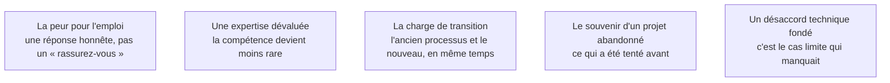

Niveau attendu : **autonomie**. Trier la résistance par cause et y répondre honnêtement suffit ; la conduite du changement est un métier à part entière, qu'on appelle quand elle devient le sujet principal.

La résistance n'est pas un obstacle à contourner, c'est une information. Cinq causes reviennent, et une seule relève de la communication.

## Ce qu'il faut savoir faire

- Refuser de dire « rassurez-vous » quand on n'en sait rien, et obtenir du commanditaire une position claire sur l'emploi, à annoncer par lui. Le FDE n'est presque jamais celui qui peut répondre.
- Reconnaître et planifier la charge de transition : pendant plusieurs semaines les équipes font l'ancien processus et le nouveau. Ce coût non reconnu se transforme en rejet.
- Demander dès le premier jour ce qui a été tenté avant et pourquoi ça s'est arrêté. C'est l'une des questions les plus utiles de la mission.
- Traiter un désaccord technique venu du terrain comme une information : l'opérateur qui dit « ça ne marchera pas sur les dossiers de tel type » nomme un cas limite, qui entre dans le jeu d'évaluation.
- Faire construire le jeu d'évaluation par les plus sceptiques : ils choisissent les cas difficiles, s'approprient le critère de réussite, et sont les mieux placés pour dire que le système passe.

## Les notions mobilisées

- [[notions/conduite-du-changement]] — l'angle FDE est qu'il n'a aucun pouvoir hiérarchique et une présence limitée dans le temps : son seul levier est la preuve accumulée et la relation avec les opérationnels.
- [[notions/transfert-de-competences]] — donner un rôle dans le système à celui dont l'expertise est dévaluée est plus efficace que le rassurer.
- [[notions/reingenierie-de-processus]] — la transition double le travail avant de le réduire, et cela se planifie.
- [[notions/gestion-parties-prenantes]] — la mémoire des projets antérieurs conditionne l'accueil bien plus que la qualité de la proposition.
- [[notions/evaluation-llm]] — c'est là que les objections de terrain deviennent des cas mesurables.

> [!warning] Piège
> Contourner un opposant en obtenant un arbitrage hiérarchique. Cela fonctionne une fois, et cela coûte la coopération de son équipe pour le reste de la mission — celle dont on a besoin pour les cas limites, les données de test et l'adoption.
