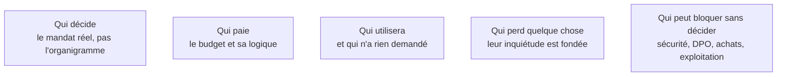

Niveau attendu : **autonomie**. La cartographie politique se mène seul et sans mandat, mais le FDE reste un extérieur récent : ceux qui connaissent la maison la lisent mieux que lui.

Un travail d'observation aussi méthodique que la cartographie de processus. La catégorie la plus sous-estimée est celle de ceux qui peuvent bloquer sans avoir le pouvoir de décider.

## Ce qu'il faut savoir faire

- Repérer le mandat réel à ce qu'une personne peut engager seule : un budget, une ouverture de flux, une modification de processus. Le commanditaire n'est pas toujours le décideur.
- Intégrer tôt les bloqueurs légitimes — sécurité, protection des données, achats, exploitation, instances représentatives. Ils ne bloquent pas par principe, ils appliquent un rôle : intégrés tôt ils deviennent des alliés, découverts tard ils deviennent des obstacles.
- Nommer ceux qui perdent quelque chose : l'expert dont la compétence devient moins rare, le service dont le volume justifiait l'effectif, la personne qui maintenait le tableur devenu inutile.
- Identifier un allié opérationnel qui connaît le terrain et parle aux autres. Une mission sans relais interne n'avance pas.
- Tenir cette cartographie par écrit, pour soi, et la relire toutes les deux semaines : les positions bougent.

## Les notions mobilisées

- [[notions/gestion-parties-prenantes]] — l'angle FDE est que la cartographie se fait pendant la phase 1, en même temps que celle du processus, et que les couloirs du schéma en donnent le premier jet.
- [[notions/roi-des-projets-ia]] — comprendre la logique du budget dit ce qui sera défendable en comité et ce qui ne le sera pas.
- [[notions/conduite-du-changement]] — les utilisateurs qui n'ont rien demandé décident de l'adoption autant que ceux qui ont commandé.
- [[notions/reingenierie-de-processus]] — la suppression d'une étape enlève toujours quelque chose à quelqu'un.
- [[notions/gouvernance-ia]] — les bloqueurs légitimes appliquent un cadre : le connaître transforme l'obstacle en calendrier.

> [!warning] Piège
> Se croire au-dessus de la politique interne parce qu'on est technique et de passage. C'est l'inverse : le statut d'extérieur donne une liberté de parole rare, et la gaspiller par maladresse la referme définitivement. Le FDE est observé dès le premier jour, y compris sur la façon dont il parle des équipes en leur absence.
