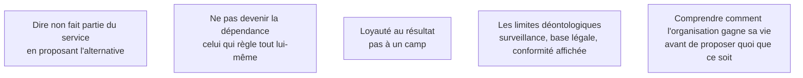

Niveau attendu : **autonomie**. Dire non en proposant l'alternative et refuser de devenir la dépendance se tiennent sous pression, sans que personne n'arbitre à la place du FDE.

Le FDE partage le quotidien des équipes clientes sans en faire partie, et représente un fournisseur sans être un commercial. Cette position a une valeur propre : celle d'un tiers qui peut dire ce que les gens de l'intérieur ne peuvent pas dire, parce qu'ils ont une carrière à faire dans l'organisation.

## Ce qu'il faut savoir faire

- Ne pas prendre parti dans les conflits internes, ce qui ne veut pas dire ne pas avoir d'avis technique. La distinction se voit et elle se respecte.
- Refuser une demande hors périmètre en proposant l'alternative honnête. C'est une prestation, pas un défaut de coopération.
- Ne pas devenir indispensable : le FDE qui règle tout lui-même, plus vite que quiconque, construit un système qui s'arrête avec son départ.
- Nommer les limites déontologiques quand elles se présentent — un système qui surveille individuellement des salariés, un traitement sans base légale, une conformité affichée qui n'existe pas — par écrit, et les faire remonter.
- Répondre aux questions de couloir sur les faits observés — « sur ce processus, le point de blocage est le délai de validation » — jamais sur les personnes. Cela paraît évident à froid ; en fin de journée, après trois semaines d'immersion, ça ne l'est pas.

## Les notions mobilisées

- [[notions/cadrage-besoin]] — un refus qui s'appuie sur un périmètre écrit n'est pas un refus personnel.
- [[notions/transfert-de-competences]] — l'indépendance du client est le critère qui départage un tiers de confiance d'un fournisseur captif.
- [[notions/gestion-parties-prenantes]] — l'angle FDE est qu'un avis technique venu de l'extérieur a du poids, et que certains le solliciteront pour trancher un débat qui n'est pas technique.
- [[notions/gouvernance-ia]] — les limites déontologiques ont un cadre juridique : s'y référer évite d'en faire une question de morale personnelle.
- [[notions/roi-des-projets-ia]] — comprendre comment l'organisation gagne de l'argent, c'est savoir ce qui est en jeu pour chacun.

> [!warning] Piège
> Se laisser instrumentaliser dans un arbitrage interne — remplacer un outil parce qu'un service veut reprendre la main, par exemple. Répondre sur le terrain technique, nommer explicitement ce qui relève d'une décision d'organisation, et laisser cette décision à ceux dont c'est le rôle.
