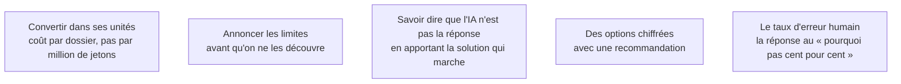

La difficulté n'est pas de simplifier, c'est de simplifier sans mentir. Le test : après l'explication, l'interlocuteur doit pouvoir **prendre une décision** et la défendre lui-même devant quelqu'un d'autre.

## Ce qu'il faut savoir faire

- Convertir systématiquement dans les unités de l'interlocuteur : coût par dossier traité et non par million de jetons, délai de réponse ressenti et non latence au premier jeton, taux de reprise et non score de fidélité.
- Présenter un arbitrage comme un choix entre options chiffrées, avec une recommandation. Une direction qui reçoit trois options sans recommandation ne décide pas, elle demande une autre réunion.
- Annoncer les limites avant qu'elles ne soient découvertes. La crédibilité d'un FDE se construit sur la première limite qu'il annonce lui-même, pas sur la première réussite.
- Préparer une réponse tenant en trois phrases à « pourquoi ça ne peut pas être fiable à cent pour cent ». Celle qui fonctionne ne parle ni de probabilités ni d'architecture : elle compare au taux d'erreur humain actuel sur la même tâche, et explique ce qui est fait des cas incertains.
- Ne jamais improviser un chiffre en comité : un ordre de grandeur donné de mémoire devient un engagement dans le compte rendu.

## Les notions mobilisées

- [[notions/cout-et-latence-inference]] — l'angle FDE est qu'il faut parler de tokens et de latence dans la même conversation qu'un retour sur investissement, sans changer de registre.
- [[notions/garde-fous]] — annoncer une limite, c'est décrire ce que le système refuse de faire et pourquoi.
- [[notions/arbitrage-deterministe-probabiliste]] — dire que l'IA n'est pas la réponse est plus facile quand on apporte en même temps la solution déterministe qui, elle, fonctionne.
- [[notions/roi-des-projets-ia]] — une option non chiffrée n'est pas une option.
- [[notions/metriques-evaluation-ml]] — la référence humaine est l'argument qui clôt la discussion sur la fiabilité.

> [!warning] Piège
> Se réfugier dans la technique quand la question est politique. « Le modèle n'est pas déterministe » est une réponse exacte à une question qui n'a pas été posée. Ce qu'on demande est qui porte la responsabilité en cas d'erreur, et ce qu'on fait quand ça arrive — humain dans la boucle, journal d'audit, seuil de confiance, procédure de reprise.
