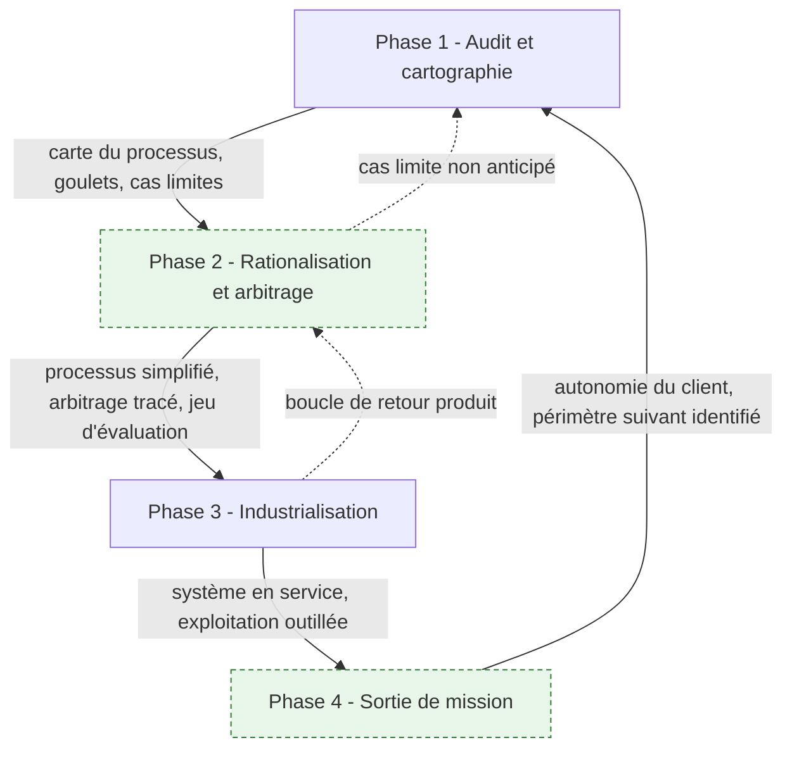
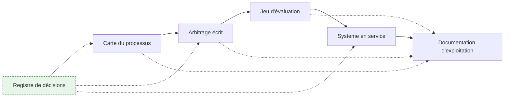
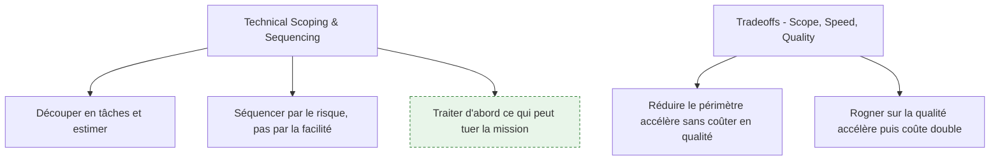
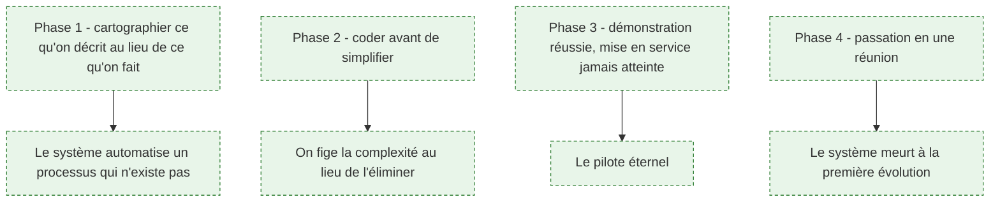

# Le cycle d'intervention

> [!abstract] La colonne vertébrale du métier : quatre phases, leurs livrables, et surtout les portes de sortie qui autorisent à passer à la suivante. C'est la page à lire avant les quatre pages de détail, parce qu'elle dit ce qui circule entre les phases et pourquoi une mission qui saute une étape échoue toujours au même endroit.

## Réconcilier deux découpages

Les deux sources ne sont pas d'accord, et l'écart est instructif.

| Amont roadmap.sh | Brief de commande | Ce dossier |
|---|---|---|
| Audit — s'immerger, cartographier les flux, décider où l'IA crée de la valeur | Audit et cartographie in situ | **Phase 1 — Audit et cartographie** |
| — | Rationalisation et sélection technologique | **Phase 2 — Rationalisation et arbitrage** |
| Évaluations — construire de quoi mesurer si le système fonctionne vraiment | — | *traité comme le pivot entre 2 et 3, pas comme une phase* |
| Déploiement — livrer en commençant par la plus petite unité d'autonomie | Développement, intégration et industrialisation | **Phase 3 — Industrialisation** |
| — | *mentionné dans la phase 3 : support, transfert, maintenance* | **Phase 4 — Sortie de mission** |

Deux décisions de rédaction, assumées :

**L'évaluation n'est pas une phase, c'est une charnière.** L'amont en fait une étape à part entière, ce qui a le mérite de lui donner du poids. Mais un protocole d'évaluation construit après le cadrage et avant le développement n'est pas une séquence : c'est ce qui **définit** ce que « ça marche » veut dire, donc ce qui conclut l'arbitrage et ouvre le développement. En faire une phase distincte laisse croire qu'on peut la reporter ; en faire la porte de sortie de la phase 2, on ne peut plus.

**La sortie de mission est une phase.** Le brief la mentionne en fin de phase 3, à côté du support et de la maintenance. C'est là que la plupart des missions échouent à laisser quelque chose derrière elles : le système tourne, la démonstration a convaincu, et six mois plus tard personne ne sait le modifier. Une étape mentionnée en fin de liste n'est jamais dotée de temps. Une phase, si.

---

## Le cycle

Les deux flèches en pointillé sont la partie honnête du schéma : les retours arrière sont normaux. Ce qui n'est pas normal, c'est de traverser une porte de sortie sans son livrable.

| Phase | Durée indicative | Livrable | Porte de sortie |
|---|---|---|---|
| 1 — Audit | 1 à 3 semaines | Carte du processus réel, inventaire des données, liste des cas limites | Le client reconnaît son processus dans la carte, y compris ce qui le dérange |
| 2 — Rationalisation | 1 à 2 semaines | Processus cible simplifié, arbitrage écrit, jeu d'évaluation | Le seuil de réussite est chiffré et accepté par celui qui décide |
| 3 — Industrialisation | 4 à 10 semaines | Système en service, chaîne de livraison, observabilité | Des utilisateurs réels s'en servent sur des cas réels, mesurés |
| 4 — Sortie | 2 à 4 semaines | Documentation d'exploitation, passation, critères de reprise | L'équipe cliente a corrigé un incident sans le FDE |

Les durées sont indicatives et calées sur une mission de trois à six mois. Elles n'ont pas valeur de norme : aucune donnée publique consolidée n'existe sur la durée type d'une mission FDE, et ce qui circule vient de témoignages d'éditeurs.

---

## 1. Ce qui circule entre les phases

**À quoi ça sert.** Une mission produit du code, mais ce n'est pas ce qui a le plus de valeur pour le client. Ce qui reste et se réutilise, ce sont les artefacts intermédiaires : la carte du processus sert encore quand le périmètre s'élargit, le jeu d'évaluation sert à chaque montée de version de modèle, le registre de décisions évite de rejouer trois fois le même débat avec trois interlocuteurs différents. Un FDE qui ne produit que du code laisse un objet muet.

**Ce qu'il faut savoir**

- La carte du processus — voir [[notions/bpmn]] — est le seul document que les équipes métier liront réellement. Elle circule bien au-delà de la mission.
- Le registre de décisions : une page par arbitrage — la question, les options, ce qui a été retenu, par qui, et ce qui invaliderait la décision. Voir [[notions/redaction-technique]] ; l'angle FDE est qu'il sert d'abord à se protéger d'un changement d'avis rétroactif.
- Le jeu d'évaluation — voir [[notions/evaluation-llm]] — est l'artefact le plus durable. Il survit au modèle, au prestataire et au FDE.
- La documentation d'exploitation se rédige **au fil de l'eau**, pas en fin de mission. Voir [[parcours/forward-deployed-engineer/sortie-de-mission]].

> [!tip] Ajout 2026
> Tiens le registre de décisions dans le dépôt, à côté du code, en Markdown, avec une date et un nom. Ce n'est pas de la bureaucratie : c'est ce qui permet, au quatrième mois, de répondre en trente secondes à « pourquoi on n'a pas utilisé l'IA sur cette étape » — question qui sera posée par quelqu'un qui n'était pas là au cadrage, souvent devant témoins.

> [!warning] Piège
> Ne produire que les livrables contractuels. Les artefacts intermédiaires ne figurent jamais dans un bon de commande, et ce sont eux qui font la différence entre une mission dont il reste quelque chose et une mission qui laisse un dépôt que personne n'ouvre.

---

## 2. Cadencer : périmètre, vitesse, qualité

**À quoi ça sert.** L'amont pose le triangle classique périmètre / vitesse / qualité et sa bonne conclusion : réduire le périmètre est le seul levier qui accélère sans dette. Ce qu'il faut y ajouter pour le terrain, c'est l'ordre d'attaque. Un FDE séquence par le risque : ce qui peut faire échouer la mission passe en premier, même si c'est ingrat et peu démontrable. L'ouverture d'un flux réseau vers l'ERP n'impressionne personne en comité, et c'est pourtant elle qui décide du sort du projet.

**Ce qu'il faut savoir**

- Séquencer par le risque, pas par la valeur perçue : l'intégration la plus incertaine d'abord, la fonctionnalité la plus démonstrative ensuite.
- Réduire le périmètre est presque toujours la bonne réponse à une contrainte de délai. Encore faut-il que le client comprenne ce qu'il abandonne — d'où l'arbitrage écrit.
- Les délais organisationnels — validation sécurité, accès aux données, avis du délégué à la protection des données — sont sur le chemin critique et ne s'accélèrent pas avec plus d'ingénieurs.
- Une démonstration hebdomadaire, même minuscule, vaut mieux qu'un jalon mensuel : c'est le rythme qui entretient la confiance et fait remonter les objections tant qu'elles sont peu coûteuses. Voir [[notions/cadrage-besoin]].
- Le retour produit — le *Product Feedback Loop* de l'amont — se collecte en observant l'usage réel, pas en demandant un avis. Ce que les gens disent d'un outil et ce que les journaux montrent divergent systématiquement.

> [!tip] Ajout 2026
> Fixe dès le cadrage une date de mise en service partielle, très en amont de la fin de mission, et traite-la comme intangible. Tout ce qui est prêt part, le reste attend. Cette contrainte force les arbitrages utiles et rend visibles les blocages administratifs pendant qu'il est encore temps d'agir dessus.

> [!warning] Piège
> Accepter chaque demande pour entretenir la relation. C'est le mode d'échec propre au métier : le FDE est sur place, disponible, et chaque ajout paraît minime. Au bout de deux mois, le périmètre a doublé, plus rien n'est en service, et la relation se dégrade bien plus qu'elle ne l'aurait fait avec un refus argumenté au premier jour.

---

## 3. Les modes d'échec, par phase

**À quoi ça sert.** Chaque phase a son mode d'échec propre, et ils ne se compensent pas : une phase 3 excellente ne rattrape pas une phase 1 bâclée, elle en amplifie les conséquences. Connaître les quatre permet de poser les bonnes questions en revue de mission, à soi-même d'abord.

**Ce qu'il faut savoir**

- Phase 1 — le décalage entre le processus décrit et le processus réel est la cause racine la plus fréquente. L'antidote est l'observation directe, développée dans [[parcours/forward-deployed-engineer/audit-et-cartographie]].
- Phase 2 — automatiser une complexité au lieu de l'éliminer. Le brief est explicite : simplifier le processus **avant** toute écriture de code. Voir [[parcours/forward-deployed-engineer/arbitrage-technologique]].
- Phase 3 — le pilote éternel, celui qui marche bien et n'est jamais mis en service parce que personne n'a le mandat de l'ouvrir. C'est un problème politique traité dans [[parcours/forward-deployed-engineer/competences-relationnelles]], pas un problème technique.
- Phase 4 — la passation en une réunion de deux heures et un document. Voir [[parcours/forward-deployed-engineer/sortie-de-mission]].

> [!tip] Ajout 2026
> Pose-toi une fois par semaine, seul, la question de la phase en cours : « si la mission s'arrêtait demain, que resterait-il ? » La réponse pendant les trois premières semaines est légitimement « une carte et des constats » ; si c'est encore la réponse au deuxième mois, quelque chose est bloqué et ce n'est probablement pas technique.

> [!warning] Piège
> Traiter les quatre phases comme un enchaînement linéaire à valider en comité. Les retours arrière sont sains : découvrir en phase 2 un cas limite qui invalide une partie de la carte est une bonne nouvelle, pas un échec de la phase 1. Ce qui est malsain, c'est de traverser une porte de sortie sans son livrable pour tenir un planning.
