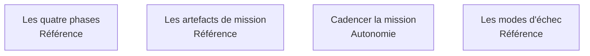

Comment se déroule une mission : quatre phases, ce qui autorise à passer de l'une à l'autre, ce qu'elles laissent derrière elles, et la façon de les cadencer.

## Les quatre sujets

## Ma progression

- [ ] [[parcours/forward-deployed-engineer/cycle-mission/les-quatre-phases|Les quatre phases]] — ce que chacune produit et ce qui autorise la suivante
- [ ] [[parcours/forward-deployed-engineer/cycle-mission/les-artefacts-de-mission|Les artefacts de mission]] — la carte, le registre de décisions, le jeu d'évaluation
- [ ] [[parcours/forward-deployed-engineer/cycle-mission/cadencer-la-mission|Cadencer la mission]] — séquencer par le risque, réduire le périmètre plutôt que la qualité
- [ ] [[parcours/forward-deployed-engineer/cycle-mission/les-modes-d-echec|Les modes d'échec]] — les quatre façons de rater, et à quoi les reconnaître
