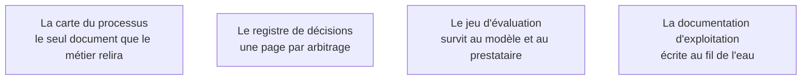

Niveau attendu : **référence**. Ce qui reste après le départ est la définition même de la réussite du métier, et aucun autre rôle ne se porte garant de ces quatre documents.

Une mission produit du code, et ce n'est pas ce qui a le plus de valeur pour le client. Ce qui reste et se réutilise, ce sont quatre documents.

## Ce qu'il faut savoir faire

- Produire la carte du processus dans une forme que les équipes métier corrigent elles-mêmes, et accepter qu'elle circule bien au-delà de la mission.
- Tenir le registre de décisions dans le dépôt, à côté du code, en Markdown, daté et signé — pour répondre en trente secondes à « pourquoi on n'a pas mis d'IA sur cette étape », question qui sera posée au quatrième mois, souvent devant témoins.
- Construire le jeu d'évaluation avec le métier et le transmettre avec son mode d'emploi : c'est l'artefact le plus durable, celui qui sert à chaque montée de version de modèle.
- Écrire la documentation d'exploitation à chaque incident traité, jamais dans les deux dernières semaines.
- Distinguer, dans un bon de commande, les livrables contractuels des artefacts qui font la différence — ces derniers n'y figurent jamais.

## Les notions mobilisées

- [[notions/bpmn]] — l'angle FDE est de n'utiliser qu'une fraction du standard : le lecteur visé est une équipe métier, pas un analyste de processus.
- [[notions/redaction-technique]] — le registre de décisions sert d'abord à distinguer un changement de contexte légitime d'un changement d'avis rétroactif.
- [[notions/evaluation-llm]] — autant un instrument de négociation qu'un outil technique : il déplace la recette d'une impression vers un chiffre.
- [[notions/transfert-de-competences]] — la documentation d'exploitation n'est pas un livrable de fin, c'est le support du transfert, donc elle s'écrit pendant.

> [!warning] Piège
> Ne produire que les livrables contractuels. C'est la différence entre une mission dont il reste quelque chose et une mission qui laisse un dépôt que personne n'ouvre.
