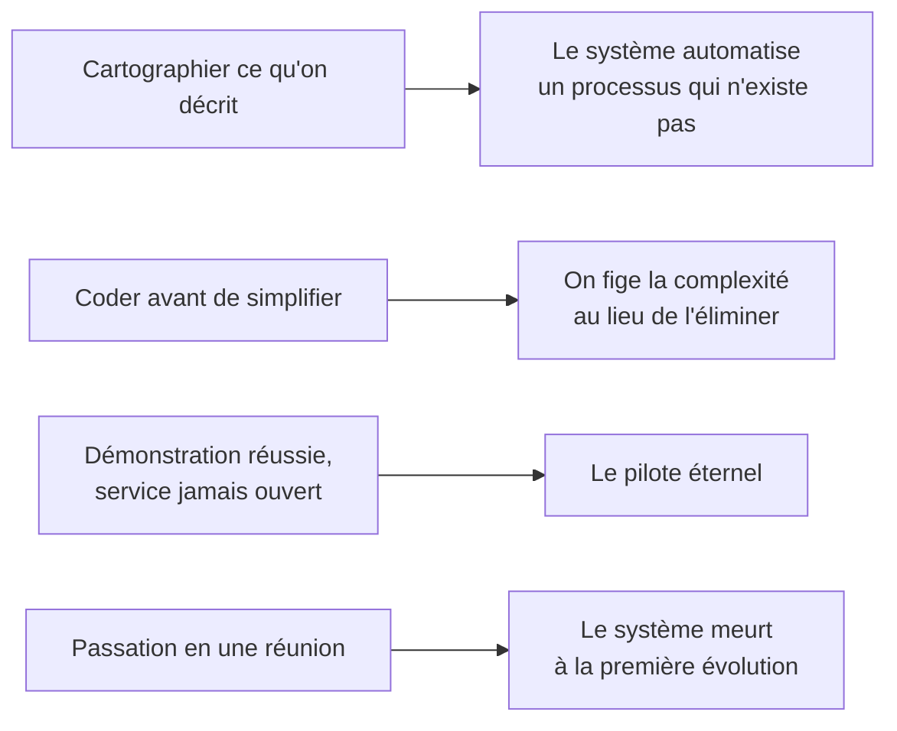
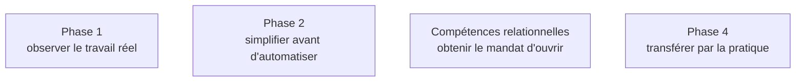

Niveau attendu : **référence**. Reconnaître qu'une mission est en train de partir dans l'un des quatre est un diagnostic que personne d'autre dans la salle ne posera tant qu'il coûte encore peu.

Chaque phase a son mode d'échec propre, et ils ne se compensent pas : une phase 3 excellente ne rattrape pas une phase 1 bâclée, elle en amplifie les conséquences.

## Ce qu'il faut savoir faire

- Reconnaître le premier : le décalage entre le processus décrit et le processus réel est la cause racine la plus fréquente, et l'antidote est l'observation directe.
- Reconnaître le deuxième : automatiser une étape inutile la rend permanente. La simplification précède l'écriture du code, jamais l'inverse.
- Reconnaître le troisième : le pilote éternel, celui qui marche bien et n'est jamais mis en service parce que personne n'a le mandat de l'ouvrir. C'est un problème politique, pas technique.
- Reconnaître le quatrième : la passation en deux heures et un document, qui ne transfère rien.
- Se poser la question une fois par semaine, seul. Si la réponse à « que resterait-il ? » est encore « une carte et des constats » au deuxième mois, quelque chose est bloqué et ce n'est probablement pas technique.

## Où se traite chaque mode d'échec

## Les notions mobilisées

- [[notions/reingenierie-de-processus]] — le deuxième mode d'échec est exactement ce que la réingénierie nomme depuis trente-cinq ans : n'automatisez pas, supprimez.
- [[notions/conduite-du-changement]] — le pilote éternel n'est presque jamais un problème de qualité du système.
- [[notions/transfert-de-competences]] — le quatrième mode d'échec se prépare en phase 1, pas en phase 4.
