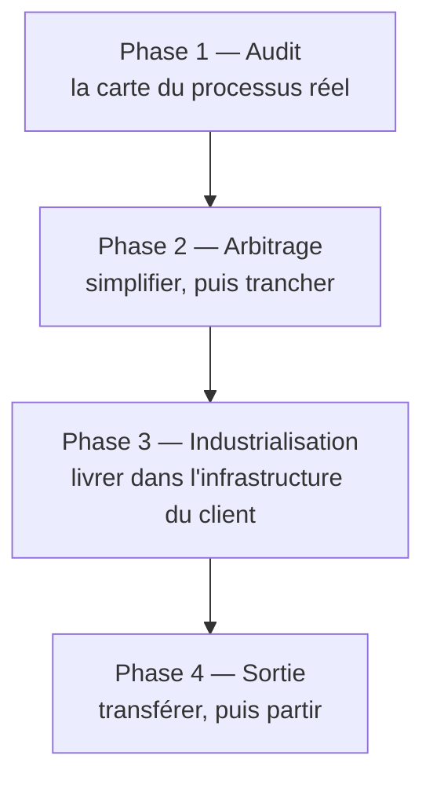

Niveau attendu : **référence**. Le découpage et ses portes de sortie sont ce que le FDE impose au cadrage : personne en face ne saura dire qu'une phase n'est pas finie.

Le déroulé d'une mission, de l'observation au départ. Ce qui autorise à passer à la phase suivante n'est pas le calendrier, c'est un livrable.

| Phase | Durée indicative | Livrable | Porte de sortie |
|---|---|---|---|
| 1 — Audit | 1 à 3 semaines | Carte du processus réel, inventaire des données, cas limites | Le client reconnaît son processus dans la carte, y compris ce qui le dérange |
| 2 — Arbitrage | 1 à 2 semaines | Processus cible simplifié, arbitrage écrit, jeu d'évaluation | Le seuil de réussite est chiffré et accepté par celui qui décide |
| 3 — Industrialisation | 4 à 10 semaines | Système en service, chaîne de livraison, observabilité | Des utilisateurs réels traitent des cas réels, et l'usage est mesuré |
| 4 — Sortie | 2 à 4 semaines | Documentation d'exploitation, passation, critères de reprise | L'équipe cliente a corrigé un incident sans le FDE |

Les durées sont calées sur une mission de trois à six mois et n'ont pas valeur de norme : aucune donnée publique consolidée n'existe sur la durée type d'une mission.

## Ce qu'il faut savoir faire

- Refuser de franchir une porte de sortie sans son livrable, même quand le planning le réclame.
- Traiter un retour arrière comme une information et non comme un échec : un cas limite découvert en phase 2 invalide une partie de la carte, et c'est une bonne nouvelle tant qu'on est en phase 2.
- Placer l'évaluation à la charnière des phases 2 et 3. Elle n'est pas une étape qu'on peut reporter : elle **définit** ce que « ça marche » veut dire, donc elle conclut l'arbitrage et ouvre le développement.
- Défendre la phase 4 au cadrage. Une sortie mentionnée en fin de liste n'obtient jamais de temps ; une phase, si.
- Répondre à tout moment, pour la phase en cours, à la question « si la mission s'arrêtait demain, que resterait-il ? ».

## Les notions mobilisées

- [[notions/cadrage-besoin]] — l'angle FDE est que la porte de sortie de la phase 1 se négocie au cadrage, sous la forme de ce que le client s'engage à reconnaître.
- [[notions/evaluation-llm]] — le jeu d'évaluation est la porte de sortie de la phase 2, parce qu'il est la seule formulation vérifiable de la réussite.
- [[notions/redaction-technique]] — une porte de sortie franchie sans trace écrite sera rouverte au troisième mois par quelqu'un qui n'était pas là.

> [!warning] Piège
> Traiter les quatre phases comme un enchaînement linéaire à valider en comité. Les retours arrière sont sains. Ce qui ne l'est pas, c'est de traverser une porte de sortie sans son livrable pour tenir une date.
