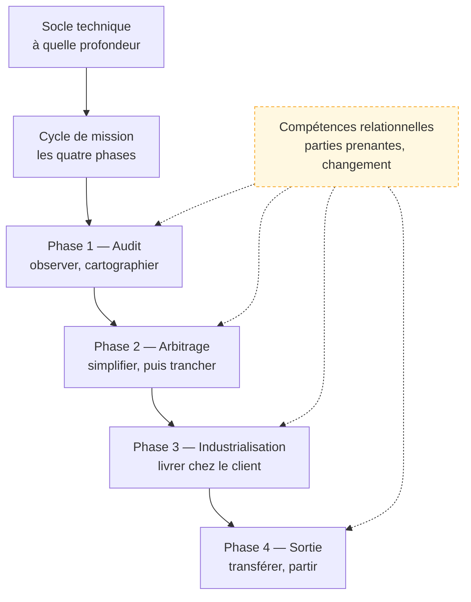

Un ingénieur logiciel qui travaille **à l'intérieur** de l'environnement d'un client, pour y construire et y faire adopter un système d'IA qui tienne dans son infrastructure et dans ses habitudes.

## La roadmap

Chaque case mène à sa page. Cochez les étapes acquises en bas de page pour suivre votre progression.

## Ma progression

- [ ] [[parcours/forward-deployed-engineer/socle-technique|Socle technique]] — ce qu'il faut savoir faire, et à quelle profondeur
- [ ] [[parcours/forward-deployed-engineer/cycle-mission|Cycle de mission]] — les quatre phases et leurs portes de sortie
- [ ] [[parcours/forward-deployed-engineer/audit-et-cartographie|Phase 1 — Audit et cartographie]] — observer le travail réel, modéliser le processus
- [ ] [[parcours/forward-deployed-engineer/arbitrage-technologique|Phase 2 — Arbitrage technologique]] — simplifier avant d'automatiser, déterministe ou probabiliste
- [ ] [[parcours/forward-deployed-engineer/industrialisation|Phase 3 — Industrialisation]] — interfaçage, sécurité, évaluation, exploitation
- [ ] [[parcours/forward-deployed-engineer/sortie-de-mission|Phase 4 — Sortie de mission]] — transfert de compétences, maintenance
- [ ] [[parcours/forward-deployed-engineer/competences-relationnelles|Compétences relationnelles]] — parties prenantes, politique interne, conduite du changement
