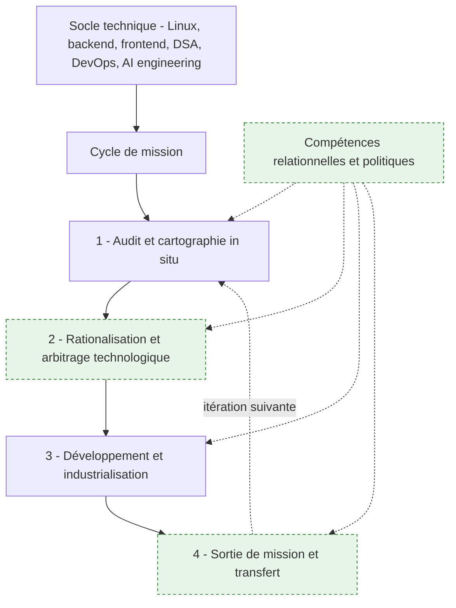
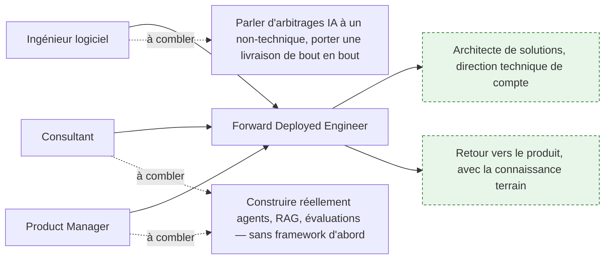

# Forward Deployed Engineer

> [!abstract] Le métier qui consiste à s'installer chez le client, comprendre comment son travail se fait réellement, et livrer un système d'IA qui tient dans son infrastructure et dans ses habitudes. Ce dossier s'adresse à un ingénieur logiciel qui veut basculer vers le terrain, à un consultant qui veut cesser de s'arrêter au slide, et à quiconque doit recruter ou cadrer ce profil sans se tromper sur ce qu'il recouvre.

## Lire la provenance

Trois origines cohabitent dans ce dossier, et le lecteur doit pouvoir les distinguer.

| Signal | Origine |
|---|---|
| Nœud plein dans un schéma | roadmap.sh/forward-deployed-engineer, capture du 16 septembre 2026 |
| Nœud **en vert pointillé** | Absent de la roadmap amont — vient du brief de commande ou d'un apport propre |
| `> [!tip] Ajout 2026` | Apport propre : ce que ni l'amont ni le brief ne disent |
| `> [!warning] Piège` | Erreur constatée sur le terrain, signalée comme telle |
| Mention « le brief pose… » dans le texte | Provient du cahier des charges de commande, pas de l'amont |

Le métier est récent. Une bonne partie de ce qui circule à son sujet est du contenu promotionnel produit par des éditeurs qui vendent de la prestation. Quand une affirmation relève de la pratique rapportée et non d'un consensus établi, c'est écrit.

---

## Le métier en une page

Un Forward Deployed Engineer est un ingénieur logiciel qui travaille **à l'intérieur** de l'environnement d'un client pour construire, déployer et stabiliser des systèmes d'IA. Le rôle vient de Palantir, où des ingénieurs appelés *Deltas* s'intégraient aux équipes clientes — parfois sur des bases militaires — et livraient du code dans la nuit à partir des retours recueillis le jour même. La même idée structure aujourd'hui la façon dont OpenAI, Anthropic et quelques autres font entrer l'IA dans les grandes organisations.

Ce qui le distingue des rôles voisins tient en une phrase :

| Rôle | Ce qu'il optimise | Où il s'arrête |
|---|---|---|
| **AI Engineer** | la qualité du système construit | à la frontière de son dépôt |
| **Consultant** | la justesse de la recommandation | au livrable écrit |
| **Solutions Architect** | la cohérence de la cible | au schéma d'architecture |
| **Forward Deployed Engineer** | l'adoption réelle d'un système en production chez un tiers | quand le client s'en sert sans lui |

La conséquence est brutale : un FDE peut livrer un système techniquement irréprochable et échouer complètement. Le critère de réussite n'est pas « ça marche », c'est « ils s'en servent encore dans six mois, et sans moi ».

---

## La carte

Le socle technique est un prérequis, pas une étape. Les compétences relationnelles ne sont pas une phase non plus : elles sont la condition de survie de chacune des quatre.

---

## Le dossier

| Page | Ce qu'elle traite |
|---|---|
| [[parcours/forward-deployed-engineer/socle-technique]] | ce qu'il faut savoir faire, et surtout **à quelle profondeur** : le seul chiffre utile quand l'amont se contente de lister sept roadmaps |
| [[parcours/forward-deployed-engineer/cycle-mission]] | la colonne vertébrale : les quatre phases, leurs portes de sortie, ce qui circule entre elles |
| [[parcours/forward-deployed-engineer/audit-et-cartographie]] | phase 1 — l'immersion, l'observation du travail réel, la modélisation BPMN, les goulets et les silos |
| [[parcours/forward-deployed-engineer/arbitrage-technologique]] | phase 2 — simplifier avant d'automatiser, puis trancher entre déterministe et probabiliste |
| [[parcours/forward-deployed-engineer/industrialisation]] | phase 3 — livrer dans l'infrastructure du client : interfaçage, sécurité, évaluation, exploitation |
| [[parcours/forward-deployed-engineer/sortie-de-mission]] | phase 4 — transfert de compétences, maintenance, ce qui reste quand le FDE part |
| [[parcours/forward-deployed-engineer/competences-relationnelles]] | parties prenantes, politique interne, conduite du changement, vulgarisation |

---

## Trajectoires d'accès

L'amont identifie trois profils qui basculent bien vers le métier. Le diagnostic est juste ; ce qui suit précise ce que chacun doit réellement combler.

**À quoi ça sert.** Savoir d'où l'on vient dit exactement où l'on va perdre du temps. L'ingénieur sous-estime systématiquement le coût de l'alignement humain et croit qu'une démonstration convaincante emporte la décision ; elle ne l'emporte jamais seule. Le consultant et le PM surestiment ce qu'ils savent faire techniquement, parce qu'ils ont piloté des projets où quelqu'un d'autre écrivait le code — et la différence entre piloter et livrer se voit à la première intégration avec un ERP.

**Ce qu'il faut savoir**

- Ingénieur logiciel — le socle est là. Ce qui manque : tenir une réunion avec une direction métier, dire non à une demande, et défendre un arbitrage de coût d'inférence devant quelqu'un qui n'a jamais entendu le mot « token ». Voir [[parcours/forward-deployed-engineer/competences-relationnelles]].
- Consultant — la moitié du métier est acquise : reformuler un besoin, lire une organisation, tenir une salle. Ce qui manque : avoir construit **soi-même** un pipeline RAG, une boucle d'agent et un jeu d'évaluation, sans framework, au moins une fois. Sans ça, l'arbitrage technique reste une opinion.
- Product Manager — même diagnostic que le consultant, avec un avantage sur la priorisation et un handicap sur la profondeur système.
- Le portefeuille qui compte n'est pas une liste de technologies mais **une livraison complète assumée** : cadrage, code, mise en production, passation. Un dépôt public avec un README qui explique les arbitrages vaut plus que dix démonstrations.

> [!tip] Ajout 2026
> Deux sorties de carrière se dessinent, et elles ne se préparent pas pareil. Rester au contact du client mène à la direction technique de compte : le métier devient majoritairement politique. Revenir au produit avec la connaissance terrain mène à la conception de ce que les autres FDE déploieront : c'est le chemin le moins visible et souvent le plus utile à l'éditeur. Décider vers quoi l'on penche au bout de deux ou trois missions évite de subir le glissement.

> [!warning] Piège
> Traiter le poste comme un poste d'ingénieur avec des déplacements. Le temps réellement passé à écrire du code sur une mission d'immersion est minoritaire — la pratique rapportée dans les retours d'expérience publics le situe entre un tiers et la moitié, sans mesure consolidée disponible. Quelqu'un qui n'accepte pas cette répartition sera malheureux dans le rôle, même très bon techniquement.

---

## Ce que la roadmap amont ne dit pas

Cinq sujets font le quotidien du métier et sont absents de la source. Ce dossier les traite au même niveau que le reste.

| Sujet | Où c'est traité |
|---|---|
| Réingénierie de processus et modélisation BPMN | [[parcours/forward-deployed-engineer/audit-et-cartographie]] |
| Arbitrage entre automatisation déterministe et IA générative | [[parcours/forward-deployed-engineer/arbitrage-technologique]] |
| Interfaçage avec les systèmes patrimoniaux — ERP, CRM, bases legacy | [[parcours/forward-deployed-engineer/industrialisation]] |
| Dimension politique d'une mission en immersion | [[parcours/forward-deployed-engineer/competences-relationnelles]] |
| Sortie de mission et transfert de compétences | [[parcours/forward-deployed-engineer/sortie-de-mission]] |

---

## Parcours conseillé

| Ordre | Étape | Effort | À viser |
|---|---|---|---|
| 1 | Socle logiciel et Linux en conditions réelles | selon le profil | Déboguer un service en production sans accès graphique |
| 2 | AI engineering : API, RAG, agents, évaluation | ~6 semaines | Un pipeline complet écrit sans framework, avec son jeu d'évaluation |
| 3 | Lecture d'un processus métier et BPMN | ~1 semaine | Cartographier un processus réel en deux jours d'observation |
| 4 | Arbitrage déterministe / probabiliste | ~1 semaine | Savoir argumenter le refus de l'IA sur un cas donné |
| 5 | Interfaçage avec l'existant | ~2 semaines | Un connecteur vers un système patrimonial, avec sa stratégie de reprise |
| 6 | Sécurité, garde-fous, données sensibles | ~2 semaines | Une revue de sécurité passée avant mise en service |
| 7 | Exploitation : observabilité, coût, latence | continu | Traces par requête, budget plafonné dans le code |
| 8 | Parties prenantes et conduite du changement | continu | Tenir un comité de pilotage contradictoire |
| 9 | Transfert et sortie | à préparer dès le jour 1 | Une passation qui tient sans le FDE pendant un mois |

L'ordre est indicatif sauf sur un point : l'étape 9 ne se prépare pas à la fin. Voir [[parcours/forward-deployed-engineer/sortie-de-mission]].

---

## Pour aller plus loin

Les notes du corpus qui couvrent le socle technique :

- [[roadmaps/05 - Roadmap — AI Engineer]] — la note la plus proche du métier : API, embeddings, RAG, coût, mise en production.
- [[roadmaps/07 - Roadmap — AI Agents]] — boucle agentique, outils, MCP, mémoire, évaluation, sécurité.
- [[roadmaps/08 - Roadmap — MLOps]] — exploitation, versioning, monitoring, dérive, la part LLMOps.
- [[roadmaps/01 - Roadmap — Computer Science]] — les fondations système et réseau, quand elles manquent.

Sources amont retenues, toutes vérifiées dans la capture du 16 septembre 2026 :

- [Forward deployed engineer is AI's hottest job](https://thenewstack.io/forward-deployed-engineer-fde-openai-google/) — The New Stack. Le panorama le plus sobre parmi les articles disponibles.
- [The Definitive Guide to Forward Deployed Engineer Interviews in 2026](https://www.sundeepteki.org/advice/the-definitive-guide-to-forward-deployed-engineer-interviews-in-2026) — utile pour la préparation d'entretien, à lire en sachant que c'est un contenu d'auteur qui vend du coaching.
