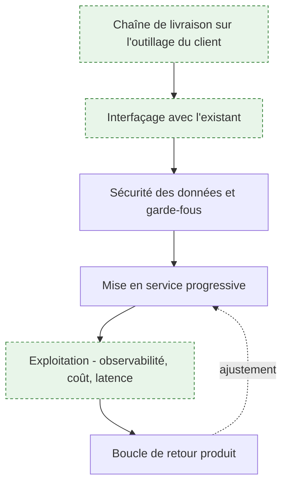
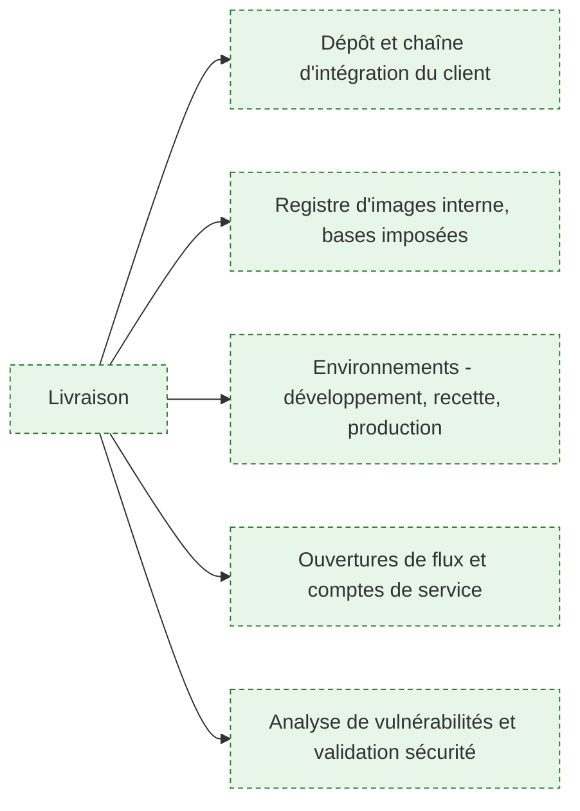
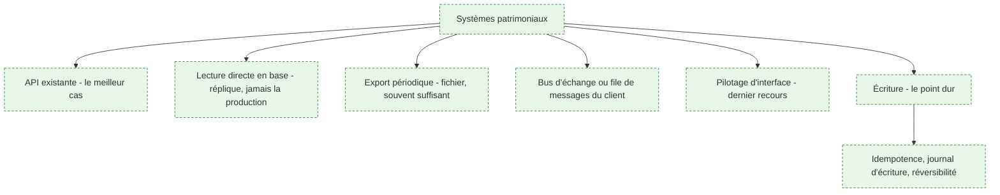
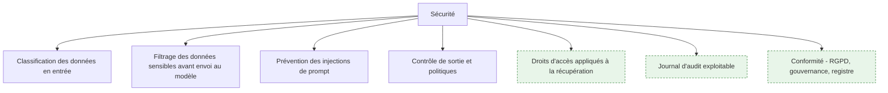
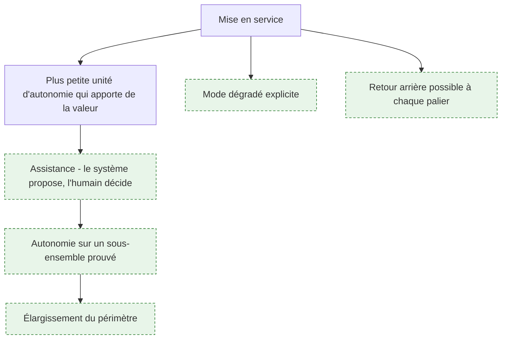
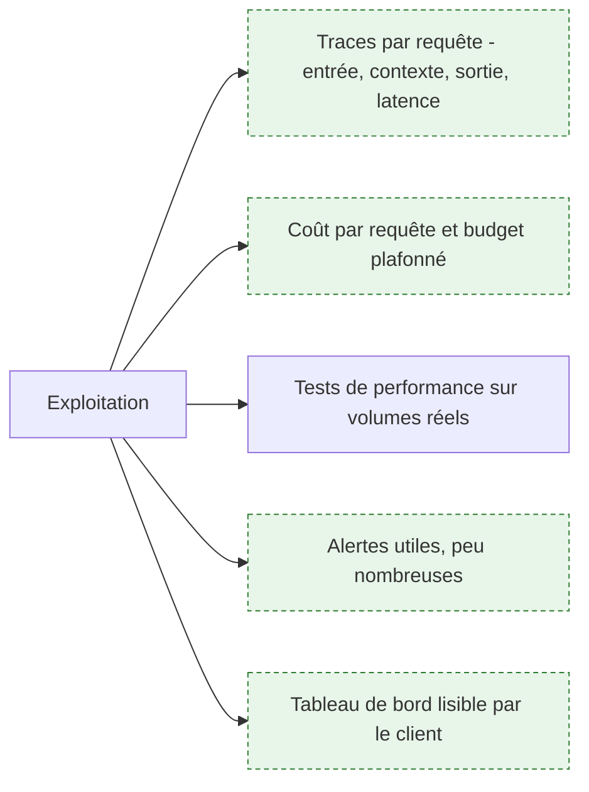
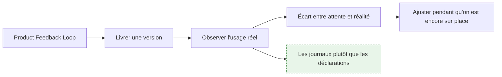

# Phase 3 — Développement, intégration et industrialisation

> [!abstract] La phase longue : livrer des briques logicielles résilientes **dans l'infrastructure du client**, les brancher sur des systèmes qui n'ont pas été conçus pour ça, faire valider la sécurité des données et amener le tout jusqu'à des utilisateurs réels. La difficulté n'est presque jamais le modèle. Elle est dans le branchement, dans les droits d'accès et dans la mise en service.

## La phase en un coup d'œil

**Porte de sortie** : des utilisateurs réels traitent des cas réels avec le système, et l'usage est mesuré. Une démonstration réussie ne franchit pas cette porte.

---

## 1. Livrer dans l'infrastructure du client

**À quoi ça sert.** Le brief demande de livrer les briques logicielles directement dans l'infrastructure client. C'est ce qui sépare le FDE du prestataire classique, et c'est aussi ce qui rend la phase imprévisible : le chemin de livraison appartient au client, avec ses règles, ses délais et ses équipes. Un système qui ne se déploie pas par la chaîne officielle n'existera jamais en production, quelle que soit sa qualité.

**Ce qu'il faut savoir**

- Utiliser l'outillage du client dès le premier jour : son dépôt, sa chaîne d'intégration, son registre d'images, son coffre à secrets. Voir [[notions/integration-continue]].
- Les bases d'images imposées par la sécurité sont souvent anciennes. Le vérifier tôt : une dépendance qui exige une version récente de la bibliothèque système peut à elle seule imposer un contournement lourd.
- Traverser la chaîne complète jusqu'en production dès la première semaine, avec une fonctionnalité triviale. C'est un test du processus organisationnel, pas du code.
- Recenser les demandes à délai long — ouverture de flux réseau, compte de service, habilitation, passage en commission — et les poser immédiatement. Elles sont sur le chemin critique.
- Voir [[notions/conteneurisation]]. L'angle FDE : l'image doit se construire hors ligne, depuis le registre interne, sans accès direct aux dépôts publics.

> [!tip] Ajout 2026
> Demande à voir le processus de mise en production d'une application existante du client, et fais-le décrire par quelqu'un qui l'a subi. On y apprend en une heure ce que les documents de gouvernance ne disent pas : quelles commissions se réunissent tous les quinze jours, quel formulaire bloque systématiquement, qui peut accélérer. Cette heure vaut plusieurs semaines de planning.

> [!warning] Piège
> Construire sur son propre environnement d'hébergement « en attendant » que le client ouvre le sien. La migration ultérieure n'est jamais anodine — identité, réseau, secrets, journalisation changent tous — et l'expérience montre que le provisoire dure jusqu'à la fin de mission, moment où il devient le problème de quelqu'un d'autre.

---

## 2. Interfacer avec les systèmes patrimoniaux

**À quoi ça sert.** Le brief place l'interfaçage avec les ERP, CRM et bases legacy parmi les domaines d'expertise requis ; l'amont n'en dit rien. C'est pourtant l'essentiel du travail d'intégration, et la principale source de mauvaises surprises. Ces systèmes ont dix à trente ans, leur documentation est partielle, leur propriétaire est prudent, et ils portent des données que toute l'organisation utilise. La règle qui structure tout : **lire est négociable, écrire ne l'est pas**. On obtient un accès en lecture en quelques jours, un droit d'écriture en quelques mois — quand on l'obtient.

**Ce qu'il faut savoir**

- Par ordre de préférence : une API existante, un bus ou une file de messages, un export périodique, une réplique en lecture, et en dernier recours le pilotage d'interface.
- Ne jamais lire directement dans la base de production d'un ERP : le risque de charge et de verrou n'est pas théorique, et c'est le meilleur moyen de se faire retirer ses accès.
- Un export nocturne suffit dans la majorité des cas. Interroger la fraîcheur réellement nécessaire avant de construire du temps réel : la réponse est souvent « la veille au soir ».
- L'écriture demande trois garanties : idempotence — le même traitement rejoué ne duplique rien —, un journal de ce qui a été écrit, et un moyen de revenir en arrière. Sans elles, aucune direction informatique raisonnable n'accordera le droit.
- Prévoir la panne de la dépendance : que fait le système quand l'ERP est en maintenance. File d'attente, dégradation, ou arrêt propre avec message clair. Le silence est la pire option.
- Voir [[notions/systemes-patrimoniaux]] et [[notions/conception-d-api]]. L'angle FDE : le connecteur est le composant qui survivra le plus longtemps et sera repris par l'équipe du client ; il mérite plus de soin que la partie IA.
- Exposer les systèmes internes à un agent via [[notions/mcp]] est aujourd'hui la voie la plus rapide — et un point d'entrée de sécurité à traiter comme tel.

> [!tip] Ajout 2026
> Fais valider le connecteur par le propriétaire du système patrimonial avant d'écrire la partie IA, et donne-lui ce qu'il veut : le volume de requêtes, la plage horaire, le compte utilisé, le comportement en cas d'erreur. Ces gens ont l'habitude qu'on leur impose des intégrations et qu'on leur laisse les incidents. Un FDE qui arrive avec une fiche d'intégration complète obtient en deux semaines ce que d'autres n'obtiennent pas en trois mois.

> [!warning] Piège
> Découvrir tard que le champ pivot n'est pas fiable. Presque toutes les intégrations reposent sur un identifiant supposé unique et stable — numéro de client, référence de dossier. Dans un système patrimonial, il ne l'est pas toujours : doublons, réattributions, formats hérités de deux fusions successives. Vérifier l'unicité et la stabilité par requête, en phase 1, avant de construire quoi que ce soit dessus.

---

## 3. Sécurité des données et garde-fous

**À quoi ça sert.** Le brief demande d'implémenter des garde-fous, de prévenir les injections de prompt et de filtrer les données sensibles. En mission, ce bloc a une fonction supplémentaire : c'est lui qui décide si le système obtient l'autorisation de mise en service. Le service sécurité du client ne juge pas la qualité des réponses, il juge l'exposition. Un système excellent qui ne passe pas la revue de sécurité ne sert à rien, et un système médiocre qui la passe rend au moins un service.

**Ce qu'il faut savoir**

- Les droits d'accès s'appliquent **à la récupération**, pas à la réponse. Filtrer les documents avant qu'ils n'entrent dans le contexte est la seule mise en œuvre correcte ; demander au modèle de ne pas divulguer ce qu'on lui a donné n'en est pas une. C'est la faille la plus fréquente des systèmes documentaires en entreprise.
- [[notions/injection-de-prompt]] — angle FDE : l'injection indirecte est le cas réaliste en entreprise. Le contenu hostile n'arrive pas par l'utilisateur mais par un document indexé, un courriel entrant ou un champ libre d'un CRM.
- [[notions/garde-fous]] — angle FDE : le garde-fou qui compte en environnement client est celui qui borne les **actions** de l'agent, pas seulement ses mots. Écriture réversible, périmètre de données limité, confirmation humaine sur les opérations irréversibles.
- [[notions/donnees-sensibles]] — angle FDE : la classification existe déjà chez le client et fait autorité. S'y conformer plutôt qu'en inventer une.
- [[notions/rgpd]] — angle FDE : rencontrer le délégué à la protection des données en phase 1 et lui fournir base légale, finalité, durée de conservation et localisation du traitement. Un traitement découvert en fin de mission peut être bloqué.
- [[notions/gouvernance-ia]] — angle FDE : l'inscription du système au registre interne et la documentation de conformité font partie du livrable, pas d'une démarche ultérieure.
- Journal d'audit : qui a demandé quoi, quelles sources ont été utilisées, qu'a répondu le système. Exigé en cas d'incident, impossible à reconstituer après coup.

> [!tip] Ajout 2026
> Provoque la revue de sécurité au milieu de la phase 3, pas à la fin. Apporter une architecture, une matrice de flux, la liste des données traitées et une suite de tests adverses rejouée en continu transforme une commission d'autorisation en revue technique. Les équipes sécurité sont habituées à recevoir des dossiers vides très tard ; arriver tôt avec un dossier complet change complètement le traitement du sujet.

> [!warning] Piège
> Traiter les garde-fous comme une couche ajoutée à la fin. Certaines décisions d'architecture les rendent impossibles — un index unique sans métadonnées de droits ne pourra jamais appliquer un filtrage par utilisateur sans être reconstruit intégralement. La sécurité se conçoit à l'ingestion.

---

## 4. Mettre en service progressivement

**À quoi ça sert.** L'amont donne ici son meilleur conseil : commencer par la plus petite unité d'autonomie possible et n'ajouter une capacité qu'après avoir prouvé que la précédente fonctionne. C'est une méthode de gestion du risque technique, et tout autant une méthode de gestion du risque politique — chaque palier franchi produit une preuve publique, et les preuves accumulées sont ce qui permet d'obtenir le palier suivant. À l'inverse, un incident sur un système mis en autonomie complète dès le premier jour referme la porte pour des mois.

**Ce qu'il faut savoir**

- Palier 1, l'assistance : le système prépare, propose, met en évidence ; l'humain valide. Coût d'erreur quasi nul, valeur souvent déjà substantielle.
- Palier 2, l'autonomie sur un sous-ensemble : les cas bien identifiés passent seuls, les autres sont routés vers l'humain. Le critère de routage doit être explicite et journalisé.
- Palier 3, l'élargissement : uniquement sur mesure, avec le jeu d'évaluation rejoué sur le nouveau périmètre.
- Chaque palier a son critère de franchissement, fixé à l'avance, et son retour arrière.
- Le mode dégradé fait partie de la livraison : ce que fait le système quand le fournisseur de modèle est indisponible ou trop lent. Basculer sur un modèle de repli, mettre en file, ou s'arrêter en le disant clairement.
- Voir [[notions/observabilite]] pour la mesure qui autorise le passage au palier suivant.

> [!tip] Ajout 2026
> Fais du taux de rejet un paramètre de conception et non une fatalité. Un système qui traite soixante-dix pour cent des cas et passe la main proprement sur le reste est accepté ; un système qui traite tout avec huit pour cent d'erreurs silencieuses est retiré au premier incident. Savoir dire « je ne sais pas » et router vers un humain est une fonctionnalité à part entière, et c'est celle qui décide de l'acceptation.

> [!warning] Piège
> Confondre la démonstration et la mise en service. Une démonstration a un jeu de données choisi, un présentateur qui connaît les limites, et aucun enjeu. La mise en service a des utilisateurs pressés, des cas non anticipés et des conséquences. Le passage de l'une à l'autre demande du travail que le client ne voit pas et n'a donc pas prévu ; c'est au FDE de l'expliquer avant qu'on ne lui demande « mais ça marchait la semaine dernière ».

---

## 5. Exploiter : observabilité, coût, performance

**À quoi ça sert.** Le brief demande d'exécuter les tests de performance et d'assurer le support et la maintenance opérationnelle. Ce qui décide vraiment de la suite, c'est l'observabilité : un système d'IA n'a pas de comportement stable, il dérive avec son corpus, ses utilisateurs et les versions de modèle. Sans traces, aucun incident n'est reproductible, et l'équipe du client se retrouve face à une boîte noire qu'elle n'osera pas modifier. L'observabilité est le premier élément du transfert de compétences, avant toute documentation.

**Ce qu'il faut savoir**

- Tracer chaque requête : entrée, contexte récupéré, appels d'outils, sortie, latence, coût. Voir [[notions/observabilite]].
- Instrumenter le coût dès le premier jour et plafonner le budget **dans le code**, par requête et par session. Une boucle d'agent découverte le lendemain matin coûte plus que le reste du projet. Voir [[notions/cout-et-latence-inference]].
- Tests de performance sur volumes réels, y compris le pic : la clôture mensuelle, la reprise du lundi matin. Le volume moyen ne dit rien du dimensionnement.
- Peu d'alertes, et seulement celles sur lesquelles quelqu'un agira. Une alerte que personne ne traite dégrade toutes les autres.
- Un tableau de bord compréhensible par l'équipe du client, dans son outil de supervision à lui. Voir [[roadmaps/08 - Roadmap — MLOps]].
- Le jeu d'évaluation rejoué périodiquement en production détecte la dérive avant les utilisateurs.

> [!tip] Ajout 2026
> Ajoute un identifiant de corrélation unique visible par l'utilisateur, affiché à côté de chaque réponse. Quand quelqu'un signale « le système a dit n'importe quoi », cet identifiant permet de retrouver la trace exacte en dix secondes au lieu de demander une capture d'écran et de tenter de reproduire. C'est un détail de cinq lignes de code qui change la qualité du support après la mission.

> [!warning] Piège
> Brancher une plateforme d'observabilité externe sans validation. Les traces contiennent les prompts, donc les données du client — souvent des données personnelles, parfois sensibles. C'est un transfert de données à part entière, qui relève du même examen que le fournisseur de modèle. Beaucoup de missions se font arrêter sur ce point précis, en fin de parcours.

---

## 6. La boucle de retour produit

**À quoi ça sert.** L'amont décrit la boucle classique — livrer, collecter, améliorer — et ajoute la précision qui compte pour un FDE : observer comment le produit livré est **réellement** utilisé, pendant qu'on est encore sur place. C'est l'avantage structurel du métier. Une équipe produit distante reçoit des tickets ; un FDE voit l'utilisateur contourner sa fonctionnalité, recopier la sortie dans un tableur et retravailler le résultat. Cette information ne remonte jamais par un formulaire.

**Ce qu'il faut savoir**

- Les journaux d'usage disent la vérité, les enquêtes de satisfaction disent la politesse. Regarder ce qui est utilisé, ce qui ne l'est pas, où les gens abandonnent.
- Le signal le plus fort est le retravail : si la sortie du système est systématiquement corrigée au même endroit, il y a une spécification implicite qui n'a pas été captée.
- Fermer la boucle visiblement : annoncer qu'une remarque a produit un changement. C'est ce qui entretient la remontée d'information et l'adhésion. Voir [[parcours/forward-deployed-engineer/competences-relationnelles]].
- Distinguer l'ajustement — dans le périmètre, immédiat — de la nouvelle demande — hors périmètre, à arbitrer. Le mélange des deux est le mécanisme de dérive du périmètre.
- Toute correction issue d'un retour utilisateur entre dans le jeu d'évaluation. Voir [[notions/evaluation-llm]].

> [!tip] Ajout 2026
> Installe-toi physiquement à côté des utilisateurs la semaine qui suit la mise en service, sans réunion, disponible. Ce qu'on apprend en trois jours de présence dépasse tout ce que remontent les canaux formels, et c'est le moment où les corrections coûtent le moins cher. C'est aussi le meilleur investissement relationnel de la mission : les utilisateurs qui ont vu le FDE corriger leur irritant en deux heures deviennent les premiers défenseurs du système.

> [!warning] Piège
> Prendre pour un défaut du système ce qui est un problème de processus. Quand un utilisateur recopie la sortie dans un tableur, la cause est souvent que l'étape suivante du processus n'a pas été traitée — pas que la réponse est mauvaise. Remonter à la carte de la phase 1 avant de corriger le modèle.

---

## Ressources

Issues de l'amont, capture du 16 septembre 2026 :

- [What is enterprise workflow management?](https://www.manageengine.com/appcreator/enterprise-workflow-management.html) — sur les contraintes d'intégration en environnement d'entreprise ; sommaire.

Ajoutées, sources primaires ou de référence :

- [OWASP GenAI Security Project](https://genai.owasp.org/) — le Top 10 des risques des applications à base de modèles de langage. La check-list à passer avant toute revue de sécurité ; c'est le référentiel que les équipes sécurité connaissent déjà.
- [NIST AI Risk Management Framework](https://www.nist.gov/itl/ai-risk-management-framework) — cadre de gestion du risque, utile pour structurer un dossier de conformité.
- [Règlement (UE) 2024/1689 établissant des règles harmonisées concernant l'intelligence artificielle](https://eur-lex.europa.eu/eli/reg/2024/1689/oj) — le texte lui-même. À lire plutôt que les résumés, au moins pour la classification des systèmes.
- [Model Context Protocol](https://modelcontextprotocol.io) — spécification et SDK officiels, pour exposer les systèmes internes à un agent.
