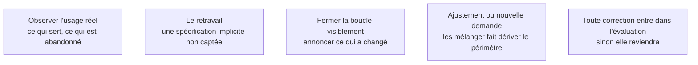

Niveau attendu : **autonomie**. Voir l'utilisateur contourner la fonctionnalité et convertir ça en correction est un geste à mener seul ; ce qui entre au périmètre reste décidé par le propriétaire du processus.

L'avantage structurel du métier : une équipe produit distante reçoit des tickets ; un FDE voit l'utilisateur contourner sa fonctionnalité, recopier la sortie dans un tableur et retravailler le résultat. Cette information ne remonte jamais par un formulaire.

## Ce qu'il faut savoir faire

- Lire les journaux d'usage plutôt que les enquêtes de satisfaction : les premiers disent la vérité, les secondes disent la politesse. Regarder ce qui est utilisé, ce qui ne l'est pas, où les gens abandonnent.
- Traiter le retravail comme le signal le plus fort : si la sortie est systématiquement corrigée au même endroit, une spécification implicite n'a pas été captée.
- Fermer la boucle visiblement : annoncer qu'une remarque a produit un changement. C'est ce qui entretient la remontée d'information.
- Distinguer l'ajustement — dans le périmètre, immédiat — de la nouvelle demande — hors périmètre, à arbitrer.
- S'installer physiquement à côté des utilisateurs la semaine qui suit la mise en service, sans réunion, disponible. C'est le moment où les corrections coûtent le moins cher, et le meilleur investissement relationnel de la mission.

## Les notions mobilisées

- [[notions/mesure-d-usage-produit]] — l'angle FDE est qu'il faut instrumenter l'usage avant la mise en service : après, plus personne n'accepte de modifier le système pour l'observer.
- [[notions/cadrage-besoin]] — un retravail répété est une exigence qui n'a pas été formulée, pas un défaut de qualité.
- [[notions/conduite-du-changement]] — une boucle fermée visiblement transforme des utilisateurs subissants en contributeurs.
- [[notions/gestion-parties-prenantes]] — le mélange de l'ajustement et de la demande nouvelle est le mécanisme de dérive du périmètre.
- [[notions/evaluation-llm]] — toute correction issue d'un retour utilisateur entre dans le jeu d'évaluation.

> [!warning] Piège
> Prendre pour un défaut du système ce qui est un problème de processus. Quand un utilisateur recopie la sortie dans un tableur, la cause est souvent que l'étape suivante du processus n'a pas été traitée. Remonter à la carte de la phase 1 avant de corriger le modèle.
