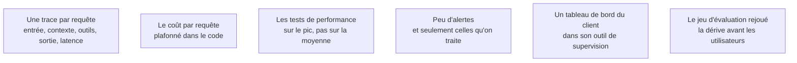

Un système d'IA n'a pas de comportement stable : il dérive avec son corpus, ses utilisateurs et les versions de modèle. Sans traces, aucun incident n'est reproductible, et l'équipe du client se retrouve face à une boîte noire qu'elle n'osera pas modifier.

## Ce qu'il faut savoir faire

- Tracer chaque requête : entrée, contexte récupéré, appels d'outils, sortie, latence, coût.
- Instrumenter le coût dès le premier jour et plafonner le budget **dans le code**, par requête et par session. Une boucle d'agent découverte le lendemain matin coûte plus que le reste du projet.
- Tester la performance sur volumes réels, y compris le pic : la clôture mensuelle, la reprise du lundi matin. Le volume moyen ne dit rien du dimensionnement.
- Ne garder que les alertes sur lesquelles quelqu'un agira. Une alerte que personne ne traite dégrade toutes les autres.
- Livrer un tableau de bord compréhensible par l'équipe du client, dans son outil de supervision à elle.
- Ajouter un identifiant de corrélation visible par l'utilisateur, affiché à côté de chaque réponse. Quand quelqu'un signale « le système a dit n'importe quoi », il permet de retrouver la trace exacte en dix secondes.

## Les notions mobilisées

- [[notions/observabilite]] — l'angle FDE est que l'observabilité est le premier élément du transfert de compétences, avant toute documentation.
- [[notions/cout-et-latence-inference]] — le client paiera la facture après le départ du FDE : le plafond est une contrainte de conception.
- [[notions/traitement-distribue]] — les pics d'un processus métier sont saisonniers et connus ; le dimensionnement se fait dessus.
- [[notions/integration-continue]] — les alertes et le rejeu périodique de l'évaluation vivent dans la même chaîne que les tests.
- [[notions/visualisation-de-donnees]] — un tableau de bord que l'équipe du client ne lit pas seule n'a pas été transféré.
- [[notions/evaluation-llm]] — rejoué périodiquement en production, il détecte la dérive avant les utilisateurs.

Exploitation et dérive en profondeur : [[roadmaps/08 - Roadmap — MLOps]].

> [!warning] Piège
> Brancher une plateforme d'observabilité externe sans validation. Les traces contiennent les prompts, donc les données du client — souvent personnelles, parfois sensibles. C'est un transfert de données à part entière, qui relève du même examen que le fournisseur de modèle, et beaucoup de missions se font arrêter là, en fin de parcours.
