La phase longue : livrer des briques résilientes **dans l'infrastructure du client**, les brancher sur des systèmes qui n'ont pas été conçus pour ça, faire valider la sécurité, et amener le tout jusqu'à des utilisateurs réels. La difficulté n'est presque jamais le modèle.

## Les six sujets

```mermaid
flowchart TD
  L["Livrer dans l'infrastructure du client<br/>sa chaîne, son registre, ses commissions"]
  I["Interfacer le patrimoine<br/>lire est négociable, écrire ne l'est pas"]
  S["Sécurité et garde-fous<br/>ce qui décide de l'autorisation"]
  M["Mise en service progressive<br/>un palier, une preuve"]
  E["Exploiter le système<br/>traces, coût, alertes utiles"]
  B["Boucle de retour produit<br/>observer l'usage, pas les déclarations"]

  click L "/parcours/forward-deployed-engineer/industrialisation/livrer-dans-l-infrastructure-du-client"
  click I "/parcours/forward-deployed-engineer/industrialisation/interfacer-le-patrimoine"
  click S "/parcours/forward-deployed-engineer/industrialisation/securite-et-garde-fous"
  click M "/parcours/forward-deployed-engineer/industrialisation/mise-en-service-progressive"
  click E "/parcours/forward-deployed-engineer/industrialisation/exploiter-le-systeme"
  click B "/parcours/forward-deployed-engineer/industrialisation/boucle-de-retour-produit"
```

**Porte de sortie** : des utilisateurs réels traitent des cas réels, et l'usage est mesuré. Une démonstration réussie ne franchit pas cette porte.

## Ma progression

- [ ] [[parcours/forward-deployed-engineer/industrialisation/livrer-dans-l-infrastructure-du-client|Livrer dans l'infrastructure du client]] — traverser la chaîne officielle dès la première semaine
- [ ] [[parcours/forward-deployed-engineer/industrialisation/interfacer-le-patrimoine|Interfacer le patrimoine]] — ERP, CRM, bases legacy, et le point dur de l'écriture
- [ ] [[parcours/forward-deployed-engineer/industrialisation/securite-et-garde-fous|Sécurité et garde-fous]] — droits appliqués à la récupération, injections, audit
- [ ] [[parcours/forward-deployed-engineer/industrialisation/mise-en-service-progressive|Mise en service progressive]] — assistance, autonomie bornée, élargissement
- [ ] [[parcours/forward-deployed-engineer/industrialisation/exploiter-le-systeme|Exploiter le système]] — traces, budget plafonné, tableau de bord du client
- [ ] [[parcours/forward-deployed-engineer/industrialisation/boucle-de-retour-produit|Boucle de retour produit]] — le retravail dit ce que les enquêtes taisent
