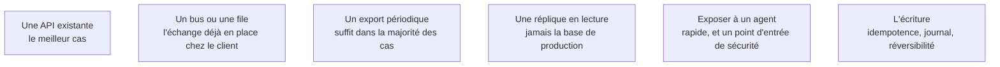

L'essentiel du travail d'intégration, et la principale source de mauvaises surprises. Ces systèmes ont dix à trente ans, leur documentation est partielle, et ils portent des données que toute l'organisation utilise. La règle qui structure tout : **lire est négociable, écrire ne l'est pas**.

## Ce qu'il faut savoir faire

- Choisir dans cet ordre : une API existante, un bus ou une file de messages, un export périodique, une réplique en lecture, et en dernier recours le pilotage d'interface.
- Ne jamais lire directement dans la base de production d'un ERP. Le risque de charge et de verrou n'est pas théorique, et c'est le meilleur moyen de se faire retirer ses accès.
- Interroger la fraîcheur réellement nécessaire avant de construire du temps réel : la réponse est souvent « la veille au soir ».
- Obtenir trois garanties avant toute écriture : idempotence — le même traitement rejoué ne duplique rien —, un journal de ce qui a été écrit, et un moyen de revenir en arrière.
- Prévoir la panne de la dépendance : file d'attente, dégradation, ou arrêt propre avec message clair. Le silence est la pire option.
- Vérifier par requête l'unicité et la stabilité du champ pivot, en phase 1. Dans un système patrimonial, l'identifiant supposé unique ne l'est pas toujours : doublons, réattributions, formats hérités de deux fusions successives.

## Les notions mobilisées

- [[notions/conception-d-api]] — l'angle FDE est que le connecteur sera consommé et repris par des gens qu'on ne verra jamais : il mérite plus de soin que la partie IA.
- [[notions/orchestration-de-flux]] — le bus et les traitements planifiés du client existent déjà ; s'y brancher coûte moins cher que d'installer un ordonnanceur de plus.
- [[notions/systemes-patrimoniaux]] — l'export nocturne est la stratégie d'interfaçage la plus sous-estimée et la plus souvent suffisante.
- [[notions/qualite-des-donnees]] — une réplique ne corrige rien : ce qui est faux en production est faux dans la copie.
- [[notions/mcp]] — la voie la plus rapide pour exposer un système interne à un agent, et un point d'entrée de sécurité à traiter comme tel.
- [[notions/tests-logiciels]] — l'idempotence ne se décrète pas, elle se teste en rejouant.

> [!tip] Ce qui débloque le propriétaire du système
> Faire valider le connecteur avant d'écrire la partie IA, en lui donnant ce qu'il veut : volume de requêtes, plage horaire, compte utilisé, comportement en cas d'erreur. Ces gens ont l'habitude qu'on leur impose des intégrations et qu'on leur laisse les incidents. Un FDE qui arrive avec une fiche d'intégration complète obtient en deux semaines ce que d'autres n'obtiennent pas en trois mois.
