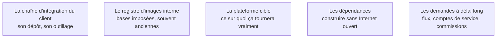

Niveau attendu : **autonomie**. Il faut savoir se conformer à une chaîne qu'on n'a pas conçue et la déboguer sans outillage ; l'autorité sur cette chaîne appartient aux équipes qui l'exploitent.

Ce qui sépare le FDE du prestataire classique, et ce qui rend la phase imprévisible : le chemin de livraison appartient au client, avec ses règles, ses délais et ses équipes. Un système qui ne se déploie pas par la chaîne officielle n'existera jamais en production.

## Ce qu'il faut savoir faire

- Utiliser l'outillage du client dès le premier jour : son dépôt, sa chaîne d'intégration, son registre d'images, son coffre à secrets.
- Traverser la chaîne complète jusqu'en production dès la première semaine, avec une fonctionnalité triviale. C'est un test du processus organisationnel, pas du code.
- Vérifier tôt la base d'image imposée par la sécurité : une dépendance qui exige une version récente de la bibliothèque système peut à elle seule imposer un contournement lourd.
- Recenser et poser immédiatement les demandes à délai long — ouverture de flux réseau, compte de service, habilitation, passage en commission. Elles sont sur le chemin critique.
- Se faire décrire le processus de mise en production d'une application existante par quelqu'un qui l'a subi. On y apprend en une heure ce que les documents de gouvernance ne disent pas : quelles commissions se réunissent tous les quinze jours, quel formulaire bloque, qui peut accélérer.

## Les notions mobilisées

- [[notions/integration-continue]] — l'angle FDE est que la chaîne doit tourner sur l'outillage du client : une chaîne bâtie sur un service qu'il n'utilise pas est inutilisable dès la fin de mission.
- [[notions/conteneurisation]] — l'image doit se construire hors ligne, depuis le registre interne, sans accès aux dépôts publics.
- [[notions/plateforme-de-deploiement]] — la cible n'est pas choisie par le FDE : c'est celle que l'équipe d'exploitation sait déjà opérer.
- [[notions/chaine-d-approvisionnement-logicielle]] — poids de modèles, SDK et serveurs d'outils tiers passent par la même revue que le reste, et ils la passent rarement du premier coup.
- [[notions/controle-d-acces]] — comptes de service et habilitations sont des délais avant d'être des mécanismes.

> [!warning] Piège
> Construire sur son propre hébergement « en attendant » que le client ouvre le sien. La migration n'est jamais anodine — identité, réseau, secrets, journalisation changent tous — et le provisoire dure jusqu'à la fin de mission, moment où il devient le problème de quelqu'un d'autre.
