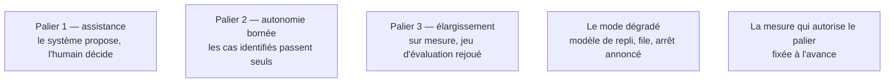

Niveau attendu : **autonomie**. Les paliers et la mesure qui les autorise se conçoivent seul et se défendent, mais franchir un palier reste une décision du client.

Commencer par la plus petite unité d'autonomie et n'ajouter une capacité qu'après avoir prouvé la précédente. C'est une méthode de gestion du risque technique, et tout autant du risque politique : chaque palier franchi produit une preuve publique.

## Ce qu'il faut savoir faire

- Commencer par l'assistance : le système prépare, propose, met en évidence ; l'humain valide. Coût d'erreur quasi nul, valeur souvent déjà substantielle.
- Passer à l'autonomie sur un sous-ensemble : les cas bien identifiés passent seuls, les autres sont routés vers l'humain, avec un critère de routage explicite et journalisé.
- Fixer à l'avance, pour chaque palier, son critère de franchissement et son retour arrière.
- Livrer le mode dégradé comme une fonctionnalité : ce que fait le système quand le fournisseur de modèle est indisponible ou trop lent.
- Faire du taux de rejet un paramètre de conception. Un système qui traite soixante-dix pour cent des cas et passe la main proprement est accepté ; un système qui traite tout avec huit pour cent d'erreurs silencieuses est retiré au premier incident.

## Les notions mobilisées

- [[notions/garde-fous]] — l'angle FDE est que « savoir dire je ne sais pas et router vers un humain » est une fonctionnalité à part entière, et celle qui décide de l'acceptation.
- [[notions/arbitrage-deterministe-probabiliste]] — le critère de routage est lui-même un arbitrage, et il gagne à être déterministe.
- [[notions/evaluation-llm]] — élargir le périmètre sans rejouer le jeu d'évaluation sur le nouveau périmètre revient à ne rien avoir mesuré.
- [[notions/observabilite]] — le mode dégradé ne vaut que si son déclenchement est visible.
- [[notions/metriques-evaluation-ml]] — le critère de franchissement est un chiffre, fixé avant d'être atteint.

> [!warning] Piège
> Confondre la démonstration et la mise en service. Une démonstration a un jeu de données choisi, un présentateur qui connaît les limites, et aucun enjeu. La mise en service a des utilisateurs pressés, des cas non anticipés et des conséquences — et le travail entre les deux, le client ne le voit pas et ne l'a donc pas prévu.
