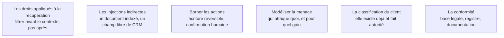

Niveau attendu : **autonomie**. Concevoir le filtrage, borner les actions et défendre le dossier se font seul ; l'autorisation de mise en service, elle, appartient au service sécurité du client.

C'est ce bloc qui décide si le système obtient l'autorisation de mise en service. Le service sécurité du client ne juge pas la qualité des réponses, il juge l'exposition.

## Ce qu'il faut savoir faire

- Appliquer les droits d'accès **à la récupération** : filtrer les documents avant qu'ils n'entrent dans le contexte. Demander au modèle de ne pas divulguer ce qu'on lui a donné n'est pas une mise en œuvre — c'est la faille la plus fréquente des systèmes documentaires en entreprise.
- Traiter l'injection indirecte comme le cas réaliste : le contenu hostile n'arrive pas par l'utilisateur mais par un document indexé, un courriel entrant, un champ libre.
- Borner les **actions** de l'agent et pas seulement ses mots : écriture réversible, périmètre de données limité, confirmation humaine sur les opérations irréversibles.
- Tenir un journal d'audit exploitable : qui a demandé quoi, quelles sources ont été utilisées, qu'a répondu le système. Exigé en cas d'incident, impossible à reconstituer après coup.
- Provoquer la revue de sécurité au milieu de la phase, pas à la fin, avec une architecture, une matrice de flux, la liste des données traitées et une suite de tests adverses rejouée en continu. Les équipes sécurité sont habituées à recevoir des dossiers vides très tard.
- Inscrire le système au registre interne et produire la documentation de conformité : cela fait partie du livrable, pas d'une démarche ultérieure.

## Les notions mobilisées

- [[notions/controle-d-acces]] — l'angle FDE est que l'identité de l'utilisateur doit se propager jusqu'à l'index, sinon aucun filtrage n'est possible.
- [[notions/injection-de-prompt]] — en entreprise, la surface d'entrée est le corpus, pas la barre de saisie.
- [[notions/garde-fous]] — le garde-fou qui compte en environnement client est celui qui borne ce que le système peut faire.
- [[notions/modelisation-de-la-menace]] — la revue de sécurité se prépare avec le vocabulaire du service sécurité : adversaires, surfaces, impact.
- [[notions/donnees-sensibles]] — s'y conformer plutôt qu'inventer une classification maison.
- [[notions/rgpd]] — base légale, finalité, durée de conservation et localisation du traitement, fournies au délégué dès la phase 1.
- [[notions/gouvernance-ia]] — l'inscription au registre et la classification du système relèvent du même dossier.

> [!warning] Piège
> Traiter les garde-fous comme une couche ajoutée à la fin. Certaines décisions d'architecture les rendent impossibles : un index sans métadonnées de droits ne pourra jamais appliquer un filtrage par utilisateur sans être reconstruit intégralement. La sécurité se conçoit à l'ingestion.
