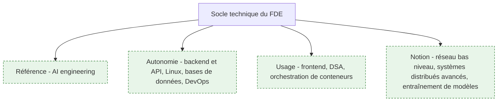
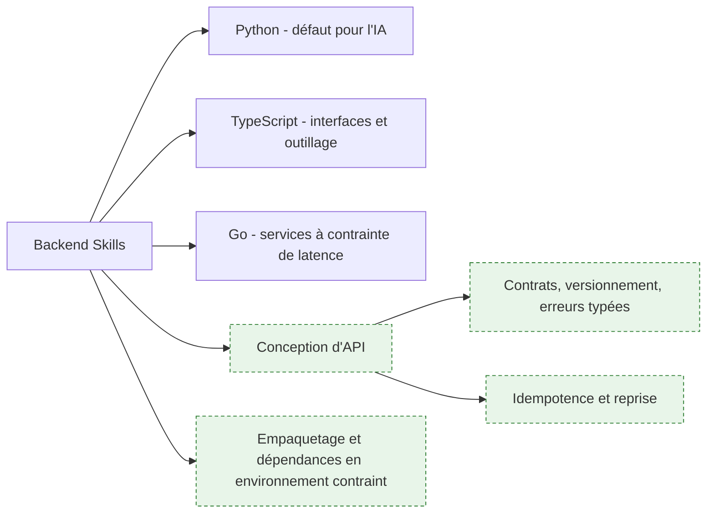
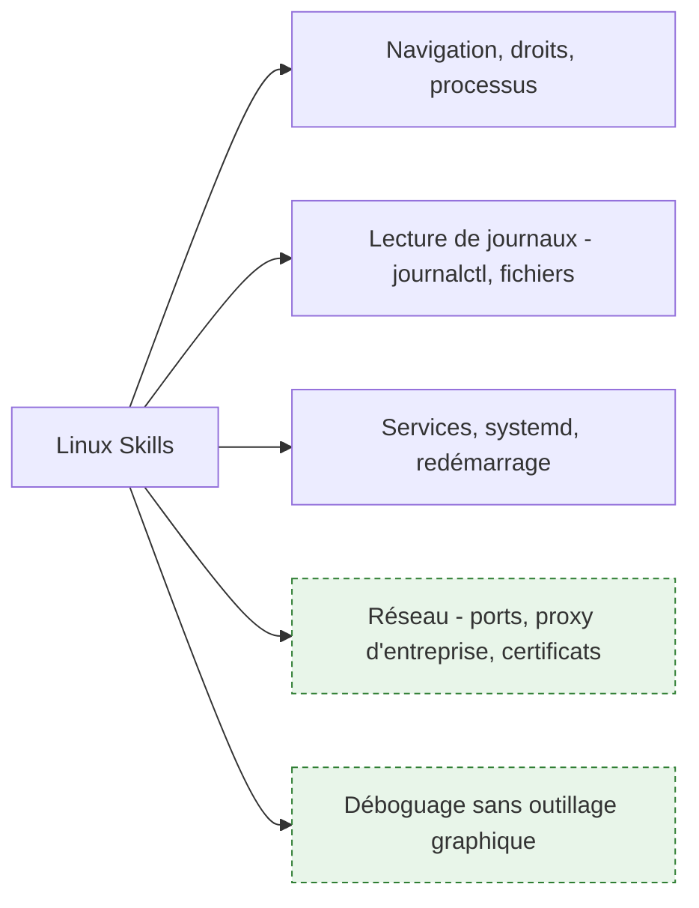
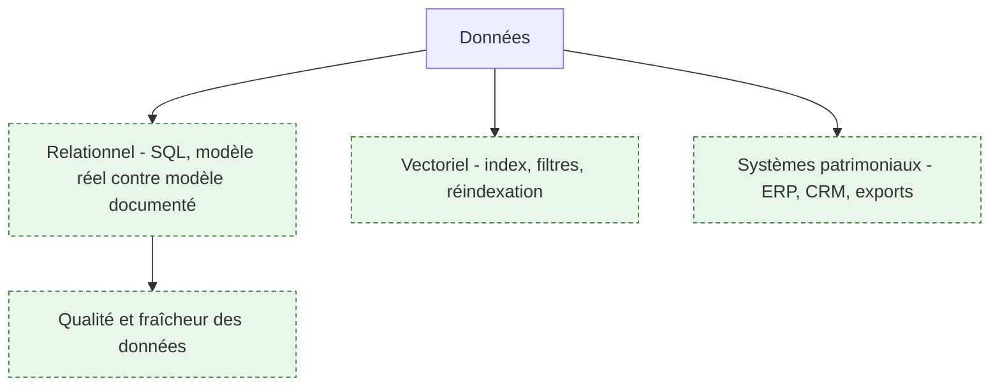
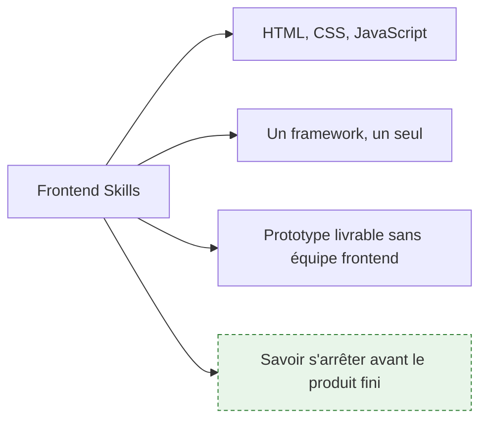
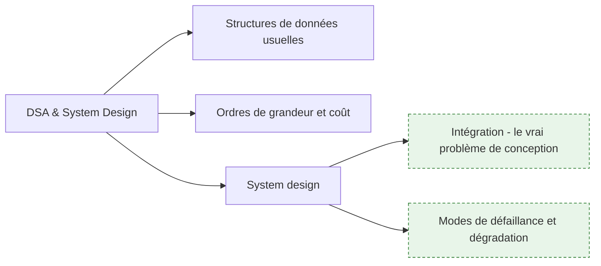
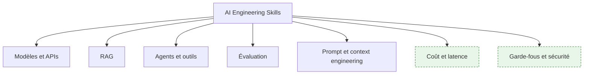
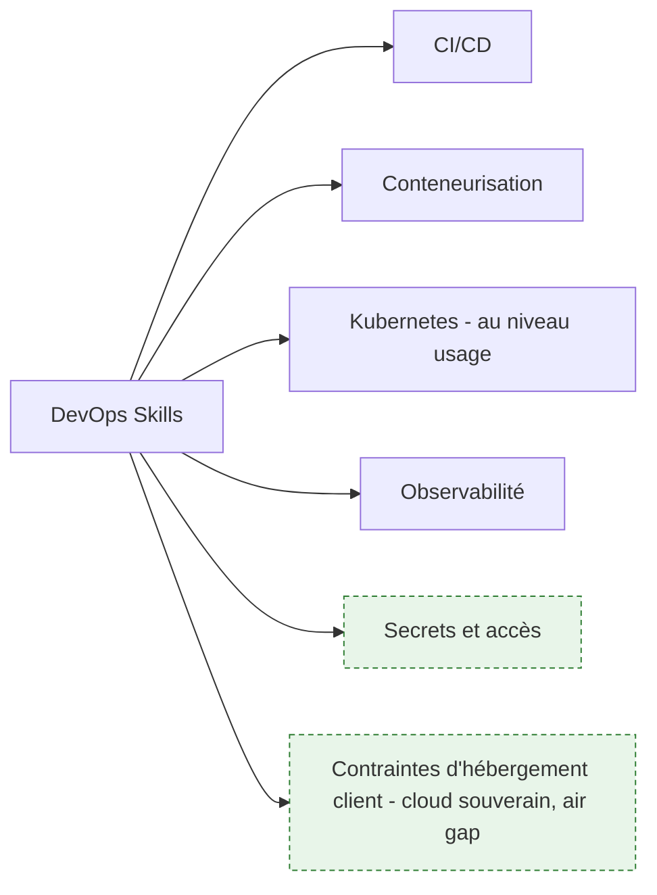

# Socle technique — et à quelle profondeur

> [!abstract] La roadmap amont réduit le socle technique à sept renvois vers d'autres roadmaps : Linux, frontend, backend, DSA, system design, AI engineering, DevOps. Renvoyer ne coûte rien et n'informe personne. Cette page dit, pour chaque domaine, **quelle profondeur est réellement attendue chez un FDE** — c'est la seule information utile, parce qu'un FDE qui vise partout le niveau maximum n'arrivera jamais sur le terrain.

**Source** : roadmap.sh/forward-deployed-engineer, capturée le 16 septembre 2026 · **Rédigée** le 16 septembre 2026
La liste des domaines vient de l'amont. Les niveaux de profondeur, l'échelle et les arbitrages sont des apports propres. Retour à [[parcours/forward-deployed-engineer/index|l'accueil du dossier]].

---

## L'échelle

Quatre niveaux, parce que « savoir Python » ne veut rien dire.

| Niveau | Ce que ça veut dire concrètement |
|---|---|
| **Notion** | Reconnaître le sujet dans une conversation, savoir qui appeler. Ne pas bloquer une réunion. |
| **Usage** | S'en servir sur un chemin balisé, documentation ouverte, sans inventer. |
| **Autonomie** | Concevoir, déboguer sous pression, arbitrer un compromis et le défendre. |
| **Référence** | Faire autorité dans la salle. Ce qu'on attend sur le cœur de métier, et nulle part ailleurs. |

| Domaine amont | Profondeur attendue | Pourquoi ce niveau et pas un autre |
|---|---|---|
| AI engineering | **Référence** | C'est ce pour quoi le client paie, et personne chez lui ne pourra corriger un mauvais arbitrage. |
| Backend et conception d'API | **Autonomie** | Le FDE livre le système complet, pas une brique qu'un autre intègre. |
| Linux | **Autonomie** | Le déboguage se fait souvent sur un serveur client, en SSH, sans outillage. |
| Bases de données relationnelles | **Autonomie** | Les données réelles y sont, et leur modèle est presque toujours plus sale que décrit. |
| Bases vectorielles | **Autonomie** | Indissociable du RAG, qui est le cas d'usage dominant des missions. |
| DevOps et CI/CD | **Autonomie** | Ce qui n'est pas déployable automatiquement ne survivra pas au départ du FDE. |
| Orchestration Kubernetes | **Usage** | Le client a déjà une plateforme et une équipe qui l'opère. S'y conformer suffit. |
| Frontend | **Usage** | Suffisant pour livrer une interface de démonstration crédible sans dépendre d'une autre équipe. |
| DSA et algorithmique | **Usage** | Sert à évaluer un coût et à déboguer une lenteur, pas à réinventer un index. |
| System design | **Autonomie** | Chaque mission est un problème d'intégration, donc un problème de conception système. |
| Entraînement de modèles | **Notion** | Hors périmètre réel. Un FDE qui entraîne un modèle a raté un arbitrage en amont. |

---

## 1. Langages, backend et conception d'API

**À quoi ça sert.** Le brief demande « un développement backend robuste » en Python, TypeScript ou Go. Sur le terrain, la difficulté n'est presque jamais le langage : c'est de livrer un service qui redémarre proprement, journalise assez pour être diagnostiqué à distance, et dont les dépendances s'installent dans un environnement où le dépôt public est filtré par un proxy d'entreprise. Un FDE écrit peu de code très sophistiqué et beaucoup de code très défensif.

**Ce qu'il faut savoir**

- Python est le défaut, parce que tout l'écosystème IA y est. TypeScript devient nécessaire dès qu'il faut une interface ou un outil interne. Go se justifie quand une contrainte de latence ou d'empreinte mémoire est explicite — pas par goût.
- Un seul langage maîtrisé à fond bat trois langages approximatifs. Le second sert à lire le code du client, pas à écrire le sien.
- Conception d'API — voir [[notions/conception-d-api]]. Pour un FDE, l'angle est le contrat : l'API qu'il expose sera consommée par des équipes qu'il ne verra jamais et qui ne liront pas sa documentation.
- Idempotence et reprise sur erreur : un traitement qui ne peut pas être rejoué à l'identique deviendra un incident dès la première coupure réseau.
- Empaquetage — versions figées, image reproductible, aucune installation qui suppose un accès Internet non filtré. Voir [[notions/conteneurisation]].
- Tests — voir [[notions/tests-logiciels]]. L'angle FDE : les tests sont la seule documentation que le client relira, parce qu'elle échoue quand elle ment.

> [!tip] Ajout 2026
> Écris le code comme s'il devait être repris par quelqu'un de moins spécialisé que toi, parce que c'est exactement ce qui va arriver. Une abstraction élégante que l'équipe cliente ne sait pas modifier est une dette que tu laisses derrière toi. Le critère n'est pas « est-ce bien écrit », c'est « est-ce que l'équipe d'exploitation du client saura le corriger un mardi soir ».

> [!warning] Piège
> Arriver avec sa stack préférée. Si le client tourne en Java depuis quinze ans et n'a personne pour maintenir du Python, un service Python impeccable est une impasse organisationnelle. Le choix de langage se fait sur la capacité de reprise du client, pas sur la productivité du FDE.

---

## 2. Linux et systèmes

**À quoi ça sert.** L'amont le formule bien : la plupart des logiciels de production tournent sous Linux. Pour un FDE, la précision qui compte est ailleurs — le serveur sur lequel il débogue n'est pas le sien. Pas d'agent d'observabilité installé, pas de droits d'administration, un proxy qui coupe la moitié des requêtes sortantes et un certificat interne que rien ne reconnaît. Le niveau utile est donc celui du diagnostic en environnement hostile, pas celui de l'administration système.

**Ce qu'il faut savoir**

- Lire un journal, suivre un processus, identifier ce qui consomme la mémoire, retrouver quel port écoute quoi : le minimum vital, en ligne de commande, sans installer d'outil.
- Proxy d'entreprise et certificats internes — la première demi-journée d'une mission passe très souvent là. Savoir configurer les variables d'environnement de proxy et injecter un certificat racine dans un conteneur fait gagner un jour entier.
- Droits et comptes de service : demander le bon niveau d'accès dès le premier jour, parce que l'obtenir prend des semaines dans une grande organisation.
- Fondations système et réseau si elles manquent : [[roadmaps/01 - Roadmap — Computer Science]].

> [!tip] Ajout 2026
> Prépare une trousse de diagnostic qui tient dans un conteneur unique et ne demande aucune installation sur l'hôte : un shell, les outils réseau de base, un client de base de données. Les environnements clients verrouillés sont la norme et non l'exception ; arriver avec un moyen de travailler sans droits d'administration change le rythme des trois premiers jours.

> [!warning] Piège
> Développer contre son poste et découvrir l'environnement client à la livraison. L'écart se paie toujours, et il se paie sur des détails idiots : une version de bibliothèque système, un fuseau horaire, un encodage de fichier, une politique de mot de passe sur la base. Obtenir un accès à un environnement représentatif fait partie du cadrage, pas de la livraison.

---

## 3. Données : relationnel, vectoriel, patrimonial

**À quoi ça sert.** Le brief place la manipulation de bases relationnelles et vectorielles dans les domaines d'expertise requis, et l'amont n'en parle pas du tout. C'est pourtant là que la plupart des missions se jouent : la qualité d'un système de récupération documentaire est plafonnée par la qualité des données qu'on lui donne, et personne chez le client ne connaît l'état réel de ses données. Le schéma documenté et le contenu effectif divergent toujours.

**Ce qu'il faut savoir**

- SQL au niveau autonomie — voir [[notions/sql]]. L'angle FDE : la première requête utile n'est pas métier, c'est un inventaire. Combien de lignes, depuis quand, combien de nulls, quelles valeurs distinctes sur les colonnes censées être normalisées.
- Bases vectorielles — voir [[notions/embeddings-et-bases-vectorielles]]. Angle FDE : choisir celle qui vit déjà dans l'infrastructure du client plutôt que la meilleure sur le papier, parce que c'est une base de plus à sauvegarder et à superviser pour son équipe.
- Systèmes patrimoniaux — voir [[notions/systemes-patrimoniaux]]. Traité en profondeur dans [[parcours/forward-deployed-engineer/industrialisation]].
- Qualité des données — voir [[notions/qualite-des-donnees]]. Angle FDE : le diagnostic qualité est un livrable de la phase d'audit, et souvent le premier résultat qui impressionne le client, avant toute IA.

> [!tip] Ajout 2026
> Sur la moitié des missions, le premier livrable réellement utile n'est pas un système d'IA : c'est le constat chiffré que la donnée sur laquelle tout le monde s'appuyait n'est renseignée qu'à soixante pour cent. Ce constat est pénible à annoncer et c'est ce qui crée la confiance, parce qu'il démontre qu'on a regardé.

> [!warning] Piège
> Prendre pour argent comptant la description du modèle de données fournie par la DSI. Elle décrit l'intention d'origine, pas quinze ans d'usages détournés — le champ « commentaire » qui porte en réalité un code de statut, la table archivée que trois traitements écrivent encore. Vérifier par requête, systématiquement, avant de concevoir quoi que ce soit.

---

## 4. Frontend

**À quoi ça sert.** L'amont vise juste : un FDE capable de produire une interface fonctionnelle est autonome dans un engagement, il livre une démonstration de bout en bout sans dépendre d'une équipe frontend. Ce qu'il ne dit pas, c'est que l'interface sert d'abord d'instrument de cadrage. Montrer un écran, même grossier, fait sortir en dix minutes des exigences que trois ateliers de recueil n'ont pas révélées — parce que les gens critiquent mieux qu'ils ne décrivent.

**Ce qu'il faut savoir**

- Le niveau utile est celui du prototype crédible : un écran, un formulaire, un affichage de résultat avec ses sources. Pas de système de design, pas d'accessibilité aux normes, pas de compatibilité multi-navigateur — sauf si c'est explicitement dans le périmètre.
- Un seul framework, celui qu'on connaît. Ce n'est pas le lieu pour apprendre.
- Les outils de génération d'interface par LLM ont rendu cette étape beaucoup moins coûteuse. Le bénéfice est réel sur le prototype, nul sur la maintenabilité.
- Dire dès le départ ce qu'est le prototype et ce qu'il n'est pas, par écrit.

> [!tip] Ajout 2026
> Le prototype d'interface est un outil de cadrage déguisé en livrable. L'utiliser comme tel — le montrer tôt, le montrer laid, le jeter ensuite — est plus efficace qu'un atelier de recueil de besoin supplémentaire. La condition est d'annoncer explicitement qu'il sera jeté, sinon il finit en production.

> [!warning] Piège
> Le prototype qui part en production parce qu'« il marche déjà ». C'est l'un des scénarios d'échec les plus courants du métier : la dette est invisible pour le client, qui a vu quelque chose de fonctionnel, et le FDE passe le reste de la mission à colmater une base jetable. La parade est contractuelle et non technique : écrire noir sur blanc ce qui est prototype, dans le compte rendu, dès le premier jour.

---

## 5. Algorithmique et conception système

**À quoi ça sert.** L'amont justifie l'algorithmique par la capacité à évaluer la performance d'un code et à déboguer les inefficacités d'un système client. C'est exact et c'est limité : un FDE n'écrit pratiquement jamais un algorithme non trivial. En revanche il conçoit des systèmes d'intégration en permanence, et c'est là que le niveau doit être élevé — un système d'IA en environnement client est un problème de couplage, de mode dégradé et de reprise, pas un problème de complexité algorithmique.

**Ce qu'il faut savoir**

- Le niveau algorithmique utile : savoir dire pourquoi un traitement met huit heures, et le ramener à vingt minutes. Presque toujours une requête dans une boucle, jamais un choix de structure de données exotique.
- Conception système au niveau autonomie : file d'attente ou appel synchrone, traitement par lot ou au fil de l'eau, où placer l'état, comment rejouer.
- Les modes de défaillance d'abord : que se passe-t-il quand le fournisseur de modèle répond en douze secondes, quand l'ERP est en maintenance, quand le corpus double. Un système d'IA sans mode dégradé explicite s'arrête avec son dépendance la plus fragile.
- Les entretiens du métier portent souvent sur ce bloc, avec un exercice de conception sous contrainte client plutôt qu'un exercice algorithmique classique — pratique rapportée dans les guides d'entretien disponibles, à prendre comme telle.

> [!tip] Ajout 2026
> La question de conception qui revient le plus souvent en mission n'est pas « quelle architecture » mais « synchrone ou asynchrone ». Un assistant qui répond en quatre secondes est utilisable ; le même traitement en lot de nuit change complètement le produit, le coût et l'acceptation par les utilisateurs. Trancher explicitement, tôt, et le noter comme une décision d'architecture.

> [!warning] Piège
> Concevoir pour une charge imaginaire. Le volume réel d'une mission FDE est presque toujours modeste — quelques milliers de documents, quelques dizaines d'utilisateurs — et l'effort de conception doit aller à la robustesse d'intégration, pas à la montée en charge. Une architecture distribuée sur un cas à trente utilisateurs est une faute de cadrage, pas une précaution.

---

## 6. AI engineering — le cœur

**À quoi ça sert.** C'est le seul domaine où le niveau attendu est celui de la référence. Non pas parce qu'il serait plus noble, mais parce que c'est le seul où le client n'a personne pour rattraper une erreur du FDE. Un mauvais choix de découpage documentaire ou un jeu d'évaluation absent ne se voient pas à la livraison ; ils se voient six mois plus tard, quand plus personne ne sait pourquoi le système s'est dégradé.

**Ce qu'il faut savoir**

- Le contenu complet est dans [[roadmaps/05 - Roadmap — AI Engineer]] et [[roadmaps/07 - Roadmap — AI Agents]]. Rien de ce qui suit ne les remplace.
- [[notions/rag]] — angle FDE : le corpus client est toujours plus sale que prévu, et l'essentiel du travail est dans l'ingestion, pas dans la génération.
- [[notions/agents-llm]] — angle FDE : commencer par la plus petite unité d'autonomie qui apporte de la valeur, et n'ajouter une capacité qu'une fois la précédente prouvée. C'est ce que dit l'amont, et c'est le meilleur conseil de la roadmap.
- [[notions/evaluation-llm]] — angle FDE : le jeu d'évaluation est autant un outil technique qu'un instrument de négociation, parce qu'il transforme « je trouve que ça marche mal » en un chiffre discutable.
- [[notions/mcp]] — angle FDE : le moyen le plus rapide d'exposer proprement un système interne à un agent, et un point d'entrée de sécurité à traiter comme tel.
- [[notions/choix-de-modele]] et [[notions/cout-et-latence-inference]] — angle FDE : le client paiera la facture après le départ du FDE, donc le coût unitaire est une contrainte de conception, pas une optimisation.
- [[notions/affinage-de-modele]] — angle FDE : presque jamais justifié en mission, et il laisse une dette de ré-entraînement que le client ne saura pas porter.

> [!tip] Ajout 2026
> La compétence qui distingue vraiment un FDE d'un AI Engineer sur ce bloc n'est pas technique : c'est de savoir dire que l'IA n'est pas la réponse. L'amont le formule dans sa section communication — « savoir dire quand l'IA n'est pas la bonne réponse » — et c'est la phrase la plus importante de toute la roadmap. Elle est développée dans [[parcours/forward-deployed-engineer/arbitrage-technologique]].

> [!warning] Piège
> Livrer un système d'IA sans jeu d'évaluation parce que la mission est courte. C'est l'inverse : plus la mission est courte, plus l'évaluation est indispensable, parce qu'elle est le seul artefact qui permettra au client de juger une évolution après le départ du FDE. Sans elle, le système devient intouchable et meurt à la première montée de version du modèle.

---

## 7. DevOps et exploitation

**À quoi ça sert.** Le nœud DevOps de l'amont est le seul de la roadmap à ne porter aucun contenu ni aucune ressource. C'est dommage, parce que c'est ce bloc qui décide si le système survit au départ du FDE. Tout ce qui se déploie à la main mourra ; tout ce qui n'est pas observable deviendra une boîte noire que personne n'osera toucher.

**Ce qu'il faut savoir**

- [[notions/integration-continue]] — angle FDE : la chaîne de livraison doit tourner sur **l'outillage du client**, GitLab interne, Jenkins vieillissant ou autre. Une chaîne construite sur un service que le client n'utilise pas est inutilisable dès la fin de mission.
- [[notions/conteneurisation]] — angle FDE : l'image doit se construire sans accès Internet ouvert, en partant du registre interne, et les bases d'images imposées par la sécurité du client sont rarement récentes.
- Kubernetes au niveau usage : déployer sur la plateforme existante, lire les événements, comprendre un plantage en boucle. L'exploiter est le métier de l'équipe cliente.
- [[notions/observabilite]] — angle FDE : traces par requête, coût par requête, et un tableau de bord que l'équipe cliente comprend sans le FDE. Développé dans [[parcours/forward-deployed-engineer/industrialisation]].
- Secrets : jamais dans le dépôt, jamais dans une variable d'environnement en clair sur un poste partagé. Le coffre du client, même s'il est pénible.
- Exploitation et dérive, en profondeur : [[roadmaps/08 - Roadmap — MLOps]].

> [!tip] Ajout 2026
> Déploie en production dès la première semaine, même une fonctionnalité triviale. Traverser la chaîne complète — validation sécurité, registre d'images, ouverture de flux réseau, mise en service — révèle les blocages organisationnels alors qu'il reste du temps pour les traiter. Faire cette traversée à la fin de la mission est le moyen le plus fiable de ne jamais mettre en service.

> [!warning] Piège
> Considérer l'accès et la conformité comme des formalités administratives. Dans une grande organisation, l'ouverture d'un flux réseau ou la validation d'un traitement de données personnelles se comptent en semaines. Ces délais appartiennent au chemin critique de la mission et doivent figurer dans le planning dès le cadrage, au même titre que le développement.
