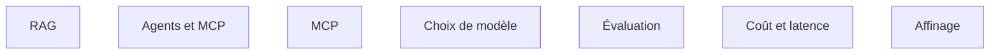

Niveau attendu : **référence**. C'est ce pour quoi le client paie, et personne chez lui ne pourra rattraper un mauvais arbitrage.

**À quoi ça sert.** C'est le seul domaine où le niveau attendu est celui de la référence. Non pas parce qu'il serait plus noble, mais parce que c'est le seul où le client n'a personne pour rattraper une erreur du FDE. Un mauvais choix de découpage documentaire ou un jeu d'évaluation absent ne se voient pas à la livraison ; ils se voient six mois plus tard, quand plus personne ne sait pourquoi le système s'est dégradé.

**Ce qu'il faut savoir**

- Le contenu complet est dans [[parcours/ai-engineer/index|AI Engineer]] et [[parcours/ai-agents/index|AI Agents]]. Rien de ce qui suit ne les remplace.
- [[notions/rag]] — angle FDE : le corpus client est toujours plus sale que prévu, et l'essentiel du travail est dans l'ingestion, pas dans la génération.
- [[notions/agents-llm]] — angle FDE : commencer par la plus petite unité d'autonomie qui apporte de la valeur, et n'ajouter une capacité qu'une fois la précédente prouvée. C'est ce que dit l'amont, et c'est le meilleur conseil de la roadmap.
- [[notions/evaluation-llm]] — angle FDE : le jeu d'évaluation est autant un outil technique qu'un instrument de négociation, parce qu'il transforme « je trouve que ça marche mal » en un chiffre discutable.
- [[notions/mcp]] — angle FDE : le moyen le plus rapide d'exposer proprement un système interne à un agent, et un point d'entrée de sécurité à traiter comme tel.
- [[notions/choix-de-modele]] et [[notions/cout-et-latence-inference]] — angle FDE : le client paiera la facture après le départ du FDE, donc le coût unitaire est une contrainte de conception, pas une optimisation.
- [[notions/affinage-de-modele]] — angle FDE : presque jamais justifié en mission, et il laisse une dette de ré-entraînement que le client ne saura pas porter.

> [!tip] Ajout 2026
> La compétence qui distingue vraiment un FDE d'un AI Engineer sur ce bloc n'est pas technique : c'est de savoir dire que l'IA n'est pas la réponse. L'amont le formule dans sa section communication — « savoir dire quand l'IA n'est pas la bonne réponse » — et c'est la phrase la plus importante de toute la roadmap. Elle est développée dans [[parcours/forward-deployed-engineer/arbitrage-technologique/index]].

> [!warning] Piège
> Livrer un système d'IA sans jeu d'évaluation parce que la mission est courte. C'est l'inverse : plus la mission est courte, plus l'évaluation est indispensable, parce qu'elle est le seul artefact qui permettra au client de juger une évolution après le départ du FDE. Sans elle, le système devient intouchable et meurt à la première montée de version du modèle.
