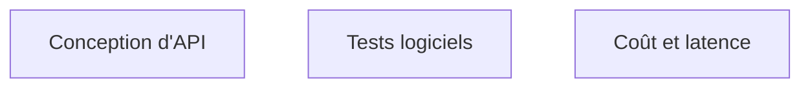

Niveau attendu : **usage**. Sert à chiffrer un coût et à déboguer une lenteur, pas à réinventer un index.

**À quoi ça sert.** L'amont justifie l'algorithmique par la capacité à évaluer la performance d'un code et à déboguer les inefficacités d'un système client. C'est exact et c'est limité : un FDE n'écrit pratiquement jamais un algorithme non trivial. En revanche il conçoit des systèmes d'intégration en permanence, et c'est là que le niveau doit être élevé — un système d'IA en environnement client est un problème de couplage, de mode dégradé et de reprise, pas un problème de complexité algorithmique.

**Ce qu'il faut savoir**

- Le niveau algorithmique utile : savoir dire pourquoi un traitement met huit heures, et le ramener à vingt minutes. Presque toujours une requête dans une boucle, jamais un choix de structure de données exotique.
- Conception système au niveau autonomie : file d'attente ou appel synchrone, traitement par lot ou au fil de l'eau, où placer l'état, comment rejouer.
- Les modes de défaillance d'abord : que se passe-t-il quand le fournisseur de modèle répond en douze secondes, quand l'ERP est en maintenance, quand le corpus double. Un système d'IA sans mode dégradé explicite s'arrête avec son dépendance la plus fragile.
- Les entretiens du métier portent souvent sur ce bloc, avec un exercice de conception sous contrainte client plutôt qu'un exercice algorithmique classique — pratique rapportée dans les guides d'entretien disponibles, à prendre comme telle.

> [!tip] Ajout 2026
> La question de conception qui revient le plus souvent en mission n'est pas « quelle architecture » mais « synchrone ou asynchrone ». Un assistant qui répond en quatre secondes est utilisable ; le même traitement en lot de nuit change complètement le produit, le coût et l'acceptation par les utilisateurs. Trancher explicitement, tôt, et le noter comme une décision d'architecture.

> [!warning] Piège
> Concevoir pour une charge imaginaire. Le volume réel d'une mission FDE est presque toujours modeste — quelques milliers de documents, quelques dizaines d'utilisateurs — et l'effort de conception doit aller à la robustesse d'intégration, pas à la montée en charge. Une architecture distribuée sur un cas à trente utilisateurs est une faute de cadrage, pas une précaution.
