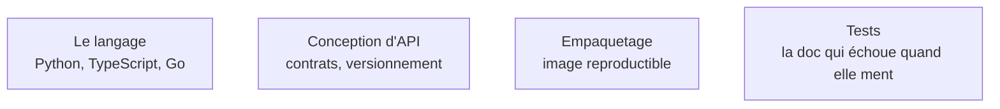

Niveau attendu : **autonomie**. Le FDE livre le système complet, pas une brique qu'un autre intègre.

## Ce qu'il faut savoir faire

- Livrer un service qui redémarre proprement et journalise assez pour être diagnostiqué à distance, sans accès graphique.
- Installer ses dépendances dans un environnement où le dépôt public est filtré par un proxy d'entreprise.
- Rendre un traitement rejouable à l'identique : ce qui ne l'est pas deviendra un incident à la première coupure réseau.
- Choisir le langage sur la capacité de reprise du client, pas sur sa propre productivité.

## Les notions mobilisées

- [[notions/python-pour-la-data]] — Python est le défaut parce que tout l'écosystème IA y est. Un seul langage maîtrisé à fond bat trois langages approximatifs ; le second sert à lire le code du client.
- [[notions/conception-d-api]] — l'angle FDE est le contrat : l'API sera consommée par des équipes qu'il ne verra jamais et qui ne liront pas sa documentation.
- [[notions/conteneurisation]] — versions figées, image reproductible, aucune installation qui suppose un accès Internet non filtré.
- [[notions/tests-logiciels]] — la seule documentation que le client relira, parce qu'elle échoue quand elle ment.

> [!warning] Piège
> Arriver avec sa pile préférée. Si le client tourne en Java depuis quinze ans et n'a personne pour maintenir du Python, un service Python impeccable est une impasse organisationnelle.

> [!tip] Le critère qui tranche
> Écris le code comme s'il devait être repris par quelqu'un de moins spécialisé que toi, parce que c'est exactement ce qui va arriver. La question n'est pas « est-ce bien écrit », c'est « est-ce que l'équipe d'exploitation du client saura le corriger un mardi soir ».
