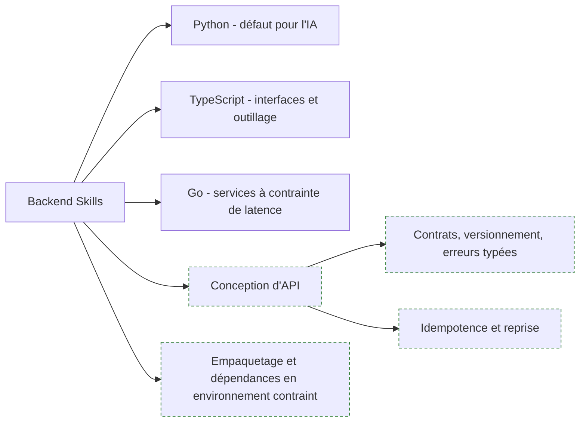

**À quoi ça sert.** Le brief demande « un développement backend robuste » en Python, TypeScript ou Go. Sur le terrain, la difficulté n'est presque jamais le langage : c'est de livrer un service qui redémarre proprement, journalise assez pour être diagnostiqué à distance, et dont les dépendances s'installent dans un environnement où le dépôt public est filtré par un proxy d'entreprise. Un FDE écrit peu de code très sophistiqué et beaucoup de code très défensif.

**Ce qu'il faut savoir**

- Python est le défaut, parce que tout l'écosystème IA y est. TypeScript devient nécessaire dès qu'il faut une interface ou un outil interne. Go se justifie quand une contrainte de latence ou d'empreinte mémoire est explicite — pas par goût.
- Un seul langage maîtrisé à fond bat trois langages approximatifs. Le second sert à lire le code du client, pas à écrire le sien.
- Conception d'API — voir [[notions/conception-d-api]]. Pour un FDE, l'angle est le contrat : l'API qu'il expose sera consommée par des équipes qu'il ne verra jamais et qui ne liront pas sa documentation.
- Idempotence et reprise sur erreur : un traitement qui ne peut pas être rejoué à l'identique deviendra un incident dès la première coupure réseau.
- Empaquetage — versions figées, image reproductible, aucune installation qui suppose un accès Internet non filtré. Voir [[notions/conteneurisation]].
- Tests — voir [[notions/tests-logiciels]]. L'angle FDE : les tests sont la seule documentation que le client relira, parce qu'elle échoue quand elle ment.

> [!tip] Ajout 2026
> Écris le code comme s'il devait être repris par quelqu'un de moins spécialisé que toi, parce que c'est exactement ce qui va arriver. Une abstraction élégante que l'équipe cliente ne sait pas modifier est une dette que tu laisses derrière toi. Le critère n'est pas « est-ce bien écrit », c'est « est-ce que l'équipe d'exploitation du client saura le corriger un mardi soir ».

> [!warning] Piège
> Arriver avec sa stack préférée. Si le client tourne en Java depuis quinze ans et n'a personne pour maintenir du Python, un service Python impeccable est une impasse organisationnelle. Le choix de langage se fait sur la capacité de reprise du client, pas sur la productivité du FDE.
