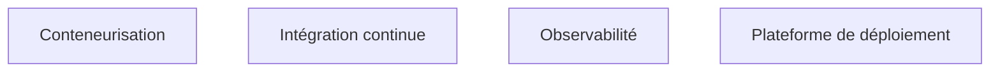

**À quoi ça sert.** Le nœud DevOps de l'amont est le seul de la roadmap à ne porter aucun contenu ni aucune ressource. C'est dommage, parce que c'est ce bloc qui décide si le système survit au départ du FDE. Tout ce qui se déploie à la main mourra ; tout ce qui n'est pas observable deviendra une boîte noire que personne n'osera toucher.

**Ce qu'il faut savoir**

- [[notions/integration-continue]] — angle FDE : la chaîne de livraison doit tourner sur **l'outillage du client**, GitLab interne, Jenkins vieillissant ou autre. Une chaîne construite sur un service que le client n'utilise pas est inutilisable dès la fin de mission.
- [[notions/conteneurisation]] — angle FDE : l'image doit se construire sans accès Internet ouvert, en partant du registre interne, et les bases d'images imposées par la sécurité du client sont rarement récentes.
- Kubernetes au niveau usage : déployer sur la plateforme existante, lire les événements, comprendre un plantage en boucle. L'exploiter est le métier de l'équipe cliente.
- [[notions/observabilite]] — angle FDE : traces par requête, coût par requête, et un tableau de bord que l'équipe cliente comprend sans le FDE. Développé dans [[parcours/forward-deployed-engineer/industrialisation/index]].
- Secrets : jamais dans le dépôt, jamais dans une variable d'environnement en clair sur un poste partagé. Le coffre du client, même s'il est pénible.
- Exploitation et dérive, en profondeur : [[parcours/mlops/supervision-et-derive]].

> [!tip] Ajout 2026
> Déploie en production dès la première semaine, même une fonctionnalité triviale. Traverser la chaîne complète — validation sécurité, registre d'images, ouverture de flux réseau, mise en service — révèle les blocages organisationnels alors qu'il reste du temps pour les traiter. Faire cette traversée à la fin de la mission est le moyen le plus fiable de ne jamais mettre en service.

> [!warning] Piège
> Considérer l'accès et la conformité comme des formalités administratives. Dans une grande organisation, l'ouverture d'un flux réseau ou la validation d'un traitement de données personnelles se comptent en semaines. Ces délais appartiennent au chemin critique de la mission et doivent figurer dans le planning dès le cadrage, au même titre que le développement.
