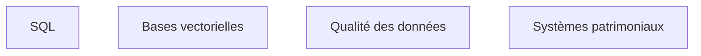

**À quoi ça sert.** Le brief place la manipulation de bases relationnelles et vectorielles dans les domaines d'expertise requis, et l'amont n'en parle pas du tout. C'est pourtant là que la plupart des missions se jouent : la qualité d'un système de récupération documentaire est plafonnée par la qualité des données qu'on lui donne, et personne chez le client ne connaît l'état réel de ses données. Le schéma documenté et le contenu effectif divergent toujours.

**Ce qu'il faut savoir**

- SQL au niveau autonomie — voir [[notions/sql]]. L'angle FDE : la première requête utile n'est pas métier, c'est un inventaire. Combien de lignes, depuis quand, combien de nulls, quelles valeurs distinctes sur les colonnes censées être normalisées.
- Bases vectorielles — voir [[notions/embeddings-et-bases-vectorielles]]. Angle FDE : choisir celle qui vit déjà dans l'infrastructure du client plutôt que la meilleure sur le papier, parce que c'est une base de plus à sauvegarder et à superviser pour son équipe.
- Systèmes patrimoniaux — voir [[notions/systemes-patrimoniaux]]. Traité en profondeur dans [[parcours/forward-deployed-engineer/industrialisation/index]].
- Qualité des données — voir [[notions/qualite-des-donnees]]. Angle FDE : le diagnostic qualité est un livrable de la phase d'audit, et souvent le premier résultat qui impressionne le client, avant toute IA.

> [!tip] Ajout 2026
> Sur la moitié des missions, le premier livrable réellement utile n'est pas un système d'IA : c'est le constat chiffré que la donnée sur laquelle tout le monde s'appuyait n'est renseignée qu'à soixante pour cent. Ce constat est pénible à annoncer et c'est ce qui crée la confiance, parce qu'il démontre qu'on a regardé.

> [!warning] Piège
> Prendre pour argent comptant la description du modèle de données fournie par la DSI. Elle décrit l'intention d'origine, pas quinze ans d'usages détournés — le champ « commentaire » qui porte en réalité un code de statut, la table archivée que trois traitements écrivent encore. Vérifier par requête, systématiquement, avant de concevoir quoi que ce soit.
