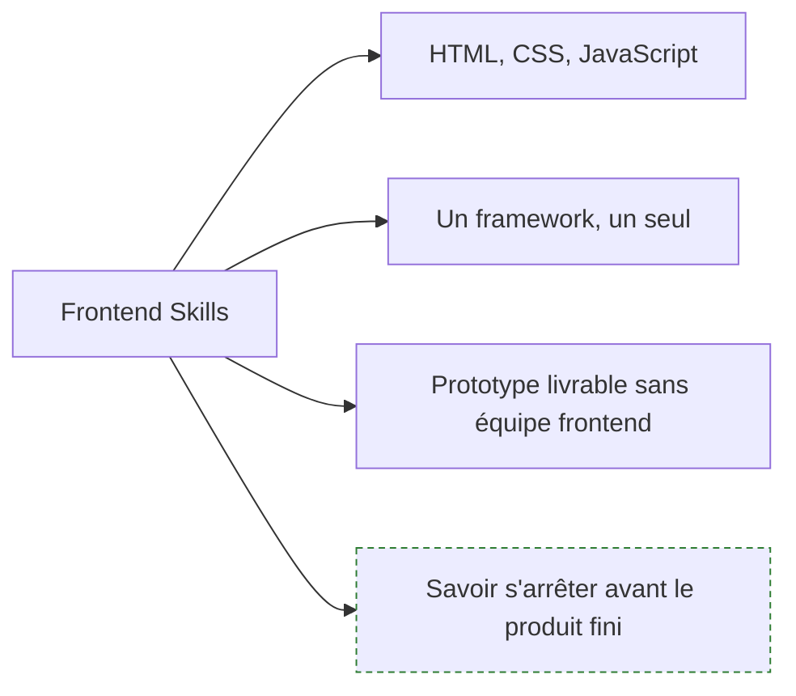

**À quoi ça sert.** L'amont vise juste : un FDE capable de produire une interface fonctionnelle est autonome dans un engagement, il livre une démonstration de bout en bout sans dépendre d'une équipe frontend. Ce qu'il ne dit pas, c'est que l'interface sert d'abord d'instrument de cadrage. Montrer un écran, même grossier, fait sortir en dix minutes des exigences que trois ateliers de recueil n'ont pas révélées — parce que les gens critiquent mieux qu'ils ne décrivent.

**Ce qu'il faut savoir**

- Le niveau utile est celui du prototype crédible : un écran, un formulaire, un affichage de résultat avec ses sources. Pas de système de design, pas d'accessibilité aux normes, pas de compatibilité multi-navigateur — sauf si c'est explicitement dans le périmètre.
- Un seul framework, celui qu'on connaît. Ce n'est pas le lieu pour apprendre.
- Les outils de génération d'interface par LLM ont rendu cette étape beaucoup moins coûteuse. Le bénéfice est réel sur le prototype, nul sur la maintenabilité.
- Dire dès le départ ce qu'est le prototype et ce qu'il n'est pas, par écrit.

> [!tip] Ajout 2026
> Le prototype d'interface est un outil de cadrage déguisé en livrable. L'utiliser comme tel — le montrer tôt, le montrer laid, le jeter ensuite — est plus efficace qu'un atelier de recueil de besoin supplémentaire. La condition est d'annoncer explicitement qu'il sera jeté, sinon il finit en production.

> [!warning] Piège
> Le prototype qui part en production parce qu'« il marche déjà ». C'est l'un des scénarios d'échec les plus courants du métier : la dette est invisible pour le client, qui a vu quelque chose de fonctionnel, et le FDE passe le reste de la mission à colmater une base jetable. La parade est contractuelle et non technique : écrire noir sur blanc ce qui est prototype, dans le compte rendu, dès le premier jour.
