Ce qu'un Forward Deployed Engineer doit savoir faire, et surtout **à quelle profondeur**.

## Les sept domaines

```mermaid
flowchart TD
  D1["Backend et conception d'API<br/>Autonomie"]
  D2["Linux et systèmes<br/>Autonomie"]
  D3["Données<br/>Autonomie"]
  D4["Frontend<br/>Usage"]
  D5["Algorithmique et conception système<br/>Usage"]
  D6["AI engineering<br/>Référence"]
  D7["DevOps et exploitation<br/>Autonomie"]

  click D1 "/parcours/forward-deployed-engineer/socle-technique/backend-et-api"
  click D2 "/parcours/forward-deployed-engineer/socle-technique/linux-et-systemes"
  click D3 "/parcours/forward-deployed-engineer/socle-technique/donnees"
  click D4 "/parcours/forward-deployed-engineer/socle-technique/frontend"
  click D5 "/parcours/forward-deployed-engineer/socle-technique/algorithmique-et-conception-systeme"
  click D6 "/parcours/forward-deployed-engineer/socle-technique/ai-engineering"
  click D7 "/parcours/forward-deployed-engineer/socle-technique/devops-et-exploitation"
```

Chaque case mène à sa page.

## L'échelle de profondeur

Quatre niveaux, parce que « savoir Python » ne veut rien dire.

| Niveau | Ce que ça veut dire concrètement |
|---|---|
| **Notion** | Reconnaître le sujet dans une conversation, savoir qui appeler. Ne pas bloquer une réunion. |
| **Usage** | S'en servir sur un chemin balisé, documentation ouverte, sans inventer. |
| **Autonomie** | Concevoir, déboguer sous pression, arbitrer un compromis et le défendre. |
| **Référence** | Faire autorité dans la salle. Ce qu'on attend sur le cœur de métier, et nulle part ailleurs. |

| Domaine amont | Profondeur attendue | Pourquoi ce niveau et pas un autre |
|---|---|---|
| AI engineering | **Référence** | C'est ce pour quoi le client paie, et personne chez lui ne pourra corriger un mauvais arbitrage. |
| Backend et conception d'API | **Autonomie** | Le FDE livre le système complet, pas une brique qu'un autre intègre. |
| Linux | **Autonomie** | Le déboguage se fait souvent sur un serveur client, en SSH, sans outillage. |
| Bases de données relationnelles | **Autonomie** | Les données réelles y sont, et leur modèle est presque toujours plus sale que décrit. |
| Bases vectorielles | **Autonomie** | Indissociable du RAG, qui est le cas d'usage dominant des missions. |
| DevOps et CI/CD | **Autonomie** | Ce qui n'est pas déployable automatiquement ne survivra pas au départ du FDE. |
| Orchestration Kubernetes | **Usage** | Le client a déjà une plateforme et une équipe qui l'opère. S'y conformer suffit. |
| Frontend | **Usage** | Suffisant pour livrer une interface de démonstration crédible sans dépendre d'une autre équipe. |
| DSA et algorithmique | **Usage** | Sert à évaluer un coût et à déboguer une lenteur, pas à réinventer un index. |
| System design | **Autonomie** | Chaque mission est un problème d'intégration, donc un problème de conception système. |
| Entraînement de modèles | **Notion** | Hors périmètre réel. Un FDE qui entraîne un modèle a raté un arbitrage en amont. |

## Ma progression

- [ ] [[parcours/forward-deployed-engineer/socle-technique/backend-et-api|Backend et conception d'API]]
- [ ] [[parcours/forward-deployed-engineer/socle-technique/linux-et-systemes|Linux et systèmes]]
- [ ] [[parcours/forward-deployed-engineer/socle-technique/donnees|Données : relationnel, vectoriel, patrimonial]]
- [ ] [[parcours/forward-deployed-engineer/socle-technique/frontend|Frontend]]
- [ ] [[parcours/forward-deployed-engineer/socle-technique/algorithmique-et-conception-systeme|Algorithmique et conception système]]
- [ ] [[parcours/forward-deployed-engineer/socle-technique/ai-engineering|AI engineering]]
- [ ] [[parcours/forward-deployed-engineer/socle-technique/devops-et-exploitation|DevOps et exploitation]]
