Ce qu'un Forward Deployed Engineer doit savoir faire, et surtout à quelle profondeur — de **notion** (reconnaître le sujet) à **référence** (faire autorité dans la salle).

## Les sept domaines

```mermaid
flowchart TD
  D1["Backend et conception d'API<br/>Autonomie"]
  D2["Linux et systèmes<br/>Autonomie"]
  D3["Données<br/>Autonomie"]
  D4["Frontend<br/>Usage"]
  D5["Algorithmique et conception système<br/>Usage"]
  D6["AI engineering<br/>Référence"]
  D7["DevOps et exploitation<br/>Autonomie"]

  click D1 "/parcours/forward-deployed-engineer/socle-technique/backend-et-api"
  click D2 "/parcours/forward-deployed-engineer/socle-technique/linux-et-systemes"
  click D3 "/parcours/forward-deployed-engineer/socle-technique/donnees"
  click D4 "/parcours/forward-deployed-engineer/socle-technique/frontend"
  click D5 "/parcours/forward-deployed-engineer/socle-technique/algorithmique-et-conception-systeme"
  click D6 "/parcours/forward-deployed-engineer/socle-technique/ai-engineering"
  click D7 "/parcours/forward-deployed-engineer/socle-technique/devops-et-exploitation"
```

## Ma progression

- [ ] [[parcours/forward-deployed-engineer/socle-technique/backend-et-api|Backend et conception d'API]]
- [ ] [[parcours/forward-deployed-engineer/socle-technique/linux-et-systemes|Linux et systèmes]]
- [ ] [[parcours/forward-deployed-engineer/socle-technique/donnees|Données : relationnel, vectoriel, patrimonial]]
- [ ] [[parcours/forward-deployed-engineer/socle-technique/frontend|Frontend]]
- [ ] [[parcours/forward-deployed-engineer/socle-technique/algorithmique-et-conception-systeme|Algorithmique et conception système]]
- [ ] [[parcours/forward-deployed-engineer/socle-technique/ai-engineering|AI engineering]]
- [ ] [[parcours/forward-deployed-engineer/socle-technique/devops-et-exploitation|DevOps et exploitation]]
