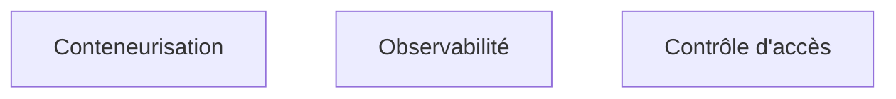

**À quoi ça sert.** L'amont le formule bien : la plupart des logiciels de production tournent sous Linux. Pour un FDE, la précision qui compte est ailleurs — le serveur sur lequel il débogue n'est pas le sien. Pas d'agent d'observabilité installé, pas de droits d'administration, un proxy qui coupe la moitié des requêtes sortantes et un certificat interne que rien ne reconnaît. Le niveau utile est donc celui du diagnostic en environnement hostile, pas celui de l'administration système.

**Ce qu'il faut savoir**

- Lire un journal, suivre un processus, identifier ce qui consomme la mémoire, retrouver quel port écoute quoi : le minimum vital, en ligne de commande, sans installer d'outil.
- Proxy d'entreprise et certificats internes — la première demi-journée d'une mission passe très souvent là. Savoir configurer les variables d'environnement de proxy et injecter un certificat racine dans un conteneur fait gagner un jour entier.
- Droits et comptes de service : demander le bon niveau d'accès dès le premier jour, parce que l'obtenir prend des semaines dans une grande organisation.
- Fondations système et réseau si elles manquent : [[roadmaps/01 - Roadmap — Computer Science]].

> [!tip] Ajout 2026
> Prépare une trousse de diagnostic qui tient dans un conteneur unique et ne demande aucune installation sur l'hôte : un shell, les outils réseau de base, un client de base de données. Les environnements clients verrouillés sont la norme et non l'exception ; arriver avec un moyen de travailler sans droits d'administration change le rythme des trois premiers jours.

> [!warning] Piège
> Développer contre son poste et découvrir l'environnement client à la livraison. L'écart se paie toujours, et il se paie sur des détails idiots : une version de bibliothèque système, un fuseau horaire, un encodage de fichier, une politique de mot de passe sur la base. Obtenir un accès à un environnement représentatif fait partie du cadrage, pas de la livraison.
