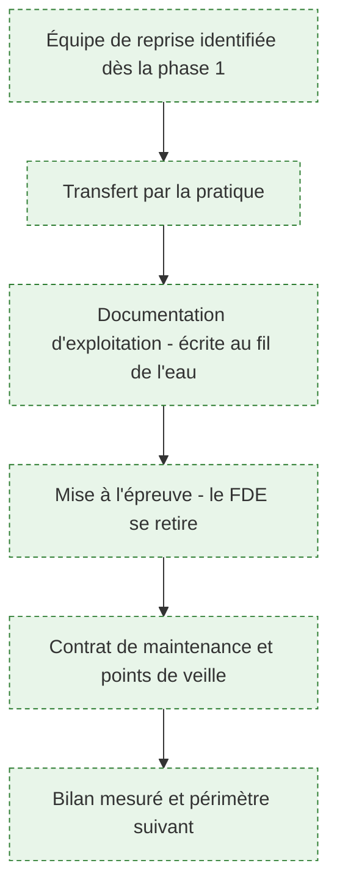
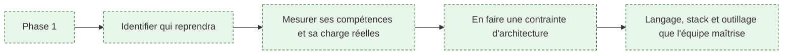
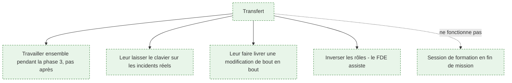
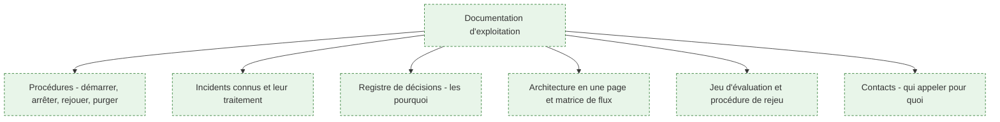
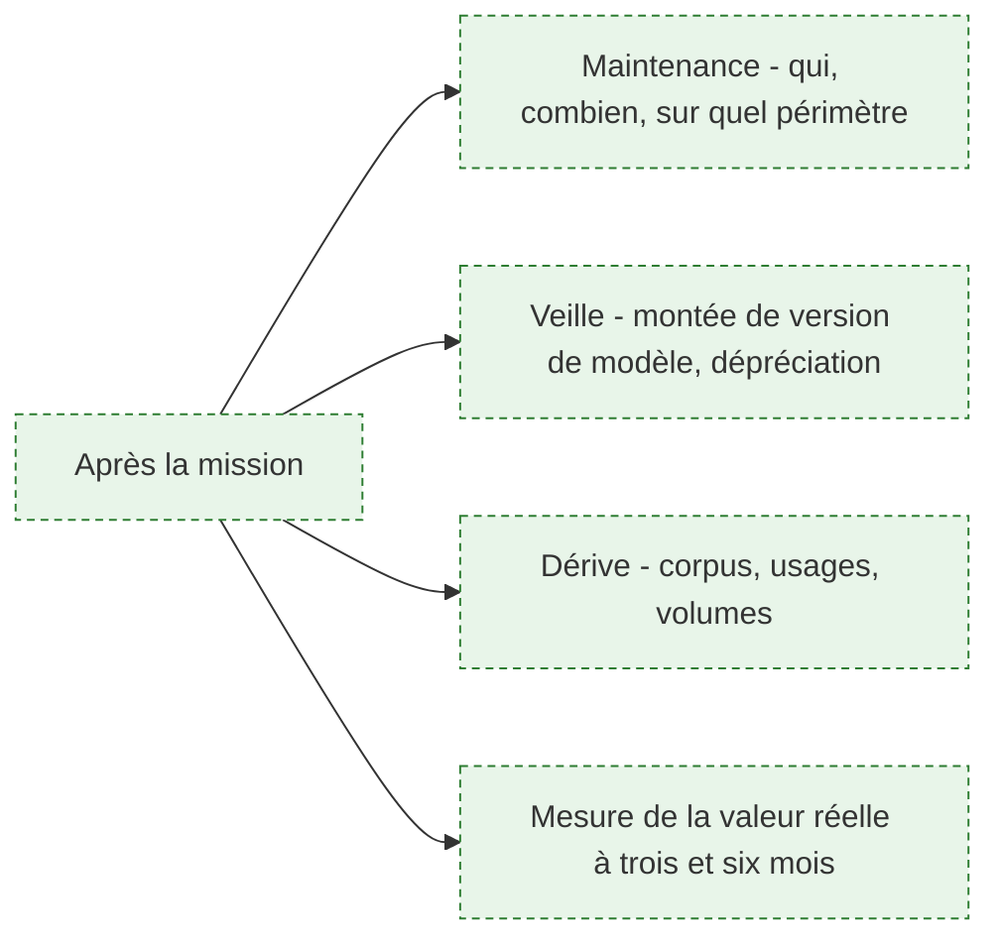
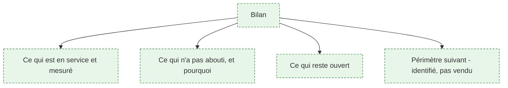

> [!abstract] La phase que personne ne planifie et où la plupart des missions perdent ce qu'elles ont produit. Le système tourne, la démonstration a convaincu, le FDE part — et six mois plus tard le système est gelé parce que personne n'ose le modifier. Cette page traite la sortie comme une phase à part entière, avec ses livrables et son critère de réussite : l'équipe cliente a corrigé un incident sans aide.

## La phase en un coup d'œil

**Porte de sortie** : l'équipe cliente a diagnostiqué et corrigé au moins un incident réel sans le FDE, et a livré une modification par sa propre chaîne. Tout le reste — documentation, réunions de passation, remise de clés — n'est qu'un moyen d'y arriver.

---

## 1. Préparer la sortie dès le premier jour

**À quoi ça sert.** La question « qui exploitera ce système après mon départ » se pose en semaine 1, pas en semaine 20. Elle a des conséquences directes sur l'architecture : une équipe de trois personnes déjà saturées, qui fait du Java et n'a jamais exploité de charge de travail IA, ne reprendra pas un système multi-agents en Python avec une base vectorielle de plus à superviser. La contrainte de reprise est une contrainte de conception au même titre que la latence ou le budget — et elle est presque toujours ignorée.

**Ce qu'il faut savoir**

- Identifier nommément l'équipe et, si possible, la personne référente. Un transfert « à la DSI » ne transfère rien.
- Évaluer honnêtement sa charge : une équipe qui reprend un système sans en avoir le temps produira le même résultat qu'une équipe qui ne l'a pas repris.
- En tirer les conséquences techniques : moins de composants, moins de magie, la stack du client quand c'est possible, et un pipeline lisible plutôt qu'un système autonome élégant. Voir [[parcours/forward-deployed-engineer/socle-technique]].
- Négocier explicitement le temps de cette équipe dans le planning de mission, dès le cadrage. Sans engagement écrit, il ne se dégagera jamais.
- Voir [[notions/transfert-de-competences]]. L'angle FDE : le transfert n'est pas une formation de fin de mission, c'est une contrainte qui s'impose à toutes les décisions techniques depuis le premier jour.

> [!tip] Ajout 2026
> Pose la question au commanditaire dans ces termes : « quelle équipe exploitera ce système dans un an, et combien de jours par mois peut-elle y consacrer ? » Si la réponse est vague, c'est le premier risque de la mission, avant tout risque technique, et il faut l'inscrire comme tel dans le compte rendu de cadrage. Beaucoup de systèmes abandonnés n'ont jamais eu de propriétaire désigné.

> [!warning] Piège
> Accepter la réponse « on verra plus tard, l'important est de démontrer la valeur ». Elle est confortable pour tout le monde, et elle programme l'abandon du système. Une démonstration de valeur sans capacité de reprise ne produit pas une décision d'industrialisation ; elle produit un pilote de plus dans une liste de pilotes.

---

## 2. Transférer par la pratique

**À quoi ça sert.** Un transfert de compétences ne se fait pas par exposé. Ce qui fonctionne est de travailler à côté pendant la phase 3, puis d'inverser progressivement les rôles : l'équipe fait, le FDE regarde et répond. C'est plus lent au début, et c'est le seul moyen d'obtenir qu'une personne ose modifier le système une fois seule. La confiance technique ne se transmet pas par un document ; elle vient d'avoir déjà réparé quelque chose soi-même.

**Ce qu'il faut savoir**

- Commencer pendant la phase 3, pas après : le transfert est une manière de construire, pas une étape de clôture.
- Chaque incident réel est une occasion de transfert. Laisser l'équipe diagnostiquer, même si c'est trois fois plus long, en restant disponible.
- Faire livrer par l'équipe au moins une modification complète — développement, tests, revue, mise en production — par sa propre chaîne. C'est le test qui révèle les droits manquants et les étapes que seul le FDE savait faire.
- Transférer aussi le jeu d'évaluation et son usage : comment l'exécuter, comment y ajouter un cas, comment lire le résultat. Voir [[notions/evaluation-llm]].
- Accepter que l'équipe fasse autrement. Un système modifié d'une façon qu'on n'aurait pas choisie mais qui est comprise par ceux qui l'exploitent est un meilleur résultat qu'un système intact et figé.

> [!tip] Ajout 2026
> Organise une « semaine de silence » avant la fin de la mission : le FDE est présent mais ne répond qu'aux questions posées explicitement, et ne corrige rien lui-même. Ce qui casse pendant cette semaine est exactement la liste de ce qu'il reste à transférer, obtenue pendant qu'il est encore là pour le faire. C'est la mise à l'épreuve la plus utile de la phase, et elle est inconfortable pour les deux parties.

> [!warning] Piège
> Être trop efficace jusqu'au dernier jour. Un FDE qui corrige tout en dix minutes parce qu'il connaît le système par cœur rend service à court terme et empêche le transfert. À partir de la mise en service, le critère de réussite change : ce n'est plus la rapidité de correction, c'est le nombre de corrections faites par quelqu'un d'autre.

---

## 3. La documentation qui sert

**À quoi ça sert.** L'amont donne la bonne justification de la rédaction technique : c'est ce qui permet au client d'exploiter et d'étendre le système sans rappeler le FDE à chaque question. Reste à savoir ce qui se lit réellement. L'expérience des passations est constante sur ce point : personne ne lit le document d'architecture de quarante pages, et tout le monde cherche la procédure de redémarrage à deux heures du matin. La documentation utile est faite de choses courtes, trouvables et vérifiées.

**Ce qu'il faut savoir**

- Les procédures d'exploitation d'abord : démarrer, arrêter, rejouer un traitement, purger un index, reconstruire, réagir à une panne du fournisseur de modèle.
- Le registre des incidents déjà survenus et de leur traitement. C'est le document le plus consulté après un départ, et il s'écrit tout seul si on le tient au fil de l'eau.
- Le registre de décisions — les pourquoi — construit en [[parcours/forward-deployed-engineer/arbitrage-technologique|phase 2]] et complété ensuite. Voir [[notions/redaction-technique]].
- Une page d'architecture : composants, flux, données, dépendances externes, points de défaillance. Une page.
- Tout dans le dépôt, en Markdown, versionné avec le code. Une documentation dans un espace collaboratif séparé diverge en trois mois.
- Vérifier les procédures en les faisant exécuter par quelqu'un d'autre, sans aide. Une procédure non testée est fausse.

> [!tip] Ajout 2026
> Écris la documentation pour quelqu'un qui arrive dans six mois, de nuit, sans contexte, avec un système en panne. Ce lecteur imaginaire est un bon filtre : il élimine les paragraphes d'introduction, la présentation du projet et les justifications générales, et il impose des titres qui se trouvent par recherche textuelle. Ce qu'il reste après ce filtre est exactement ce qui sert.

> [!warning] Piège
> Confondre documentation et volume. Un document long et non maintenu est plus dangereux qu'une absence de documentation : il induit en erreur avec l'autorité de l'écrit. Mieux vaut trois pages exactes et datées que quarante pages dont on ne sait pas lesquelles sont encore vraies.

---

## 4. Ce qui reste après

**À quoi ça sert.** Un système d'IA n'est pas un livrable stable. Les modèles sont dépréciés, les corpus vieillissent, les usages dérivent, les volumes augmentent. Le brief demande d'assurer le support et la maintenance opérationnelle ; la question à trancher avant de partir est plus précise : qui fait quoi, avec quel budget, et à quelle échéance se pose la prochaine décision. Un système livré sans cette clarification devient un actif orphelin — utilisé, non maintenu, jusqu'au premier incident qui le fait arrêter.

**Ce qu'il faut savoir**

- Écrire ce qui est couvert par la maintenance et ce qui ne l'est pas, et par qui. La zone grise entre l'équipe du client et le prestataire est là où meurent les systèmes.
- La dépréciation des modèles est une échéance connue à l'avance dans la plupart des cas : elle doit figurer dans les points de veille, avec la procédure — rejouer le jeu d'évaluation sur le modèle successeur, comparer, décider.
- Surveiller la dérive : nouveaux types de documents dans le corpus, nouveaux usages détournés, volumes en hausse. Voir [[notions/observabilite]] et [[roadmaps/08 - Roadmap — MLOps]].
- Prévoir la mesure de valeur réelle à trois et six mois, avec les indicateurs définis en phase 2. C'est ce qui justifiera — ou non — la mission suivante. Voir [[notions/roi-des-projets-ia]].
- Fixer une date de revue avec le client, dans l'agenda, avant de partir. Une revue non planifiée n'a pas lieu.

> [!tip] Ajout 2026
> Laisse une liste écrite de ce que tu aurais fait avec deux mois de plus, hiérarchisée, avec l'effort estimé. Ce document coûte une heure, il évite que le successeur redécouvre les mêmes limites, et il constitue le meilleur argumentaire pour une suite de mission — bien meilleur qu'une proposition commerciale, parce qu'il est écrit du point de vue du système et non de celui du prestataire.

> [!warning] Piège
> Partir sans avoir fait tourner le système une fois sans soi. Un système qui n'a jamais connu une semaine sans son auteur n'a pas été testé sur le critère qui compte. Si le calendrier ne permet pas cette semaine, il faut le dire explicitement au commanditaire : c'est un risque assumé, pas un détail d'organisation.

---

## 5. Le bilan de mission

**À quoi ça sert.** Le bilan honnête est la meilleure garantie de continuité, et c'est contre-intuitif : dire ce qui n'a pas marché est ce qui rend crédible ce qui a marché. Un bilan uniquement positif est lu comme un document commercial et n'engage personne. Un bilan qui nomme deux échecs, leurs causes et ce qu'ils coûtent est discuté sérieusement — et c'est dans cette discussion que se décide la suite.

**Ce qu'il faut savoir**

- Distinguer ce qui est en service et mesuré de ce qui est construit mais non utilisé. La différence est la seule chose qui compte.
- Nommer ce qui n'a pas abouti et pourquoi : accès jamais obtenus, périmètre réduit, arbitrage non tranché, blocage organisationnel. Sans désigner de responsable et sans euphémisme.
- Lister ce qui reste ouvert, avec l'effort estimé.
- Identifier le périmètre suivant à partir de la carte de la phase 1, qui contient toujours plus de gisements que ce qu'une mission peut traiter. L'identifier n'est pas le vendre ; confondre les deux est le meilleur moyen de faire relire tout le bilan comme un argumentaire.
- Le bilan se présente d'abord aux opérationnels, ensuite à la direction — même ordre que la restitution de la phase 1. Voir [[parcours/forward-deployed-engineer/competences-relationnelles]].

> [!tip] Ajout 2026
> Fais figurer dans le bilan ce que la mission a appris sur l'organisation elle-même, au-delà du système livré : les délais réels d'obtention d'un accès, les points de blocage récurrents, les processus voisins qui souffrent du même problème. C'est souvent la partie la plus reprise en interne par le client, parce qu'elle lui apprend quelque chose qu'aucun de ses collaborateurs n'est en position de formuler.

> [!warning] Piège
> Traiter la fin de mission comme une formalité parce que le système fonctionne. C'est le moment où le FDE est le plus fatigué, le plus sollicité par la mission suivante, et où tout ce qui n'est pas fait ne le sera jamais. Bloquer les deux dernières semaines dès le cadrage, et les défendre, fait partie du métier.
