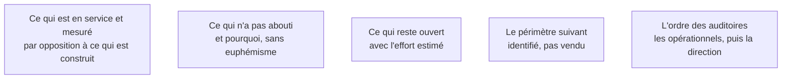

Dire ce qui n'a pas marché est ce qui rend crédible ce qui a marché. Un bilan uniquement positif est lu comme un document commercial et n'engage personne.

## Ce qu'il faut savoir faire

- Distinguer ce qui est en service et mesuré de ce qui est construit mais non utilisé. La différence est la seule chose qui compte.
- Nommer ce qui n'a pas abouti et pourquoi : accès jamais obtenus, périmètre réduit, arbitrage non tranché, blocage organisationnel. Sans désigner de responsable et sans euphémisme.
- Identifier le périmètre suivant à partir de la carte de la phase 1, qui contient toujours plus de gisements qu'une mission ne peut en traiter. L'identifier n'est pas le vendre ; confondre les deux fait relire tout le bilan comme un argumentaire.
- Présenter aux opérationnels d'abord, à la direction ensuite — même ordre que la restitution de la phase 1.
- Faire figurer ce que la mission a appris sur l'organisation elle-même : délais réels d'obtention d'un accès, points de blocage récurrents, processus voisins qui souffrent du même problème. C'est souvent la partie la plus reprise en interne, parce qu'aucun collaborateur n'est en position de la formuler.

## Les notions mobilisées

- [[notions/mesure-d-usage-produit]] — l'angle FDE est que « en service » se prouve par des chiffres d'usage, pas par une recette signée.
- [[notions/redaction-technique]] — un échec nommé avec sa cause et son coût se discute ; un échec euphémisé se rejoue.
- [[notions/roi-des-projets-ia]] — ce qui reste ouvert se chiffre, sinon il ne sera jamais arbitré.
- [[notions/bpmn]] — la carte de la phase 1 est le catalogue des périmètres suivants.
- [[notions/gestion-parties-prenantes]] — l'ordre des auditoires décide de la façon dont le bilan sera reçu.

> [!warning] Piège
> Traiter la fin de mission comme une formalité parce que le système fonctionne. C'est le moment où le FDE est le plus fatigué, le plus sollicité par la mission suivante, et où tout ce qui n'est pas fait ne le sera jamais. Bloquer les deux dernières semaines dès le cadrage, et les défendre, fait partie du métier.
