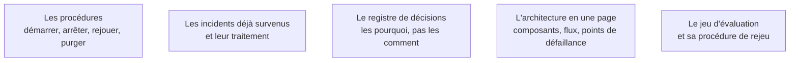

Personne ne lit le document d'architecture de quarante pages, et tout le monde cherche la procédure de redémarrage à deux heures du matin. La documentation utile est faite de choses courtes, trouvables et vérifiées.

## Ce qu'il faut savoir faire

- Écrire les procédures d'exploitation d'abord : démarrer, arrêter, rejouer un traitement, purger un index, reconstruire, réagir à une panne du fournisseur de modèle.
- Tenir le registre des incidents survenus et de leur traitement au fil de l'eau. C'est le document le plus consulté après un départ, et il s'écrit tout seul si on le tient.
- Écrire pour quelqu'un qui arrive dans six mois, de nuit, sans contexte, avec un système en panne. Ce lecteur imaginaire élimine les paragraphes d'introduction et impose des titres qui se trouvent par recherche textuelle.
- Tout mettre dans le dépôt, en Markdown, versionné avec le code. Une documentation dans un espace collaboratif séparé diverge en trois mois.
- Vérifier les procédures en les faisant exécuter par quelqu'un d'autre, sans aide. Une procédure non testée est fausse.

## Les notions mobilisées

- [[notions/redaction-technique]] — l'angle FDE est que le lecteur n'est pas un pair : c'est quelqu'un qui reprendra le système sans contexte et sans pouvoir poser de question.
- [[notions/observabilite]] — un incident documenté sans sa trace ne se reconnaît pas la fois suivante.
- [[notions/gouvernance-ia]] — le registre de décisions et la documentation de conformité se rejoignent : les deux répondent à « pourquoi ce choix, et qui l'a validé ».
- [[notions/conception-d-api]] — la page d'architecture décrit surtout des contrats et des dépendances externes.
- [[notions/evaluation-llm]] — la procédure de rejeu fait partie de la documentation d'exploitation, pas des annexes techniques.

> [!warning] Piège
> Confondre documentation et volume. Un document long et non maintenu est plus dangereux qu'une absence de documentation : il induit en erreur avec l'autorité de l'écrit. Mieux vaut trois pages exactes et datées que quarante dont on ne sait pas lesquelles sont encore vraies.
