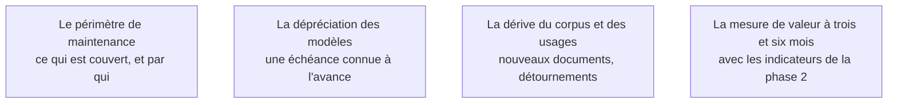

Niveau attendu : **référence**. Dire avant de partir ce qui va dériver, à quelle échéance et aux frais de qui est un arbitrage que le client ne sait pas formuler : il n'a jamais exploité de système probabiliste.

Un système d'IA n'est pas un livrable stable : les modèles sont dépréciés, les corpus vieillissent, les usages dérivent, les volumes augmentent. La question à trancher avant de partir est qui fait quoi, avec quel budget, et à quelle échéance se pose la prochaine décision.

## Ce qu'il faut savoir faire

- Écrire ce qui est couvert par la maintenance et ce qui ne l'est pas, et par qui. La zone grise entre l'équipe du client et le prestataire est là où meurent les systèmes.
- Inscrire la dépréciation des modèles dans les points de veille, avec sa procédure : rejouer le jeu d'évaluation sur le modèle successeur, comparer, décider.
- Surveiller la dérive : nouveaux types de documents dans le corpus, usages détournés, volumes en hausse.
- Prévoir la mesure de valeur réelle à trois et six mois, avec les indicateurs définis en phase 2. C'est ce qui justifiera — ou non — la mission suivante.
- Fixer une date de revue avec le client, dans l'agenda, avant de partir. Une revue non planifiée n'a pas lieu.
- Laisser une liste écrite de ce qu'on aurait fait avec deux mois de plus, hiérarchisée, avec l'effort estimé. Ce document coûte une heure et évite que le successeur redécouvre les mêmes limites.

## Les notions mobilisées

- [[notions/gouvernance-ia]] — l'angle FDE est qu'un système sans propriétaire nommé devient un actif orphelin : utilisé, non maintenu, jusqu'au premier incident qui le fait arrêter.
- [[notions/choix-de-modele]] — la montée de version n'est pas une opération d'infrastructure : elle se décide sur une comparaison mesurée.
- [[notions/observabilite]] — la dérive ne se voit que si quelqu'un regarde, et seulement si l'instrumentation a survécu au départ.
- [[notions/roi-des-projets-ia]] — la valeur annoncée en phase 2 doit être vérifiée en conditions réelles, sinon elle restera une promesse.

Exploitation et dérive en profondeur : [[parcours/mlops/supervision-et-derive]].

> [!warning] Piège
> Partir sans avoir fait tourner le système une fois sans soi. Un système qui n'a jamais connu une semaine sans son auteur n'a pas été testé sur le critère qui compte. Si le calendrier ne le permet pas, il faut le dire explicitement au commanditaire : c'est un risque assumé, pas un détail d'organisation.
