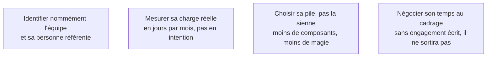

Niveau attendu : **référence**. Traiter la reprise comme une contrainte de conception dès la semaine 1 est ce que personne ne demandera jamais au FDE, et c'est ce qui décide si le système survit à son départ.

La question « qui exploitera ce système après mon départ » se pose en semaine 1, pas en semaine 20. La contrainte de reprise est une contrainte de conception au même titre que la latence ou le budget — et elle est presque toujours ignorée.

## Ce qu'il faut savoir faire

- Identifier nommément l'équipe et, si possible, la personne référente. Un transfert « à la DSI » ne transfère rien.
- Poser la question au commanditaire dans ces termes : « quelle équipe exploitera ce système dans un an, et combien de jours par mois peut-elle y consacrer ? ». Si la réponse est vague, c'est le premier risque de la mission, avant tout risque technique, et il s'inscrit comme tel au compte rendu de cadrage.
- En tirer les conséquences techniques : moins de composants, la pile du client quand c'est possible, un pipeline lisible plutôt qu'un système autonome élégant. Une équipe de trois personnes saturées qui fait du Java ne reprendra pas un système multi-agents en Python avec une base vectorielle de plus à superviser.
- Négocier le temps de cette équipe dans le planning de mission, dès le cadrage.

## Les notions mobilisées

- [[notions/transfert-de-competences]] — l'angle FDE est que le transfert n'est pas une formation de fin de mission : c'est une contrainte qui s'impose à toutes les décisions techniques depuis le premier jour.
- [[notions/gestion-parties-prenantes]] — une équipe de reprise sans propriétaire désigné n'existe pas, quelle que soit l'intention affichée.
- [[notions/plateforme-de-deploiement]] — la cible est celle que l'équipe sait déjà opérer, pas celle qui convient le mieux au système.
- [[notions/cadrage-besoin]] — le temps de l'équipe de reprise est une ligne du périmètre, pas une bonne volonté.

Ce que suppose le choix de la pile est développé dans [[parcours/forward-deployed-engineer/socle-technique/index|le socle technique]].

> [!warning] Piège
> Accepter la réponse « on verra plus tard, l'important est de démontrer la valeur ». Elle est confortable pour tout le monde et elle programme l'abandon du système : une démonstration de valeur sans capacité de reprise ne produit pas une décision d'industrialisation, elle produit un pilote de plus dans une liste de pilotes.
