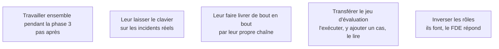

Un transfert de compétences ne se fait pas par exposé. La confiance technique ne se transmet pas par un document ; elle vient d'avoir déjà réparé quelque chose soi-même.

## Ce qu'il faut savoir faire

- Commencer pendant la phase 3 : le transfert est une manière de construire, pas une étape de clôture.
- Laisser l'équipe diagnostiquer chaque incident réel, même si c'est trois fois plus long, en restant disponible.
- Faire livrer par l'équipe au moins une modification complète — développement, tests, revue, mise en production — par sa propre chaîne. C'est le test qui révèle les droits manquants et les étapes que seul le FDE savait faire.
- Organiser une « semaine de silence » avant la fin : le FDE est présent, ne répond qu'aux questions posées explicitement, et ne corrige rien lui-même. Ce qui casse pendant cette semaine est exactement la liste de ce qu'il reste à transférer, obtenue pendant qu'il est encore là.
- Accepter que l'équipe fasse autrement. Un système modifié d'une façon qu'on n'aurait pas choisie mais comprise par ceux qui l'exploitent est un meilleur résultat qu'un système intact et figé.

## Les notions mobilisées

- [[notions/transfert-de-competences]] — l'angle FDE est que le critère de réussite change à la mise en service : ce n'est plus la rapidité de correction, c'est le nombre de corrections faites par quelqu'un d'autre.
- [[notions/observabilite]] — on ne laisse le clavier à quelqu'un que s'il peut voir ce qui se passe ; les traces sont le support du transfert.
- [[notions/integration-continue]] — une modification livrée de bout en bout par l'équipe est la seule preuve que la chaîne lui appartient.
- [[notions/evaluation-llm]] — transférer le jeu d'évaluation et son mode d'emploi, sinon la première montée de version de modèle gèlera le système.
- [[notions/conduite-du-changement]] — l'inversion des rôles est inconfortable pour les deux parties, et c'est ce qui la rend efficace.

> [!warning] Piège
> Être trop efficace jusqu'au dernier jour. Un FDE qui corrige tout en dix minutes parce qu'il connaît le système par cœur rend service à court terme et empêche le transfert.
