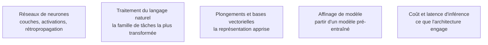

Niveau attendu : **usage**. Choisir l'architecture dont le biais inductif correspond à sa donnée et repartir d'un modèle pré-entraîné suffit ; concevoir une architecture est un métier de recherche.

La progression du perceptron à l'attention n'est pas une course à la nouveauté : c'est une histoire de biais inductif, chaque architecture encodant une hypothèse différente sur la structure de la donnée. Savoir laquelle correspond à la sienne vaut mieux que connaître la dernière parue.

## Une hypothèse par architecture

| Architecture | L'hypothèse qu'elle encode | Ce qu'elle suppose de la donnée |
|---|---|---|
| Perceptron multicouche | aucune structure particulière | des variables déjà construites et de dimension modérée |
| Convolution | localité, invariance par translation, partage de poids | une grille régulière — image, spectrogramme, signal |
| Récurrence à portes | dépendance séquentielle avec état résumé | un ordre, et une mémoire qui peut être compressée |
| Attention | toute position peut dépendre de toute autre | une longueur de séquence supportable, le coût étant quadratique |

## Ce qu'il faut savoir faire

- **Reconnaître que sans activation non linéaire, toute la pile se réduit à une seule couche.** C'est le point de départ, et il explique pourquoi la profondeur n'a de sens qu'accompagnée de non-linéarités.
- **Choisir la fonction de perte avant l'architecture.** Entropie croisée en classification, erreur quadratique ou perte robuste en régression selon la présence de valeurs extrêmes : la perte encode l'objectif, l'architecture n'en est que le moyen.
- **Employer les activations modernes sans fétichisme** : les fonctions saturantes tuent le gradient en profondeur, les variantes lisses de la rectification linéaire dominent les architectures récentes, et l'écart entre elles est bien inférieur à l'écart entre deux protocoles de données.
- **Lire les paramètres d'une convolution** — noyau, pas, remplissage, agrégation — comme le réglage conjoint de la taille de sortie et du champ réceptif, plutôt que comme des constantes recopiées d'un exemple.
- **Situer les tâches denses.** La segmentation demande une prédiction par pixel, d'où les architectures encodeur-décodeur avec connexions directes entre niveaux de résolution.
- **Connaître les briques sans lesquelles un réseau profond ne converge pas** : normalisation de couche, connexions résiduelles, optimiseur à décroissance de poids découplée, échauffement puis décroissance du taux d'apprentissage, précision mixte. Elles sont absentes de la plupart des listes d'architectures et font pourtant la différence entre un entraînement qui aboutit et un qui diverge.
- **Ne plus entraîner de modèle de vision depuis zéro.** Affiner un extracteur pré-entraîné, ou simplement solliciter un modèle de segmentation généraliste, couvre l'écrasante majorité des besoins.

> [!warning] Piège
> Sortir l'apprentissage profond sur un problème tabulaire de quelques dizaines de milliers de lignes. Un modèle d'arbres réglé en une heure fera mieux, s'expliquera plus facilement et se déploiera pour une fraction du coût. La profondeur se justifie sur du non structuré, sur du très gros volume, ou quand un modèle pré-entraîné existe déjà pour le domaine.

## Les notions mobilisées

- [[notions/reseaux-de-neurones]] — la mécanique commune, et le diagnostic d'un entraînement à partir de ses courbes.
- [[notions/traitement-langage-naturel]] — la famille de tâches où le passage aux modèles pré-entraînés a le plus changé les pratiques.
- [[notions/embeddings-et-bases-vectorielles]] — les représentations apprises, réutilisables bien au-delà de la tâche qui les a produites.
- [[notions/affinage-de-modele]] — l'opération standard du domaine, et ce qu'elle engage en maintenance.
- [[notions/cout-et-latence-inference]] — la contrainte qui élimine des architectures avant même la première expérimentation.

## Pour apprendre

- [Dive into Deep Learning](https://d2l.ai/) — le manuel libre avec code exécutable, qui couvre justement les briques d'entraînement souvent omises.
- [Neural Networks: Zero to Hero](https://karpathy.ai/zero-to-hero.html) — la rétropropagation puis un transformeur construits depuis zéro, en vidéo et en code.
- [A Recipe for Training Neural Networks](https://karpathy.github.io/2019/04/25/recipe/) — la méthode de diagnostic à suivre quand un entraînement refuse de converger.
- [CS231n — Convolutional Neural Networks for Visual Recognition](https://cs231n.github.io/) — les notes de cours de Stanford, encore la meilleure explication des convolutions.
- [The Illustrated Transformer](https://jalammar.github.io/illustrated-transformer/) puis [Attention Is All You Need](https://arxiv.org/abs/1706.03762) — l'intuition visuelle, puis l'article fondateur.
- [Tutoriels PyTorch](https://docs.pytorch.org/tutorials/) — la documentation officielle, à traiter comme un cours.
