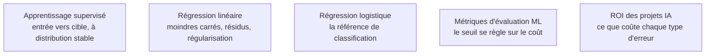

Le cœur productif : la grande majorité des modèles réellement déployés en entreprise sont ici, sur données tabulaires. Le compromis biais-variance se lit directement dans la liste des familles, du modèle linéaire fortement contraint à l'ensemble d'arbres très flexible.

## Les familles, et ce qui les sépare

| Famille | Ce qu'elle apporte | Ce qu'elle coûte |
|---|---|---|
| Plus proches voisins | aucun entraînement, frontière arbitrairement complexe | tout le coût à l'inférence, mise à l'échelle obligatoire, effondrement en grande dimension |
| Régression logistique, linéaires régularisés | rapidité, interprétation, probabilités bien calibrées par construction | une frontière linéaire, sauf expansion explicite des variables |
| Machines à vecteurs de support | marge maximale, non-linéarité par noyau | coût qui explose au-delà de quelques dizaines de milliers de lignes |
| Arbre seul, forêt aléatoire | robustesse, peu de réglages, variables mixtes sans prétraitement | un arbre seul surapprend ; la forêt perd l'interprétation directe |
| Gradient boosting | l'état de l'art sur tabulaire, devant les réseaux dans la plupart des bancs d'essai | sensibilité au réglage, surapprentissage rapide sans arrêt anticipé |

## Ce qu'il faut savoir faire

- **Choisir la régularisation en fonction de l'intention.** La pénalité quadratique réduit la variance et gère la colinéarité en conservant toutes les variables ; la pénalité absolue met des coefficients exactement à zéro et fait donc de la sélection ; leur combinaison est préférable quand des variables corrélées doivent être conservées en groupe.
- **Traiter les variables catégorielles à forte cardinalité avec méthode.** Un encodage par la cible fait à la main fuit presque toujours ; les implémentations de boosting qui intègrent un encodage ordonné évitent cette fuite par construction.
- **Régler le seuil de décision sur le coût métier.** Un faux négatif et un faux positif ont rarement le même prix ; cet ajustement rapporte presque toujours davantage que cent itérations de recherche d'hyperparamètres.
- **Lire la régression linéaire comme un outil d'analyse autant que comme un prédicteur**, en vérifiant les résidus plutôt qu'en se contentant d'un coefficient de détermination.
- **Se méfier de l'expansion polynomiale**, qui ajoute la non-linéarité mais explose en nombre de termes et surapprend très vite.
- **Livrer une incertitude défendable.** La prédiction conforme produit des intervalles avec garantie de couverture, sans hypothèse sur le modèle ; c'est aujourd'hui le moyen le plus simple d'accompagner une prédiction d'une marge honnête.

> [!warning] Piège
> Optimiser les hyperparamètres du boosting jusqu'à la troisième décimale pendant que la fonction de coût métier reste ignorée. Le gain réel est presque toujours ailleurs : dans une variable construite, dans le seuil de décision, ou dans la découverte que le jeu d'entraînement ne représente pas la population de production.

## Les notions mobilisées

- [[notions/apprentissage-supervise]] — l'hypothèse fondatrice d'une distribution identique entre entraînement et production, et ce qui arrive quand elle tombe.
- [[notions/regression-lineaire]] — les moindres carrés et le diagnostic des résidus, base commune à tous les modèles linéaires régularisés.
- [[notions/regression-logistique]] — la référence de classification : rapide, interprétable, naturellement calibrée.
- [[notions/metriques-evaluation-ml]] — le choix de métrique et de seuil, qui fait plus d'écart que le choix d'algorithme.
- [[notions/roi-des-projets-ia]] — le coût respectif des deux types d'erreur, seul fondement légitime du réglage du seuil.

## Pour apprendre

- [An Introduction to Statistical Learning](https://www.statlearning.com/) — les chapitres sur la régularisation, les arbres et les méthodes d'ensemble, avec les intuitions géométriques.
- [The Elements of Statistical Learning](https://hastie.su.domains/ElemStatLearn/) — la référence théorique, libre en PDF, à consulter chapitre par chapitre quand l'intuition ne suffit plus.
- [Documentation LightGBM](https://lightgbm.readthedocs.io/en/stable/), [XGBoost](https://xgboost.readthedocs.io/en/stable/) et [CatBoost](https://catboost.ai/docs/) — les trois implémentations, avec leurs paramètres de régularisation et leurs traitements respectifs des variables catégorielles.
- [Why do tree-based models still outperform deep learning on tabular data?](https://arxiv.org/abs/2207.08815) — le banc d'essai qui documente l'avantage persistant du boosting sur tabulaire.
- [A Gentle Introduction to Conformal Prediction](https://arxiv.org/abs/2107.07511) et [MAPIE](https://mapie.readthedocs.io/en/stable/) — la théorie courte, puis l'implémentation compatible avec scikit-learn.
