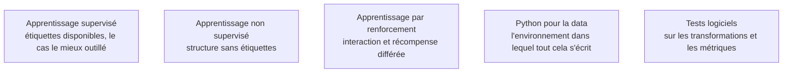

La typologie des apprentissages sert à cadrer un problème avant de choisir un algorithme, et une bibliothèque fournit l'interface qui rend tout le reste interchangeable : le même code de validation fonctionne avec une régression logistique ou un gradient boosting.

## Les cinq régimes d'apprentissage

Le **supervisé** dispose d'étiquettes ; c'est le cas le plus fréquent et le mieux outillé. Le **non supervisé** cherche une structure sans cible, et son évaluation est intrinsèquement difficile. Le **semi-supervisé** travaille avec peu d'étiquettes et beaucoup de brut, par pseudo-étiquetage ou régularisation par cohérence. L'**auto-supervisé** fabrique la supervision depuis la donnée elle-même — masquage, prédiction du jeton suivant, contraste — et c'est le paradigme qui a rendu possibles les modèles de fondation. Le **renforcement** traite la décision séquentielle où l'action modifie l'état futur.

La question de cadrage n'est donc pas « quel modèle » mais « ai-je des étiquettes, en quelle quantité, et à quel coût puis-je en obtenir davantage ».

## Ce qu'il faut savoir faire

- **Traiter le découpage comme la première décision méthodologique**, avant tout choix d'algorithme : stratifié en classification déséquilibrée, chronologique sur des séries, par groupe dès que plusieurs lignes proviennent d'une même entité — même client, même patient, même session.
- **Composer un pipeline complet**, du fichier brut à la prédiction : imputation, encodage, mise à l'échelle et modèle dans un seul objet, transmis tel quel à la validation croisée.
- **Comparer plusieurs familles sur le même protocole et la même métrique.** Une comparaison faite à protocole variable ne permet aucune conclusion, et c'est l'erreur la plus fréquente dans les comptes rendus d'expérimentation.
- **Distinguer la prédiction de classe de la prédiction de probabilité.** Le seuil de 0,5 est un choix par défaut, rarement le bon, et il appartient au métier plutôt qu'à la bibliothèque.
- **Régler les hyperparamètres sur un jeu de validation distinct du test final**, par grille quand ils sont peu nombreux, par recherche aléatoire ou bayésienne au-delà, et toujours avec un budget décidé d'avance.
- **Écrire ses propres transformations à l'interface de la bibliothèque**, pour qu'elles se branchent dans un pipeline et héritent de toutes ses garanties au lieu de vivre à côté.

> [!tip] Ce qui a changé
> Le passage à l'échelle de l'auto-supervision a produit des modèles de fondation tabulaires qui classent de petits jeux de données sans entraînement, par inférence en contexte. Sur quelques milliers de lignes, ils rivalisent avec un gradient boosting réglé. Cela ne remplace pas la méthodologie — le protocole d'évaluation reste identique — mais cela change le point de départ d'un prototype, qui n'est plus une régression logistique.

> [!warning] Piège
> L'absence de référence triviale. Avant tout modèle, mesurer la performance de la règle bête : classe majoritaire, moyenne, valeur de la veille en série temporelle. Un modèle qui ne bat pas cette référence de façon significative n'est pas un modèle — et le cas se présente plus souvent qu'on ne l'admet, souvent parce que le signal recherché n'existe pas dans les données disponibles.

## Les notions mobilisées

- [[notions/apprentissage-supervise]] — le régime central du parcours, avec ses conditions et son hypothèse forte de distribution stable.
- [[notions/apprentissage-non-supervise]] — ce qu'on peut en attendre quand aucune étiquette n'est disponible, et comment l'évaluer malgré tout.
- [[notions/apprentissage-par-renforcement]] — le cadre de la décision séquentielle, à situer même quand on ne l'implémente pas.
- [[notions/python-pour-la-data]] — l'environnement, les dépendances et les carnets, socle de toute reproductibilité.
- [[notions/tests-logiciels]] — appliqués aux transformations et au calcul des métriques, là où l'erreur ne lève aucune exception.

## Pour apprendre

- [Guide utilisateur scikit-learn](https://scikit-learn.org/stable/user_guide.html) — à lire comme un cours, en commençant par la composition de pipelines et la validation.
- [scikit-learn — validation croisée](https://scikit-learn.org/stable/modules/cross_validation.html) — les stratégies de découpage stratifié, par groupe et temporel, avec leurs cas d'usage.
- [An Introduction to Statistical Learning](https://www.statlearning.com/) — le chapitre sur le rééchantillonnage, qui fonde tout ce protocole.
- [Machine Learning Crash Course](https://developers.google.com/machine-learning/crash-course) — les exercices guidés, utiles pour ancrer la boucle complète sur un jeu simple.
