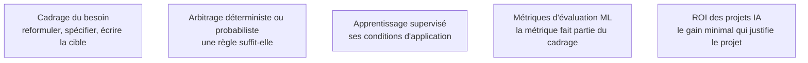

Avant toute donnée : ce problème s'apprend-il à partir d'exemples, et à quel prix. La compétence qui distingue un profil expérimenté n'est pas la connaissance des architectures récentes mais la capacité à dire « ceci ne se traite pas par apprentissage » et à proposer autre chose.

## Le profil et ce qu'il produit

Un ingénieur en apprentissage automatique part de données brutes, construit un jeu d'entraînement, entraîne et valide un modèle qu'il possède de bout en bout. C'est un profil hybride : statistiques appliquées, génie logiciel, connaissance du domaine — la modélisation elle-même ne représentant en pratique qu'une fraction minoritaire du temps. Le socle exigé n'a rien d'exotique — algèbre linéaire, analyse, probabilités, Python, SQL — mais il faut l'avoir vraiment.

## Ce qu'il faut savoir faire

- **Vérifier que le problème est apprenable.** Il faut des exemples historiques où la réponse est connue, en quantité suffisante, représentatifs de ce qu'on rencontrera, et disponibles au moment de la prédiction. Si l'une des quatre conditions manque, le sujet n'est pas un sujet d'apprentissage supervisé, quelle que soit l'envie de l'équipe.
- **Proposer la solution non apprenante quand elle suffit.** Une règle métier explicite, une requête, une optimisation classique : moins chère, vérifiable, maintenable par quelqu'un d'autre. Le proposer est un signe de maturité, pas un renoncement.
- **Définir la cible avec une date d'observation et une fenêtre.** « Client qui part » n'est pas une cible ; « client sans commande dans les quatre-vingt-dix jours suivant une date d'observation donnée » en est une.
- **Choisir la métrique au cadrage**, avec le coût relatif des deux types d'erreur. C'est une décision métier que l'on documente, pas un paramètre qu'on ajuste au moment de rédiger les résultats.
- **Estimer le coût d'obtention d'étiquettes supplémentaires.** La question pratique n'est presque jamais « quel modèle » mais « ai-je des étiquettes, en quelle quantité, et à quel prix puis-je en obtenir davantage ».
- **Poser les contraintes de service dès le départ** : latence acceptable, fréquence de prédiction, possibilité d'un traitement par lots. Elles éliminent des familles entières de modèles avant toute expérimentation.

> [!warning] Piège
> Sauter les fondamentaux d'apprentissage automatique parce qu'on travaille sur des modèles de langage. La quasi-totalité des erreurs d'évaluation observées sur des systèmes de récupération ou agentiques sont des erreurs classiques : jeu de test contaminé, métrique moyennée sur des strates hétérogènes, absence de référence triviale. Ces erreurs coûtent autant sur un système génératif que sur un classifieur.

## Les notions mobilisées

- [[notions/cadrage-besoin]] — la reformulation d'une demande en spécification écrite, dont dépend l'existence même d'un jeu d'entraînement cohérent.
- [[notions/arbitrage-deterministe-probabiliste]] — la question à trancher en premier : une règle explicite fait-elle le travail, et à quelles conditions.
- [[notions/apprentissage-supervise]] — les conditions d'application, à vérifier avant d'engager quoi que ce soit.
- [[notions/metriques-evaluation-ml]] — le choix de métrique comme élément du cadrage, et non comme étape ultérieure.
- [[notions/roi-des-projets-ia]] — le coût complet et le gain minimal, qui décident si le projet mérite d'exister.

## Pour apprendre

- [Rules of Machine Learning](https://developers.google.com/machine-learning/guides/rules-of-ml) — la règle numéro un est de ne pas faire d'apprentissage automatique quand une heuristique suffit ; le reste du document est du même niveau de franchise.
- [Machine Learning Crash Course](https://developers.google.com/machine-learning/crash-course) — le cours libre de Google, dont la partie cadrage est courte et directement applicable.
- [CS 329S — Machine Learning Systems Design](https://stanford-cs329s.github.io/) — le cadrage d'un système complet, des contraintes de service jusqu'au choix de métrique.
- [Made With ML](https://madewithml.com/) — un parcours de bout en bout qui commence par la conception produit avant la modélisation.
