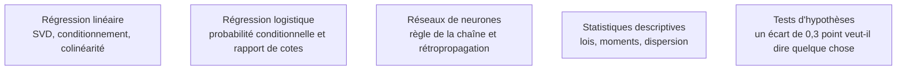

Niveau attendu : **usage**. Ces quatre blocs se rouvrent, documentation à l'appui, le jour où un modèle échoue sans raison visible ; les pousser plus loin est un investissement de chercheur, pas de praticien.

Ces blocs ne servent pas à réimplémenter les algorithmes, ils servent à comprendre pourquoi un modèle échoue. Le prérequis strictement bloquant se limite à l'algèbre linéaire de base et à la notion de dérivée ; le reste s'acquiert au moment où un comportement inexpliqué l'exige.

## Ce que chaque bloc explique

| Bloc | L'échec qu'il permet de diagnostiquer |
|---|---|
| Analyse — dérivée partielle, règle de la chaîne, gradient, hessienne | gradient qui explose ou s'évanouit, plateau d'entraînement, choix du taux d'apprentissage |
| Algèbre linéaire — matrices, valeurs propres, décomposition en valeurs singulières | coefficients de régression instables, colinéarité, analyse en composantes principales, approximations de rang faible |
| Probabilités — conditionnement, théorème de Bayes, lois usuelles | déséquilibre de classes, abondance de faux positifs sur un événement rare, choix de la fonction de perte |
| Statistique inférentielle — estimation, intervalles, rééchantillonnage | écart entre deux modèles impossible à distinguer du bruit d'échantillonnage |

## Ce qu'il faut savoir faire

- **Lire une forme de tenseur et anticiper une diffusion de dimensions.** C'est le vocabulaire quotidien de NumPy et de PyTorch, et l'essentiel des erreurs de forme s'évite à ce niveau.
- **Relier la règle de la chaîne à la rétropropagation** : la dérivée partielle donne la sensibilité de la perte à un paramètre, la règle de la chaîne la propage à travers les couches empilées. C'est tout le mécanisme ; le reste est de l'optimisation.
- **Lire un déterminant proche de zéro comme un signal de colinéarité**, donc comme une annonce de coefficients instables qui changeront de signe au prochain rééchantillonnage.
- **Expliquer la PCA par la décomposition en valeurs singulières**, et non comme une boîte noire qui « réduit les dimensions ». C'est la même mathématique que les approximations de rang faible utilisées en affinage.
- **Appliquer Bayes à un événement rare** et savoir démontrer, en deux lignes, qu'un test à 99 % de sensibilité produit une majorité de faux positifs quand la prévalence est de un pour mille. C'est la meilleure explication du déséquilibre de classes disponible.
- **Reconnaître la loi d'une variable** — normale, binomiale, de Poisson, log-normale — pour orienter la transformation à appliquer et la fonction de perte à choisir.
- **Rapporter un résultat avec un intervalle.** Rééchantillonner le jeu de test mille fois et donner un intervalle plutôt qu'un point : cinq lignes de code, et la moitié des discussions stériles sur des écarts non significatifs disparaît.

> [!warning] Piège
> Croire qu'il faut « finir les mathématiques » avant de commencer. La bonne boucle est inverse : coder un modèle, buter sur un comportement inexpliqué, revenir sur la notion concernée. Le parcours linéaire par les manuels produit six mois de retard et une mémoire qui s'efface, parce qu'aucune de ces notions ne se retient sans un échec concret auquel l'accrocher.

## Les notions mobilisées

- [[notions/regression-lineaire]] — le cas d'école où l'algèbre linéaire se lit directement dans le comportement des coefficients.
- [[notions/regression-logistique]] — la probabilité conditionnelle rendue opératoire, et le rapport de cotes comme lecture d'un coefficient.
- [[notions/reseaux-de-neurones]] — la règle de la chaîne mise en œuvre, et les pathologies de gradient qu'elle explique.
- [[notions/statistiques-descriptives]] — les lois et les moments, préalables à toute modélisation de l'incertitude.
- [[notions/tests-hypotheses]] — ce qui permet de dire si un écart de performance entre deux modèles est réel.

## Pour apprendre

- [Mathematics for Machine Learning](https://mml-book.github.io/) — libre en PDF, calibré exactement sur ce qui sert ici, avec la partie algèbre linéaire à traiter en premier.
- [Probabilistic Machine Learning — An Introduction](https://probml.github.io/pml-book/book1.html) — la référence moderne côté probabiliste, à consulter par chapitre.
- [MLU-Explain](https://mlu-explain.github.io/) — explications visuelles et interactives, notamment la page sur le [compromis biais-variance](https://mlu-explain.github.io/bias-variance/).
- [PCA expliquée visuellement](https://setosa.io/ev/principal-component-analysis/) — projection, variance et valeurs propres en trois manipulations.
- [Computational and Inferential Thinking](https://www.inferentialthinking.com/) — l'inférence construite par simulation avant les formules, libre en ligne.
