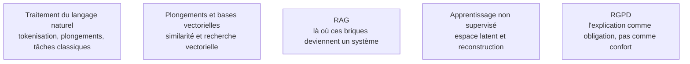

Ce qui déborde du cadre supervisé classique : générer, expliquer, traiter du texte. C'est aussi la charnière avec la branche des modèles de langage — les plongements et les modèles à attention sont exactement les briques sur lesquelles reposent les systèmes de récupération.

## Ce qu'il faut savoir faire

- **Distinguer interprétabilité globale et locale.** Quelles variables comptent dans l'ensemble, contre pourquoi cette prédiction-ci ; ce sont deux questions différentes, deux outils différents, et deux publics différents.
- **Connaître les limites de l'importance par permutation.** Elle devient trompeuse en présence de variables fortement corrélées, puisqu'elle évalue le modèle sur des combinaisons qui n'existent pas dans la réalité. Les attributions par valeurs de Shapley sont plus coûteuses mais plus fiables dans ce cas.
- **Répondre à une exigence réglementaire d'explication.** Dans le crédit, l'assurance et la santé, produire une raison intelligible pour une décision individuelle n'est pas une amélioration facultative : c'est une condition de mise en service.
- **Employer un autoencodeur pour ce qu'il fait réellement** : compresser vers un espace latent puis reconstruire, en version débruitante pour la robustesse ou variationnelle pour un latent continu et génératif. L'erreur de reconstruction fournit un score d'anomalie directement exploitable.
- **Situer les modèles adversariaux.** Générateur contre discriminateur produit des échantillons nets, au prix d'un entraînement instable — effondrement de mode, non-convergence — ce qui explique largement leur recul face aux approches par diffusion.
- **Maîtriser la chaîne de traitement du texte telle qu'elle est aujourd'hui** : le découpage en sous-mots a remplacé le mot entier, élimine le vocabulaire hors-liste et gère la morphologie. Troncature de suffixes et lemmatisation n'ont plus d'usage dans une chaîne à base de transformeurs, mais gardent leur place en recherche lexicale, qui reste indispensable en complément de la recherche vectorielle.
- **Utiliser des représentations contextuelles plutôt que statiques** dès que le sens dépend de la phrase, et savoir qu'un modèle à attention pré-entraîné couvre classification, extraction d'entités et similarité sans entraînement lourd.

> [!warning] Piège
> Confondre similarité de plongements et pertinence. Deux phrases de sens opposé peuvent avoir une similarité élevée parce qu'elles partagent le même sujet. C'est la raison d'être des modèles de reclassement, et la cause la plus fréquente de résultats de récupération décevants avec une chaîne pourtant correctement montée.

## Les notions mobilisées

- [[notions/traitement-langage-naturel]] — la chaîne complète, et ce qui y est devenu obsolète depuis l'arrivée des transformeurs.
- [[notions/embeddings-et-bases-vectorielles]] — la représentation dense et sa mesure de similarité, avec ses limites.
- [[notions/rag]] — le système qui assemble ces briques, et ses modes d'échec typiques.
- [[notions/apprentissage-non-supervise]] — l'espace latent, la reconstruction et leur usage en détection d'anomalie.
- [[notions/rgpd]] — le cadre qui transforme l'explicabilité en obligation quand une décision automatisée touche des personnes.

## Pour apprendre

- [Interpretable Machine Learning](https://christophm.github.io/interpretable-ml-book/) — libre en ligne, couvre les méthodes d'explication et surtout les limites de chacune.
- [Towards A Rigorous Science of Interpretable Machine Learning](https://arxiv.org/abs/1702.08608) — l'article qui pose le problème de fond : que veut dire « expliquer » et pour qui.
- [Documentation SHAP](https://shap.readthedocs.io/en/latest/) — l'implémentation de référence, avec les précautions d'usage sur variables corrélées.
- [Speech and Language Processing](https://web.stanford.edu/~jurafsky/slp3/) — Jurafsky et Martin, libre en ligne, la référence du domaine tenue à jour.
- [Hugging Face NLP Course](https://huggingface.co/learn/nlp-course/chapter1/1) — le parcours pratique, de la tokenisation à l'affinage d'un modèle à attention.
