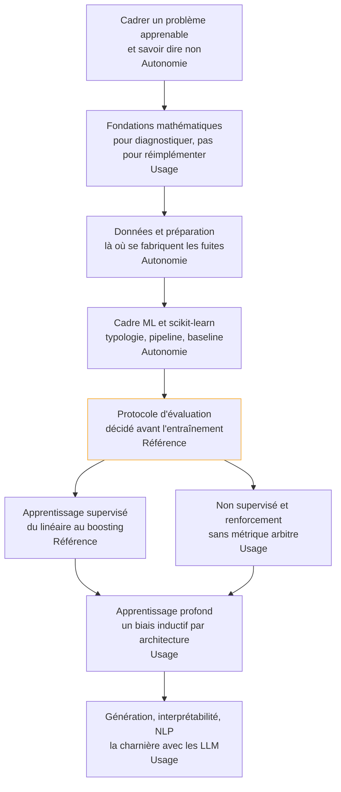

Construire un modèle qu'on possède de bout en bout, des données brutes au modèle validé, et le mesurer assez sérieusement pour que le chiffre annoncé survive au premier contact avec la production.

## La roadmap

Chaque case mène à sa page et porte, en dernière ligne, la profondeur attendue chez un profil confirmé — de **notion** (reconnaître le sujet, savoir qui appeler) à **référence** (faire autorité dans la salle). Cochez les étapes acquises en bas de page pour suivre votre progression.

L'évaluation vient avant les familles d'algorithmes, et ce n'est pas un détail d'ordonnancement : apprendre les modèles avant le protocole conduit à mesurer faux pendant des mois.

## Ma progression

- [ ] [[parcours/machine-learning/cadrer-un-probleme-apprenable|Cadrer un problème apprenable]] — cible, métrique, et les cas où l'apprentissage n'est pas la réponse
- [ ] [[parcours/machine-learning/fondations-mathematiques|Fondations mathématiques]] — gradient, SVD, Bayes, inférence : les quatre qui servent au diagnostic
- [ ] [[parcours/machine-learning/donnees-et-preparation|Données et préparation]] — collecte, formats, nettoyage, variables construites, mise à l'échelle
- [ ] [[parcours/machine-learning/cadre-et-scikit-learn|Cadre ML et scikit-learn]] — types d'apprentissage, découpage, pipeline, baseline triviale
- [ ] [[parcours/machine-learning/protocole-d-evaluation|Protocole d'évaluation]] — matrice de confusion, métriques, validation croisée, audit de fuite
- [ ] [[parcours/machine-learning/apprentissage-supervise|Apprentissage supervisé]] — KNN, linéaires régularisés, SVM, forêts, gradient boosting
- [ ] [[parcours/machine-learning/non-supervise-et-renforcement|Non supervisé et renforcement]] — clustering, réduction de dimension, politique et récompense
- [ ] [[parcours/machine-learning/apprentissage-profond|Apprentissage profond]] — MLP, CNN, RNN, attention, et les briques qui font converger
- [ ] [[parcours/machine-learning/generation-et-interpretabilite|Génération, interprétabilité, NLP]] — autoencodeurs, diffusion, SHAP, plongements
