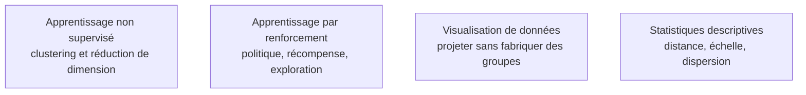

Niveau attendu : **usage** pour le non supervisé, **notion** seulement pour le renforcement — hors périmètre réel de presque tous les postes en dehors de la robotique, des jeux et du contrôle, où il suffit de reconnaître le sujet et de savoir qui appeler.

Deux familles qui partagent un problème : l'absence de cible étiquetée, donc de métrique arbitre évidente. L'une explore et segmente, l'autre décide en séquence — et toutes deux exigent un critère de validation qu'il faut construire soi-même.

## Ce qu'il faut savoir faire

- **Traiter le nombre de groupes, la métrique de distance et la mise à l'échelle comme des hypothèses fortes**, pas comme des paramètres neutres. Changer l'échelle d'une variable change la segmentation, ce qui suffit à disqualifier toute segmentation dont les choix de normalisation ne sont pas documentés.
- **Choisir la famille de clustering selon la forme attendue** : partition exclusive quand les groupes sont convexes et de taille comparable ; appartenance partielle quand les frontières sont réellement floues ; agglomération hiérarchique pour éviter de fixer le nombre de groupes et le lire sur un dendrogramme ; mélanges probabilistes pour obtenir une probabilité d'appartenance et accepter des groupes de tailles différentes.
- **Valider une segmentation par sa stabilité.** Rejouer le clustering sur des sous-échantillons et mesurer la concordance : si les groupes changent d'un tirage à l'autre, la segmentation décrit du bruit et ne doit pas être livrée.
- **Ne clusteriser jamais sur une projection de visualisation.** Les projections non linéaires servent à voir, et uniquement à voir : elles déforment les distances globales et fabriquent des groupes qui n'existent pas.
- **Employer l'erreur de reconstruction d'un autoencodeur comme score d'anomalie**, en gardant en tête que le seuil relève d'un arbitrage métier et non d'un quantile choisi par commodité.
- **Situer le renforcement honnêtement** : peu déployé en entreprise hors robotique, jeux et contrôle, mais devenu incontournable indirectement puisque c'est le mécanisme d'alignement et d'entraînement au raisonnement des modèles de langage actuels.
- **Distinguer les deux grandes approches du renforcement** : apprendre la valeur des paires état-action, hors politique, tabulaire puis approximée par un réseau ; ou optimiser directement la politique par montée de gradient, ce qui gère les actions continues au prix d'une variance de gradient élevée que l'ajout d'un estimateur de valeur vient réduire.

> [!tip] Ce qui a changé
> En exploration réelle, les méthodes à densité avec hiérarchie ont largement remplacé les partitions classiques : pas de nombre de groupes à fixer, formes arbitraires, et surtout une classe « bruit » explicite pour les points non assignables — ce qu'une partition ne sait pas faire puisqu'elle force chaque point dans un groupe. Côté renforcement, l'entraînement au raisonnement des modèles récents s'appuie sur des variantes sans réseau de valeur, où l'avantage est estimé en comparant plusieurs réponses échantillonnées pour la même requête : plus léger en mémoire et plus stable quand la récompense est vérifiable.

> [!warning] Piège
> Le détournement de récompense. L'agent optimise exactement la récompense écrite, pas l'intention derrière, et le symptôme se voit dans les trajectoires — jamais dans la courbe de récompense, qui monte parfaitement. L'équivalent côté non supervisé est la segmentation livrée sans test de stabilité : elle est présentée, nommée, adoptée par le métier, et elle ne se reproduit pas au trimestre suivant.

## Les notions mobilisées

- [[notions/apprentissage-non-supervise]] — clustering et réduction de dimension, et la difficulté propre de leur évaluation.
- [[notions/apprentissage-par-renforcement]] — politique, récompense et compromis exploration-exploitation, à comprendre même sans implémenter.
- [[notions/visualisation-de-donnees]] — les projections de visualisation, leur utilité et la limite au-delà de laquelle elles trompent.
- [[notions/statistiques-descriptives]] — distances, échelles et dispersion, qui déterminent entièrement le résultat d'un clustering.

## Pour apprendre

- [Guide utilisateur scikit-learn — clustering](https://scikit-learn.org/stable/user_guide.html) — le tableau comparatif des méthodes par forme de groupe et par passage à l'échelle est le plus utile du guide.
- [Documentation HDBSCAN](https://hdbscan.readthedocs.io/en/latest/) — la méthode à densité hiérarchique, avec sa classe de bruit explicite.
- [Documentation UMAP](https://umap-learn.readthedocs.io/en/latest/) et [How to Use t-SNE Effectively](https://distill.pub/2016/misread-tsne/) — l'outil de projection, et la démonstration interactive de ce qu'il ne faut pas y lire.
- [Reinforcement Learning: An Introduction](http://incompleteideas.net/book/the-book-2nd.html) — Sutton et Barto, la référence unique du domaine, libre en PDF.
- [Spinning Up in Deep RL](https://spinningup.openai.com/en/latest/) — l'entrée pratique, des équations au code, sur les méthodes de gradient de politique.
- [Deep RL Course](https://huggingface.co/learn/deep-rl-course/unit0/introduction) — le parcours libre avec environnements exécutables, pour se faire une intuition sans monter d'infrastructure.
