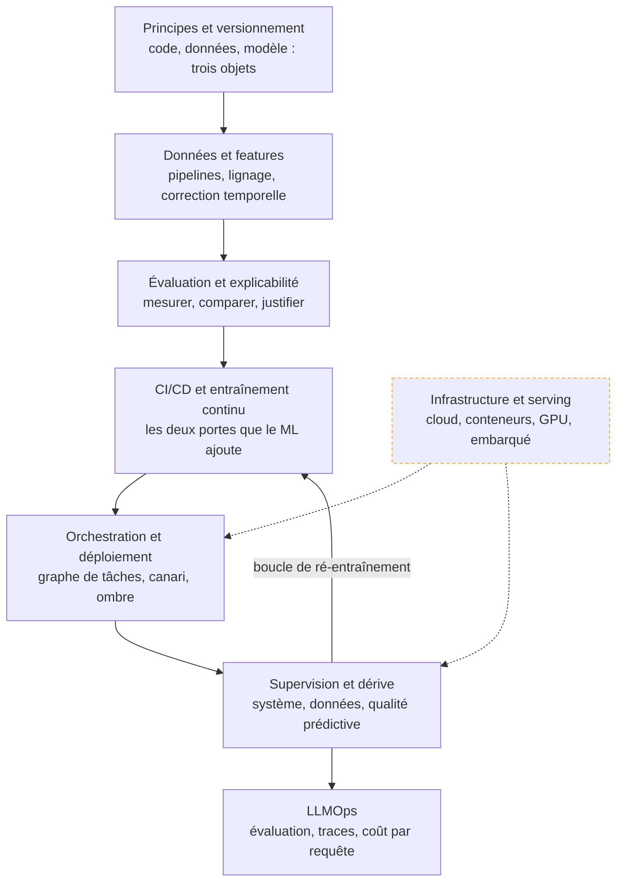

Mener un modèle du carnet où il marche jusqu'à la production où il tient : le versionner, le livrer, le servir, le surveiller — et savoir décider, sur des chiffres, quand il faut le refaire.

## La roadmap

Chaque case mène à sa page. Cochez les étapes acquises en bas de page pour suivre votre progression.

## Ma progression

- [ ] [[parcours/mlops/principes-et-versionnement|Principes et versionnement]] — l'échelle de maturité, la reproductibilité, et les trois objets à versionner
- [ ] [[parcours/mlops/donnees-et-features|Données et features]] — la plupart des incidents « modèle » sont des incidents « données »
- [ ] [[parcours/mlops/evaluation-et-explicabilite|Évaluation et explicabilité]] — découpage temporel, calibration, métriques par segment, attribution
- [ ] [[parcours/mlops/ci-cd-et-entrainement-continu|CI/CD et entraînement continu]] — tester les données, comparer au modèle en place, produire un candidat
- [ ] [[parcours/mlops/infrastructure-et-serving|Infrastructure et serving]] — cloud, conteneurs, GPU, mise à l'échelle, embarqué
- [ ] [[parcours/mlops/orchestration-et-deploiement|Orchestration et déploiement]] — graphe de tâches, bleu-vert, canari, ombre, retour arrière
- [ ] [[parcours/mlops/supervision-et-derive|Supervision et dérive]] — trois couches à surveiller, et la cadence de ré-entraînement qui se mesure
- [ ] [[parcours/mlops/llmops|LLMOps]] — ce qui change quand le modèle est appelé et non entraîné
