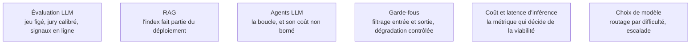

**Usage.** Instrumenter des traces, plafonner un coût par requête, brancher un juge automatique : un confirmé le fait sur un chemin balisé ; la conception du jeu d'évaluation et des invites appartient à l'AI engineer, et c'est de ce côté-là que se trouve la référence.

Ce qui change quand le modèle n'est plus entraîné mais appelé : pas de fonction de perte en production, pas d'exactitude calculable sur le trafic réel, et un coût variable par requête. Ces trois écarts suffisent à rendre le tableau de bord MLOps classique inopérant.

## Un déploiement n'est plus un fichier de poids

C'est un ensemble de six composantes qui bougent indépendamment : la version du prompt, la version du modèle sous-jacent — qui peut changer du côté du fournisseur sans vous prévenir —, la version des définitions d'outils, l'instantané de l'index de récupération, les paramètres de récupération, et la configuration des garde-fous. Épingler la version exacte du modèle et journaliser les six composantes à chaque requête est le minimum pour pouvoir expliquer une régression. Sans cela, la question « pourquoi les réponses se sont dégradées jeudi » n'a aucune réponse possible.

## L'évaluation, à trois niveaux cumulatifs

Un **jeu de régression figé** de quelques centaines de cas annotés, rejoué à chaque changement avec un seuil bloquant dans la chaîne d'intégration. Un **jury de modèle** pour les critères qualitatifs, dont l'accord avec des annotations humaines doit être mesuré avant qu'on lui fasse confiance — sinon on automatise un biais. Une **évaluation en ligne** à partir de signaux implicites : reformulations, abandon, escalade vers un humain, correction manuelle du résultat. Les trois se complètent ; aucun ne remplace les autres. Voir [[notions/evaluation-llm]].

## Ce qu'il faut savoir faire

- **Tracer l'arbre d'exécution, pas la requête.** L'unité d'observabilité devient la décomposition de la question, les appels de récupération, les appels d'outils et les générations intermédiaires. Sans trace hiérarchique, diagnostiquer une mauvaise réponse dans un système de récupération ou un agent est impossible. Voir [[notions/observabilite]].
- **Mesurer le coût par requête et le décomposer** en jetons d'entrée et de sortie. Les leviers, par rendement décroissant : mise en cache des parties stables du prompt, routage par difficulté vers un petit modèle avec escalade en cas d'échec, compression du contexte, réduction du nombre d'allers-retours dans les boucles d'agent.
- **Borner les boucles d'agent.** Une boucle mal bornée multiplie le coût par dix sans améliorer la réponse, et le fait sans erreur ni alerte.
- **Dimensionner un service GPU** : le facteur limitant en mémoire est souvent le cache d'attention, pas les poids. Les leviers de capacité sont la quantification, la longueur de contexte maximale autorisée et le degré de parallélisme.
- **Traiter le texte comme une surface d'attaque** : injection via un document ingéré, exfiltration de contexte, appel d'outil détourné. D'où des garde-fous en entrée et en sortie, un principe de moindre privilège sur les outils, et une journalisation des appels d'outils comme on journalise des appels de base. Voir [[notions/injection-de-prompt]].
- **Décider si un affinage est nécessaire** plutôt que de le supposer : il crée une dette de ré-entraînement et rend la donnée d'entraînement publiable dès que le modèle est exposé. Voir [[notions/affinage-de-modele]].

> [!tip] Ajout 2026
> Le vocabulaire s'est stratifié. **MLOps** pour les modèles entraînés maison, **LLMOps** pour les modèles de fondation appelés ou servis, **AgentOps** pour les systèmes multi-étapes à outils. Les trois partagent le versionnement et l'observabilité, et divergent complètement sur l'évaluation : exactitude hors ligne pour le premier, jury et jeux de régression pour les deux autres. Une organisation qui applique son cadre MLOps tel quel à un système de récupération documentaire passe systématiquement à côté des vraies défaillances.

> [!warning] Piège
> Faire du jury de modèle la seule mesure de qualité et ne jamais le calibrer. Les jurys favorisent les réponses longues, bien structurées et confiantes — y compris fausses. Sans un échantillon annoté humainement qui mesure l'accord juge-humain, et sans réétalonnage à chaque changement de modèle juge, la courbe de qualité monte pendant que le produit se dégrade.

> [!warning] Piège
> Traiter le passage d'un modèle propriétaire à sa version suivante comme une mise à jour transparente. Les prompts sont surajustés à un modèle donné ; un changement de version se traite comme un déploiement de modèle à part entière, avec canari et jeu de régression.

## Les notions mobilisées

- [[notions/evaluation-llm]] — le cœur du sujet : jeux figés, évaluations déterministes, jury calibré, signaux en ligne.
- [[notions/rag]] — l'index fait partie du déploiement ; sa fraîcheur et sa version se journalisent comme celles du modèle.
- [[notions/agents-llm]] — la boucle, les outils, et le coût qui n'est borné que si on le borne explicitement.
- [[notions/garde-fous]] — filtrage en entrée et en sortie, politiques, dégradation contrôlée quand le modèle refuse ou échoue.
- [[notions/cout-et-latence-inference]] — facturation par jeton, mise en cache, traitement par lots : la métrique qui décide si le produit tient.
- [[notions/choix-de-modele]] — arbitrage taille-qualité-coût, et routage par difficulté avec escalade.

## Pour apprendre

- [OpenTelemetry — conventions sémantiques GenAI](https://opentelemetry.io/docs/specs/semconv/gen-ai/) — le vocabulaire standard des traces d'appels de modèles.
- [Langfuse — Documentation](https://langfuse.com/docs) — une implémentation courante des traces hiérarchiques et de l'évaluation en ligne.
- [vLLM — Documentation](https://docs.vllm.ai/en/latest/) — traitement par lots continu, attention paginée, et le dimensionnement du cache d'attention.
- [SGLang](https://github.com/sgl-project/sglang) — l'autre moteur de service à haut débit, utile pour comparer les arbitrages.
- [OWASP Top 10 for LLM Applications](https://genai.owasp.org/llm-top-10/) — la liste de référence des défaillances de sécurité propres à ces systèmes.
