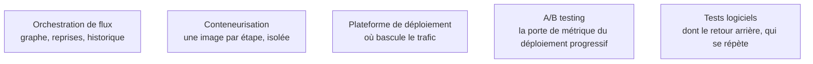

**Autonomie.** Choisir entre bleu-vert, canari et ombre selon le risque réel, et revenir en arrière sans convoquer de réunion, se tient exactement à l'autonomie ; la référence revient au domaine qui juge après coup si le déploiement était bon — la supervision, page voisine.

Le pipeline est une suite d'étapes hétérogènes dont chacune peut échouer et doit pouvoir être rejouée seule ; le déploiement est le moment où le risque se matérialise, et la stratégie choisie décide de combien d'utilisateurs voient un modèle défaillant.

## Trois stratégies, trois risques différents

Le **bleu-vert** maintient deux environnements complets et bascule d'un coup : retour arrière instantané, ressources doublées le temps de la bascule, et aucune information avant le basculement.

Le **canari** envoie une fraction croissante du trafic — un pour cent, cinq, vingt-cinq, cent — avec une porte sur les métriques à chaque palier. C'est le défaut raisonnable : le risque est borné par la fraction, et l'arrêt est automatique.

L'**ombre** envoie le trafic réel au nouveau modèle, enregistre ses réponses et ne les sert pas. C'est le seul moyen de valider latence et comportement à risque nul, et le seul qui coûte le calcul complet sans rien rapporter — donc à réserver aux modèles dont l'erreur coûte cher.

## Ce qu'il faut savoir faire

- **Faire déclencher, pas calculer.** L'orchestrateur planifie, réessaie, alerte et garde l'historique ; le calcul tourne ailleurs — sur un cluster, dans l'entrepôt, dans un conteneur dédié.
- **Rendre chaque étape rejouable seule**, avec ses entrées explicitement datées. Un pipeline d'entraînement qu'on ne peut relancer qu'en entier ne se débogue pas.
- **Isoler les étapes GPU** dans leur propre conteneur : c'est ce qui permet de ne payer la ressource rare que pendant l'étape qui l'utilise.
- **Poser des portes de métrique automatiques** à chaque palier de déploiement, avec un retour arrière déclenché sans intervention humaine si le seuil est franchi.
- **Répéter le retour arrière pour de vrai**, au moins une fois, hors incident. Revenir en arrière ne se limite pas à l'image précédente : il faut que le préprocessing, le schéma de features et le cache soient compatibles.
- **Faire du déploiement une valeur dans un manifeste versionné** : la version du modèle servi devient relisible, et le retour arrière devient une révocation de commit.

> [!tip] Ajout 2026
> Une génération d'orchestrateurs plus adaptés au ML s'est imposée à côté d'Airflow : **Dagster** avec ses assets typés et testés, **Prefect** en Python natif à faible cérémonie, **Flyte** fortement typé et pensé pour le ML sur cluster, **Argo Workflows** comme moteur bas niveau. Le basculement conceptuel utile est l'orientation asset : on déclare les données et les modèles à produire, l'orchestrateur déduit le graphe — plus lisible qu'un graphe de tâches dès que la lignée compte.

> [!warning] Piège
> Déployer sans plan de retour arrière éprouvé. Un retour arrière jamais répété est un retour arrière qui échouera le jour de l'incident, et il échouera sur la partie qu'on n'avait pas considérée : la table de features au nouveau schéma, le cache empoisonné, la migration de base déjà appliquée.

## Les notions mobilisées

- [[notions/orchestration-de-flux]] — graphe de dépendances, reprises et historique ; le même outil que côté data, avec des étapes plus hétérogènes.
- [[notions/conteneurisation]] — une image par étape, ce qui permet d'isoler les dépendances lourdes et les ressources rares.
- [[notions/plateforme-de-deploiement]] — c'est elle qui détermine les stratégies de bascule réellement disponibles.
- [[notions/ab-testing]] — un déploiement canari est une expérimentation avec une porte de décision ; les mêmes règles de mesure s'appliquent.
- [[notions/tests-logiciels]] — et la répétition du retour arrière, qui est un test comme un autre, simplement jamais écrit.

## Pour apprendre

- [Apache Airflow Docs](https://airflow.apache.org/docs) — la référence sur les graphes, les reprises et les dates d'exécution.
- [Kubeflow](https://www.kubeflow.org/) — les pipelines conteneurisés natifs cluster, avec recherche d'hyperparamètres et service intégrés.
- [Dagster Documentation](https://docs.dagster.io/) — l'orientation asset, typage des entrées et sorties compris.
- [Argo CD — Documentation](https://argo-cd.readthedocs.io/en/stable/) — le modèle GitOps qui fait du retour arrière une opération ordinaire.
- [What is orchestration?](https://www.redhat.com/en/topics/automation/what-is-orchestration) — la mise au point de vocabulaire, courte, avant les documentations d'outils.
