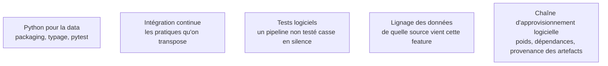

**Autonomie.** Un confirmé met en place le versionnement des trois objets et rend une exécution reproductible sans qu'on le lui demande ; ce n'est pas un domaine de référence parce qu'il s'agit d'une discipline à tenir, pas d'un arbitrage technique que personne d'autre dans la salle ne saurait rendre.

Pourquoi le MLOps existe — un système à trois entrées mouvantes au lieu d'une — et la conséquence directe : ce qu'il faut versionner pour pouvoir déboguer quoi que ce soit plus tard.

## Trois objets à versionner, pas un

Le code, les données, le modèle produit. Git règle le premier proprement, échoue sur le deuxième — un jeu de quarante gigaoctets dans un dépôt est une faute — et n'a rien à dire sur le troisième. D'où trois outillages distincts qui doivent se recouper : un commit, un identifiant de jeu de données, un modèle enregistré avec son état, sa signature d'entrée-sortie et un lien vers l'exécution qui l'a produit.

Le test qui dit si tout cela est en place tient en une question : **peut-on régénérer le modèle actuellement en production à partir d'un commit, d'un identifiant de données et d'un fichier de configuration ?** Si la réponse est non, on ne peut pas le déboguer non plus.

## L'échelle de maturité, et ce qu'il faut en faire

Le niveau 0 fait tout à la main. Le niveau 1 automatise le pipeline d'entraînement. Le niveau 2 automatise la livraison du pipeline lui-même. Viser le niveau 2 partout est une erreur de priorisation ; viser le niveau 1 sur les modèles qui rapportent est le bon arbitrage, et le reste peut rester au niveau 0 sans honte.

## Ce qu'il faut savoir faire

- **Traiter le modèle, son préprocesseur et sa signature comme un seul artefact.** Séparés, ils se réassemblent mal : rechargé six mois plus tard, le modèle rend des prédictions absurdes parce que l'ordre des colonnes a changé.
- **Versionner les données par empreinte**, avec les blobs sur stockage objet et seulement des pointeurs dans le dépôt. Un fichier de verrouillage devient alors la preuve de reproductibilité d'une exécution.
- **Tenir un registre de modèles** avec des états explicites — candidat, production, archivé — et interdire tout déploiement qui ne passe pas par lui.
- **Écrire du Python de production** : packaging, typage progressif, tests. Cela compte davantage que la connaissance de dix bibliothèques de modélisation.
- **Journaliser la provenance de chaque artefact téléchargé** : poids de modèle, image de base, dépendance transitive. C'est ce qui permet de répondre à « d'où vient ce fichier » le jour d'un incident de sécurité.
- **Retrouver par bissection le commit qui a dégradé une métrique.** Cela suppose des métriques d'évaluation stables et enregistrées — sinon la bissection n'a rien à comparer.

> [!tip] Ajout 2026
> Deux alternatives au versionnement de données par empreinte ont mûri. **LakeFS** applique la sémantique Git à un espace de stockage objet entier. **Apache Iceberg**, devenu le format de table de fait, offre un retour dans le temps natif : on référence un identifiant d'instantané au lieu de copier des données. Sur gros volumes, Iceberg plus l'identifiant d'instantané dans les métadonnées de l'exécution remplace avantageusement une copie versionnée.

> [!warning] Piège
> Construire la plateforme avant le premier modèle en production. La séquence qui marche est inverse : mettre un modèle simple en production le plus tôt possible, souffrir, puis outiller exactement ce qui a fait mal. Corollaire : le carnet d'exploration n'est pas un artefact de production — pas d'ordre d'exécution garanti, se compare mal, état global caché.

## Les notions mobilisées

- [[notions/python-pour-la-data]] — vu d'ici, c'est du code livré : packaging, typage, tests, et un environnement reproductible.
- [[notions/integration-continue]] — les pratiques qu'on transpose depuis le logiciel, avant d'y ajouter les portes propres au ML.
- [[notions/tests-logiciels]] — sur un pipeline d'entraînement, l'absence de test ne se manifeste pas par un plantage mais par un modèle silencieusement moins bon.
- [[notions/lignage-des-donnees]] — savoir de quelle source, quelle transformation et quelle version de schéma vient chaque feature : c'est ce qui répond en cinq minutes à « pourquoi ça a dérivé mardi ».
- [[notions/chaine-d-approvisionnement-logicielle]] — poids de modèles, SDK et images de base téléchargés sans être lus : une surface qu'on hérite sans l'avoir choisie.

## Pour apprendre

- [MLOps Principles](https://ml-ops.org/content/mlops-principles) — le texte de référence, court, qui pose le vocabulaire commun.
- [Hidden Technical Debt in Machine Learning Systems](https://papers.nips.cc/paper_files/paper/2015/hash/86df7dcfd896fcaf2674f757a2463eba-Abstract.html) — l'article fondateur : le code du modèle est la petite partie du problème.
- [Get Started with DVC](https://doc.dvc.org/start) — le versionnement de données et la reprise d'un graphe de transformations, par la pratique.
- [MLflow — Documentation](https://mlflow.org/docs/latest/index.html) — le suivi d'exécutions et le registre de modèles, standard de fait.
- [Rules of Machine Learning](https://developers.google.com/machine-learning/guides/rules-of-ml) — les règles empiriques de mise en production, toujours valables dix ans après.
