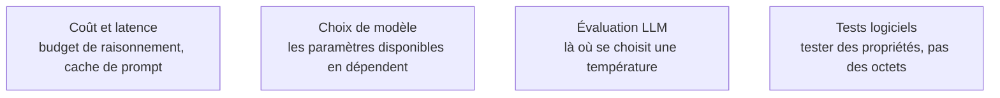

Les paramètres d'appel agissent sur la **sélection** du token, jamais sur la distribution apprise : ce sont des leviers de forme et de variance, pas de qualité de raisonnement.

## Ce que chaque paramètre déplace réellement

La **température** divise les logits avant softmax : proche de zéro on prend le token le plus probable — extraction, classification, génération de JSON ; au-delà de 0,8 on ouvre la distribution — variantes rédactionnelles, exploration. Entre les deux il n'y a pas de valeur magique. **Top-K** ne garde que les K tokens les plus probables ; plusieurs API commerciales l'ont retiré, il survit surtout dans les serveurs locaux. **Top-P** garde le plus petit ensemble dont la masse de probabilité atteint P, ce qui est plus adaptatif. On règle **soit** la température **soit** top-p : les combiner rend l'effet illisible.

Côté contrôle de sortie, `max_tokens` est à la fois un garde-fou de coût et un coupe-circuit contre les boucles — mais une réponse tronquée produit du JSON invalide, qu'il faut détecter par le `finish_reason` et non par un `try/except` silencieux. Les **séquences d'arrêt** servent dans les formats maison et les boucles artisanales. Les **pénalités de fréquence et de présence** sont des rustines : sur les modèles récents, une valeur non nulle dégrade souvent le respect du format bien avant d'améliorer la variété.

Deux paramètres absents de la roadmap d'origine dominent aujourd'hui la configuration. Le **budget de raisonnement** est le seul curseur qui change réellement la qualité sur les tâches difficiles, et c'est un arbitrage direct coût / latence / exactitude. La **mise en cache du prompt** impose une contrainte d'ordre — parties stables en tête, parties variables en fin — qui pèse plus sur l'architecture d'un prompt de production que tous les réglages d'échantillonnage réunis.

## Ce qu'il faut savoir faire

- **Choisir une température par type de tâche et la justifier par une mesure**, pas par habitude : la valeur se lit sur le jeu d'évaluation, elle ne se devine pas.
- **Détecter une troncature** via le motif de fin renvoyé par l'API, et traiter le cas explicitement plutôt que de retenter à l'aveugle.
- **Structurer un prompt pour le cache** : instructions système, schémas et documents de référence en tête ; entrée utilisateur en fin. Le gain porte autant sur la facture que sur le temps jusqu'au premier token.
- **Doser un budget de réflexion** en fonction de la difficulté réelle de la tâche, et savoir constater qu'il ne rapporte rien sur une extraction.
- **Écrire des tests qui ne comparent pas des chaînes** : schéma valide, champs présents, contrainte métier respectée. Une suite qui compare des sorties de LLM octet à octet est condamnée à clignoter.

> [!warning] Piège
> Attendre du déterminisme de `temperature=0`. L'inférence servie par lots sur GPU n'est pas déterministe bit à bit : le regroupement des requêtes change l'ordre des réductions en virgule flottante. Une graine fixe aide, elle ne garantit rien.

## Les notions mobilisées

- [[notions/cout-et-latence-inference]] — l'angle prompt engineering : le cache de préfixe et le budget de raisonnement sont les deux paramètres qui se lisent sur la facture.
- [[notions/choix-de-modele]] — les paramètres réellement disponibles varient d'un fournisseur à l'autre, et un mode raisonnement en neutralise plusieurs.
- [[notions/evaluation-llm]] — un réglage sans jeu d'évaluation est une préférence personnelle.
- [[notions/tests-logiciels]] — tester une sortie non déterministe par propriétés est le seul contrat tenable en intégration continue.

## Pour apprendre

- [Prompt Engineering](https://www.kaggle.com/whitepaper-prompt-engineering), Lee Boonstra (Google) — le chapitre sur les paramètres d'échantillonnage est la meilleure explication courte de température, top-K et top-P.
- [Prompt caching](https://docs.claude.com/en/docs/build-with-claude/prompt-caching) — la documentation de référence sur la contrainte d'ordre et ce qu'elle rapporte.
- [How to generate text: decoding methods](https://huggingface.co/blog/how-to-generate) (Hugging Face) — greedy, beam search, top-K et nucleus sampling, avec le code qui les produit.
- [Defeating Nondeterminism in LLM Inference](https://thinkingmachines.ai/blog/defeating-nondeterminism-in-llm-inference/) — pourquoi le batching casse la reproductibilité, et à quelle condition on la récupère.
