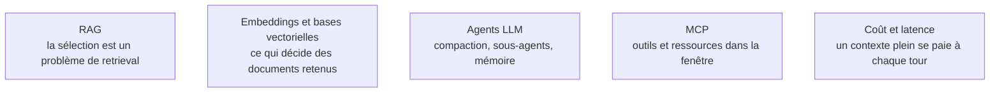

Quand la fenêtre passe à des centaines de milliers de tokens, la question n'est plus « comment formuler » mais **quoi mettre, dans quel ordre, et quoi retirer**. Le prompt devient une politique de gestion d'un budget rare et dégradant.

## Cinq leviers sur un budget qui se dégrade

**La fenêtre annoncée n'est pas la fenêtre utile.** La performance décroît bien avant la limite, et l'information placée au milieu d'un long contexte est moins bien exploitée que celle placée au début ou à la fin — le phénomène décrit par « Lost in the Middle » et confirmé depuis sur les générations suivantes. Remplir la fenêtre parce qu'on peut est une erreur de conception.

De là, cinq leviers. La **sélection** : moins de documents mieux choisis battent presque toujours plus de documents, et c'est un problème de récupération avant d'être un problème de prompt. L'**ordonnancement**, qui combine trois contraintes — le stable en tête pour le cache, l'instruction critique près de la fin où l'attention est la plus forte, les documents entre les deux avec les plus pertinents aux extrémités. La **compaction** : dans une boucle d'agent, ce sont les résultats d'outils qui saturent le contexte, et on élague les observations anciennes, on résume les tours précédents, on ne garde que des identifiants plutôt que des charges utiles complètes. L'**isolation** : un sous-agent doté de son propre contexte, qui ne rend qu'un résumé, protège le contexte principal — c'est l'argument architectural principal en faveur du multi-agent, bien plus que la « spécialisation » des rôles. La **mémoire externe** enfin : fichiers de notes, base vectorielle, état structuré relu à chaque tour.

Conséquence pratique souvent manquée : une bonne part du travail consiste désormais à écrire de **bonnes descriptions d'outils**. Un agent qui choisit mal ses outils a presque toujours un problème de description, pas de modèle.

## Ce qu'il faut savoir faire

- **Réduire de moitié le contexte d'un pipeline existant sans perdre de score** — l'exercice de référence, et celui qui révèle ce qui ne servait à rien.
- **Mesurer la dégradation en fonction de la longueur** plutôt que la supposer : un même jeu de cas, joué à trois tailles de contexte, montre où se situe la fenêtre utile réelle.
- **Ordonner un prompt sous trois contraintes à la fois** — cache, attention, pertinence — et savoir laquelle on sacrifie quand elles s'opposent.
- **Élaguer une trace d'agent** : décider ce qui se résume, ce qui se remplace par un identifiant et ce qui se jette, sans casser la capacité à revenir en arrière.
- **Rédiger une description d'outil** comme un mini-prompt : nom explicite, paramètres typés, une phrase sur quand l'utiliser et une sur quand ne pas l'utiliser.

> [!warning] Piège
> Le « tout dans le contexte » comme substitut au retrieval. Coller trois cent mille tokens de documentation coûte cher, ajoute de la latence, désensibilise le modèle et masque le vrai problème : on ne sait pas quels documents sont pertinents. Un retrieval médiocre reste médiocre à grande fenêtre, il devient juste plus coûteux.

## Les notions mobilisées

- [[notions/rag]] — l'angle prompt engineering : le context engineering commence là où le retrieval s'arrête, et hérite de sa qualité.
- [[notions/embeddings-et-bases-vectorielles]] — la sélection se joue dans l'index bien avant de se jouer dans le prompt.
- [[notions/agents-llm]] — compaction et isolation sont d'abord des problèmes de boucle agentique.
- [[notions/mcp]] — le protocole par lequel outils et ressources entrent dans la fenêtre, avec leurs descriptions.
- [[notions/cout-et-latence-inference]] — un contexte long est refacturé à chaque tour de boucle, pas une fois.

## Pour apprendre

- [Effective context engineering for AI agents](https://www.anthropic.com/engineering/effective-context-engineering-for-ai-agents) — compaction, sous-agents et mémoire externe, par ceux qui exploitent des agents en production.
- [Lost in the Middle: How Language Models Use Long Contexts](https://arxiv.org/abs/2307.03172) — le papier qui a établi la dégradation par position, et la raison d'ordonner un prompt.
- [Context Engineering for Agents](https://blog.langchain.com/context-engineering-for-agents/) (LangChain) — la taxonomie écrire / sélectionner / compresser / isoler, courte et opérationnelle.
- [How Long Contexts Fail](https://www.dbreunig.com/2025/06/22/how-contexts-fail-and-how-to-fix-them.html), Drew Breunig — les quatre modes d'échec d'un contexte long, avec des exemples reproductibles.
